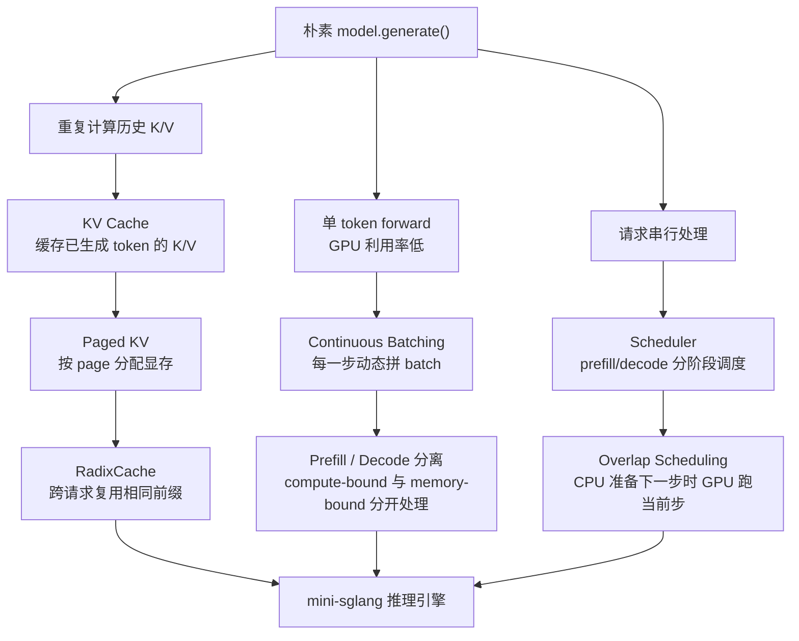

# 第 0 章：推理引擎要解决什么问题

> 在读 mini-sglang 代码之前，先想清楚：**为什么我们需要一个"推理引擎"？直接 `model.generate()` 不行吗？**
>
> 这一章不涉及代码。目标是建立后续 15 章的"动机锚点"——之后每当你看到一个让你疑惑的实现，都可以回到这里问自己：它在缓解哪一个矛盾？
>
> 如果你看过 nano-vllm 的对应章节，本章的前半（三大矛盾）是相同的；后半我们会引入 mini-sglang **额外面对的两个矛盾**：跨进程通信开销、跨请求的前缀复用。

---

## 0.1 朴素生成：一个 token 一次前向

最直白的 LLM 推理代码是这样：

```python
tokens = tokenize(prompt)
while not finished:
    logits = model(tokens)        # 跑一次 forward
    next_token = sample(logits[-1])
    tokens.append(next_token)
    finished = (next_token == eos)
```

这段代码能跑，但只要稍微提性能要求，就会暴露出三个本质问题：

1. **重复计算 K/V**：每跑一次 `model(tokens)`，前面已生成的 token 的 K、V 都要被重新算。token 数从 1 涨到 2000 时，每次 forward 的耗时随上下文长度线性增长，但其实只有最后一个 token 是新的。
2. **GPU 利用率低**：序列里只有 1 个 token，矩阵乘法又瘦又长（`[1, hidden] × [hidden, hidden]`），根本喂不饱 GPU。一张 H100 的 FP16 算力是 ~1 PFLOPS，跑这种单 token 的矩阵乘法只能用到 1% 不到。
3. **不能并发**：服务里同时有 10 个用户请求时，这段代码只能串行处理。

要解决以上三个问题，就要把"自回归生成"变成一个**带有显式状态、能批处理、能并发的系统**——这就是推理引擎。

---

## 0.2 三大矛盾

任何推理引擎，无论是 vLLM、SGLang、TGI 还是 mini-sglang，本质上都在调和这三对矛盾：

先把全局关系画出来。后面读到任意一个组件时，都可以回到这张图定位：它到底是在缓解哪个瓶颈。



### 矛盾一：批处理 vs 序列异质性

**好消息**：把多个请求拼成 batch 一起跑，能摊薄 kernel launch 开销，提高 GPU 利用率。
**坏消息**：用户请求各不相同——prompt 长度、生成长度、还要不要继续 decode、有没有提前停止——拼一个静态的 `[batch, max_len]` 矩阵会浪费大量算力。

更深的麻烦是：**prefill 和 decode 的计算特性是反的**。
- **Prefill**：把整段 prompt 一次性送进模型。序列长（几百到几千 token），矩阵很大，**计算密集**（compute-bound），瓶颈是 FLOPs。
- **Decode**：每一步只送 1 个新 token。矩阵又瘦又长，**带宽密集**（memory-bound），瓶颈是把 KV cache 从 HBM 读出来的速度。batch size 越大越赚。

> **粗略 roofline 验证**：以 H100 为例，FP16 算力约 990 TFLOPs、HBM 带宽约 3.35 TB/s，**拐点 ≈ 295 FLOP/byte**——访存每读 1 字节最多匹配 295 FLOP，超过这个比值就是 compute-bound，反之 memory-bound。
> - Prefill 的 attention 算术强度 ≈ `2 * seq_len / dtype_size`（FA1 论文 §3）：seq_len=2048、bf16，约 **2048 FLOP/byte**——远高于拐点 → **compute-bound**。
> - Decode 的 attention 算术强度 ≈ `2 / dtype_size` ≈ **1 FLOP/byte**——远低于拐点 → **memory-bound**，瓶颈在读 KV。
>
> 这就是为什么 decode batch size 越大越好（多个请求摊薄 KV 读取）、而 prefill 没必要堆大 batch（早就 compute-bound）。

把它们混在一个 batch 里跑，会让 prefill 拖慢 decode、decode 浪费 prefill 的 compute。所以现代引擎几乎都做了 **prefill / decode 分离调度**。

> 解决思路：**continuous batching**（每步动态成 batch）+ **phase separation**（prefill 和 decode 分开成 batch）。
> 在 mini-sglang 里，这就是 [`Scheduler._schedule_next_batch`](../../python/minisgl/scheduler/scheduler.py)：先看 prefill 队列有没有，没有再调度 decode。
>
> 📚 **延伸阅读**：continuous batching 最早由 **Orca (Yu et al., OSDI 2022)** 系统化，原文叫"iteration-level scheduling"。详见 [`references.md`](./references.md#orca-a-distributed-serving-system-for-transformer-based-generative-models)。

### 矛盾二：显存有限 vs KV cache 巨大

KV cache 大概多大？以 Llama-3.1-70B 为例，单个 token 的 KV 是：

```
K + V = 2 × num_layers × num_kv_heads × head_dim × dtype_bytes
      = 2 × 80 × 8 × 128 × 2  ≈ 320 KB / token
```

8K 上下文的一条请求 = 2.5 GB；并发 100 条 = 250 GB。但一张 H200 才 141 GB。

朴素方案是给每条请求按 `max_seq_len` 预留**一段连续显存**——但这样：
- **内部碎片**：实际生成长度通常远小于上限，预留的显存大多浪费。
- **静态预留**：要么预留太多 → 并发数低，要么太少 → OOM。
- **不能共享**：两条请求即使 prompt 前缀完全相同，也各占一份 KV。

> 解决思路：**PagedAttention**——把 KV cache 切成固定大小的 **page**（类比操作系统的页），按需分配，每个序列维护一张"页表"。物理 page 不必连续，最多浪费一个 page 的尾部；相同前缀的 page 还可以**跨请求共享**（用引用计数管理）。
> 在 mini-sglang 里，这就是 [`MHAKVCache`](../../python/minisgl/kvcache/mha_pool.py) + [`CacheManager`](../../python/minisgl/scheduler/cache.py) + [`RadixPrefixCache`](../../python/minisgl/kvcache/radix_cache.py)。
>
> 📚 **延伸阅读**：PagedAttention 由 **vLLM (Kwon et al., SOSP 2023)** 提出；跨请求前缀共享的 radix-tree 形式由 **SGLang (Zheng et al., NeurIPS 2024)** 提出，叫 RadixAttention。详见 [`references.md`](./references.md#efficient-memory-management-for-large-language-model-serving-with-pagedattention-vllm)。

### 矛盾三：调度决策——什么时候做什么

显存吃紧时，引擎必须做出选择：
- 还能不能再接新请求？（Admission control）
- 该跑 prefill 还是 decode？（Phase decision）
- 显存不够用了，要不要踢掉某个 running 的请求？（Eviction / preemption）

朴素方案"先到先服务、按上限预留显存"会让吞吐崩溃；激进方案"塞满到 OOM"会让系统直接挂掉。

> 解决思路：**状态机 + 预算分配 + 抢占**。在 mini-sglang 里，这一矛盾被分解到四个 manager 上：
> - `PrefillManager` 管 pending 请求 + token 预算
> - `DecodeManager` 管 running 请求
> - `CacheManager` 管 KV page 分配 + 前缀复用
> - `TableManager` 管"序列槽位"（一个请求要占一行 page table）

---

## 0.3 mini-sglang 还要面对的两个额外矛盾

上面三大矛盾在所有引擎里都成立。mini-sglang 跟 nano-vllm 的差异，主要来自下面两条它额外要解决的问题：

### 矛盾四：单进程 vs 多组件

nano-vllm 用 SharedMemory + Event 的方式做 TP，整个进程组其实是"一个 driver 进程把指令写进共享内存，N 个 worker 进程读出来执行"——所有逻辑都耦合在 `LLMEngine.step()` 里。

但当推理引擎需要做成"在线服务"（OpenAI 兼容 API、支持并发流式输出、支持取消）的时候，单进程就开始捉襟见肘了：

- **HTTP 框架（FastAPI）需要 asyncio**：放在 GPU 推理同进程里，会和 PyTorch 的 GIL 持有产生奇怪的卡顿。
- **Tokenizer 慢**：HuggingFace 的 `tokenizer.encode` 和 `apply_chat_template` 的 P99 延迟可达毫秒级，挤占主循环时间。
- **GPU 紧绑定到一个进程**：CUDA context 和 NCCL 通信子都和进程一一对应，TP 想要"一个进程一张卡"就必须开多进程。

> 解决思路：mini-sglang 把整个引擎拆成 **API server / Tokenizer worker / Detokenizer worker / Scheduler×TP（每个 rank 一个进程）** 这样的多进程流水线，靠 ZeroMQ（控制消息）+ NCCL（张量数据）通信。这是它和 nano-vllm 最显著的架构差异，第 1 章会详细展开。

### 矛盾五：CPU 调度 vs GPU 计算

哪怕 KV cache 已经分好页、batch 已经凑好，调度逻辑（决定下一个 batch 是什么、把 Python 列表打包成 GPU 张量、为 attention 后端构造 metadata）的 CPU 开销，每一步都是几百微秒到几毫秒的量级。

而一次 decode 的 GPU forward，对小模型也只有几毫秒。**CPU 调度 vs GPU 计算 = 几乎 1:1**。如果这两段被串行执行，就是 GPU 一半时间在等 CPU。

> 解决思路：**Overlap scheduling**——把"为下一步调度 + 准备 metadata"和"GPU 跑当前步 forward"放到两个 CUDA stream 上重叠执行。这是 mini-sglang 的招牌特性，也是它的代码相对复杂、为什么有 `ForwardData` 这种"携带上一步状态"的奇怪类型的根本原因。第 7 章详细讲。

---

## 0.4 一张大表把所有矛盾对齐

| # | 矛盾 | 核心组件（mini-sglang） | 关键思想 | 后续章节 |
|---|------|-----------------------|---------|---------|
| 1 | 批处理 vs 异质性 | `Scheduler` + `PrefillManager` + `DecodeManager` | continuous batching, phase separation | 第 6 章 |
| 2 | 显存 vs KV cache | `MHAKVCache` + `CacheManager` + `RadixPrefixCache` | paged KV, prefix sharing, eviction | 第 4、5 章 |
| 3 | 调度决策 | `Scheduler._schedule_next_batch` + 4 个 Manager | budget, state machine, preemption-via-evict | 第 6 章 |
| 4 | 多组件解耦 | API server / Tokenizer / Scheduler / Engine + ZMQ | 进程隔离 + 消息总线 | 第 1、2 章 |
| 5 | CPU/GPU 重叠 | `Scheduler.overlap_loop` + 两个 CUDA stream | overlap scheduling, ForwardData 携带状态 | 第 7 章 |

读到任何一段你看不懂的代码，回到这张表，找到它对应的矛盾——这样就有了"为什么要这样写"的方向感。

---

## 0.5 检查清单（读完该会的）

先尝试自己答，再展开"参考答案"对照。

1. **KV cache 解决了什么问题？为什么会有 prefill / decode 两个阶段？**
   <details><summary>参考答案</summary>

   解决了"自回归生成时，前面所有 token 的 K、V 在每一步都要被重新计算"的浪费——因为因果掩码保证已生成 token 看不到未来，它们的 K/V 不会再变，缓存即可复用。

   一旦缓存了 K/V，整个生成过程自然分成两段：
   - **prefill**：第一次把整段 prompt 一起送进模型，把每层 K/V 算出来存进 cache（一次大批量计算）。
   - **decode**：之后每一步只送 1 个新 token，用它的 Q 去查 cache 里的全部 K/V。
   </details>

2. **prefill 和 decode 在计算特性上有什么本质差别？**
   <details><summary>参考答案</summary>

   - **Prefill**：序列长（成百上千 token 一起算），矩阵很大，**计算密集**（compute-bound），FLOPs 是瓶颈。batch size 不需要很大就能塞满 GPU。
   - **Decode**：每个序列只算 1 个 token，矩阵又瘦又长，几乎跑不满 GPU 的算力，瓶颈在显存带宽（memory-bound，主要时间花在把 KV cache 从显存读出来）。**batch size 越大越赚**。

   这种差异是 mini-sglang 把 prefill / decode 分别成 batch 调度的根本原因。代码上对应 `Scheduler._schedule_next_batch` 里"先 prefill 再 decode"的逻辑。
   </details>

3. **为什么需要 PagedAttention，朴素的 KV cache 分配有什么问题？**
   <details><summary>参考答案</summary>

   朴素方案给每个请求按 `max_seq_len` 预留**一段连续显存**。问题：
   - **内部碎片**：实际生成长度往往远小于上限，预留的显存大多浪费。
   - **静态预留**：要么预留太多 → 并发数低，要么预留太少 → OOM。
   - **不能共享**：两个请求即使 prompt 前缀完全相同，也各占一份 KV。

   PagedAttention 把 KV cache 切成固定大小的 page，按需分配，每个序列维护一张"page 表"。物理 page 不必连续，最多浪费一个 page 的尾部；相同前缀的 page 可以**跨请求共享**——这是 mini-sglang `RadixPrefixCache` 的基础。
   </details>

4. **mini-sglang 为什么要拆成多个进程？放在一个进程里不行吗？**
   <details><summary>参考答案</summary>

   三个原因叠加：
   - **GIL 与 asyncio 不和谐**：FastAPI/uvicorn 在 asyncio 之上跑，PyTorch GPU forward 持有 GIL 时间长（释放点不是处处都有），混在同一进程里 P99 延迟抖动大。
   - **Tokenizer 是 CPU 工作**：用单独进程能在 GPU 跑下一步 forward 时并行做 tokenize/detokenize。
   - **TP 必须一卡一进程**：CUDA context、NCCL 通信子绑死进程，所以 TP=N 时 scheduler/engine 必须有 N 个进程；从架构对称性出发，把 server 和 tokenizer 也独立成进程是最自然的选择。

   代价是必须有一套消息总线——这就是 ZeroMQ 在做的事。
   </details>

5. **Overlap scheduling 解决的是什么问题？为什么 nano-vllm 没有？**
   <details><summary>参考答案</summary>

   解决的是 **CPU 调度开销 vs GPU 计算时间 ~= 1:1** 时，二者串行会让 GPU 一半时间空闲的问题。

   做法：在两个 CUDA stream 上并行运行——
   - 主 stream（`scheduler.stream`）：CPU 端做调度决策、构造 attention metadata、把 Python 列表搬到 GPU。
   - Engine stream（`engine.stream`）：GPU 端跑当前步的模型 forward。

   关键是要**把"上一步的输出"和"当前步的输入准备"分开来管理**，所以代码里有个 `ForwardData = (ForwardInput, ForwardOutput)` 类型在两次 `step` 之间流动；并且为了避免一个请求被释放两次，`Scheduler` 还得维护 `self.finished_reqs` 这个集合作为防御。

   nano-vllm 没有 overlap，是因为它定位是"最简实现"——它的 `step()` 是 schedule → forward → process → return 的串行结构，简单但留了 30%+ 的 GPU 空闲。
   </details>

如果某个问题答不上来，先回到对应小节再想一遍——后续章节都建立在这些直觉上。

---

## 下一章预告

下一章我们沿着进程拓扑走一遍：从 `python -m minisgl --model X` 启动那一刻，到底有几个进程被拉起来、它们怎么通过 ZMQ 找到彼此、消息怎么从 HTTP 一路流到 GPU。读完后你会建立起一张"全局总线图"，后续章节里所有"消息从哪里来到哪里去"的疑问都能在这张图上定位。
