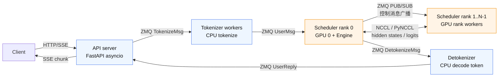

# 第 1 章：多进程流水线总览

> 上一章我们指出 mini-sglang 把推理引擎拆成多个进程，是为了同时解决"FastAPI/asyncio + GPU 推理同进程的 GIL 抖动"、"tokenizer 是纯 CPU 工作"、"TP 必须一卡一进程"三个问题。
>
> 这一章把"拆出来的几个进程"画清楚——谁是谁、谁连着谁、用什么方式连。读完后，所有"消息从哪儿来到哪儿去"的问题你都能在这张总线图上定位。

---

## 1.1 一行命令背后的进程拓扑

启动命令很短：

```bash
python -m minisgl --model Qwen/Qwen3-0.6B --tp 2
```

但 [`minisgl.server.launch.launch_server`](../../python/minisgl/server/launch.py) 会拉起 **5 类、最少 4 个、可能更多**的进程。`--tp 2` 时的拓扑是这样：

```
                ┌─────────────────────┐
                │  API server (asyncio)│   ← 主进程
                │   uvicorn + FastAPI │
                └──────────┬──────────┘
                           │ ZMQ ipc:/.../minisgl_3 (in)   ← UserReply 流
                           │ ZMQ ipc:/.../minisgl_4 (out)  ← TokenizeMsg 流（或 minisgl_1，与 detok 共用）
                           ▼
                ┌─────────────────────┐
                │ Tokenizer / Detok   │   ← --num-tokenizer 0 时，编码+解码合一个进程
                │ (transformers)      │
                └──────────┬──────────┘
                           │ ZMQ ipc:/.../minisgl_0  ← UserMsg / AbortBackendMsg
                           ▼
   ┌──────────────────┬─────────────────────────────────┐
   │  Scheduler rank0 │       Scheduler rank 1          │   ← 每个 TP rank 一个进程
   │   ZMQ PUB ─────→ │  ZMQ SUB（pid=2 总线广播）       │
   │                  │                                  │
   │   Engine on GPU0 │   Engine on GPU1                 │
   └────────┬─────────┴──────────────┬──────────────────┘
            │                        │
            └────── NCCL all-reduce / all-gather ─────────┘   ← 重张量数据走 NCCL
            │
            ▼
   ZMQ ipc:/.../minisgl_1   ← rank 0 把 DetokenizeMsg 发回给 detokenizer
```

地址是 `ipc:///tmp/minisgl_<N>.pid=<scheduler_pid>` 的形式（见 [`SchedulerConfig`](../../python/minisgl/scheduler/config.py)、[`ServerArgs`](../../python/minisgl/server/args.py)）。`pid` 后缀保证多个 server 在同一台机上不会互相串台。

把每个进程的角色和它收发的消息列出来：

| # | 进程 | 数量 | 监听 / 接收 | 发送 |
|---|------|-----|-----------|------|
| 1 | API server | 1（主进程） | `frontend_addr=minisgl_3`（UserReply） | `tokenizer_addr=minisgl_4 或 _1` |
| 2 | Tokenizer / Detokenizer | 1 ~ N+1 | `tokenizer_addr` / `detokenizer_addr` | `backend_addr=minisgl_0`（UserMsg）；`frontend_addr` |
| 3 | Scheduler rank 0 | 1 | `backend_addr` | `detokenizer_addr`（DetokenizeMsg）；`broadcast_addr=minisgl_2`（PUB） |
| 4 | Scheduler rank ≥1 | TP-1 | `broadcast_addr`（SUB） | NCCL（数据） |

数量小总结：
- `--tp 1 --num-tokenizer 0`（默认）：**3 个进程**——API server / Tokenize+Detokenize / Scheduler rank 0。
- `--tp 4 --num-tokenizer 2`：**1 + (2+1) + 4 = 8 个进程**。

如果把上面的 ASCII 拓扑压成一张更适合记忆的图，可以按"控制流走 ZMQ、张量流走 NCCL"来理解：



> 验证：[`launch.py:108-111`](../../python/minisgl/server/launch.py) 在等的 ack 数是 `1 + num_tokenizers + 1`（schedulers 只让 primary rank 发 ack），匹配上面的数量。

---

## 1.2 为什么是 ZMQ 而不是 HTTP / gRPC

mini-sglang 的所有跨进程消息走的都是 [ZeroMQ over IPC](../../python/minisgl/utils/__init__.py)（`ipc://` 在 Linux 上就是 Unix domain socket）。原因是 ZMQ 把"消息边界 + push/pull / pub/sub 模式 + 高吞吐"打包好了：

| 模式 | 用在哪 | 为什么这么选 |
|------|-------|-----------|
| `PUSH` / `PULL` | API server ↔ Tokenizer ↔ Scheduler rank0 | 多生产者 / 多消费者的工作队列，自动 round-robin |
| `PUB` / `SUB` | Scheduler rank 0 → rank 1..N-1 | 一对多广播；新连进来的 rank 不会回填历史消息 |

每条消息用 [msgpack](../../python/minisgl/message/utils.py) 序列化为 dict，然后 ZMQ 当 bytes 发出去。消息类型只有 3 类：
- `BaseBackendMsg`（[`backend.py`](../../python/minisgl/message/backend.py)）：tokenizer → scheduler。包括 `UserMsg`（input_ids）、`AbortBackendMsg`、`ExitMsg`、`BatchBackendMsg`。
- `BaseTokenizerMsg`（[`tokenizer.py`](../../python/minisgl/message/tokenizer.py)）：API server → tokenizer 和 scheduler → detokenizer。包括 `TokenizeMsg`、`DetokenizeMsg`、`AbortMsg`。
- `BaseFrontendMsg`（[`frontend.py`](../../python/minisgl/message/frontend.py)）：detokenizer → API server。`UserReply`（增量字符串）。

> 设计点：这三组消息的命名是**按"接收方"取的**——`BackendMsg` 是给 backend (scheduler) 看的、`TokenizerMsg` 是给 tokenizer/detokenizer 看的、`FrontendMsg` 是给前端 API 看的。代码里看到 `recv_from_tokenizer` 类的字段名时记住这个约定就不会绕。

为什么不直接用 HTTP？
- **延迟**：HTTP 解析 header 开销大（数十微秒级），mini-sglang 一次 decode 才几毫秒，HTTP 占比明显。
- **没必要序列化为字符串**：进程在同一台机器上，IPC 直接传 bytes 就行。
- **不需要服务端语义**：消息总线是单向流，HTTP 的 request/response 模型反而不对路。

---

## 1.3 控制平面 vs 数据平面

划重点：mini-sglang 用了**两套通信系统**，不要混淆。

| 平面 | 协议 | 传什么 | 频率 | 数据量 |
|------|------|-------|-----|-------|
| 控制平面 | ZMQ + msgpack | `UserMsg` / `DetokenizeMsg`（一个 token / 一段 token_ids） | 每个请求几次 | KB 级 |
| 数据平面 | NCCL (`torch.distributed`) | hidden states、logits 等 GPU 张量 | 每层 forward 都跑 | MB 级 |

NCCL 的工作发生在 [`minisgl.distributed.impl.DistributedCommunicator`](../../python/minisgl/distributed/impl.py)：

```python
# OProj 之后的 all-reduce
class LinearOProj(_LinearTPImpl):
    def forward(self, x):
        y = F.linear(x, self.weight, self.bias)
        if self._tp_size > 1:
            y = self._comm.all_reduce(y)   # ← NCCL all-reduce
        return y
```

而 ZMQ 的工作只在请求生命周期的两端发生：
- **进入引擎之前**：API server → Tokenizer → Scheduler。每个请求 1 次。
- **生成 token 之后**：Scheduler → Detokenizer → API server。每个 token 1 次。

为什么这样划分？因为 ZMQ 走 CPU 内存 + Linux IPC，不能传 GPU 张量；而 NCCL 不能跨进程做"消息队列"，它只擅长在已建立的通信子上做集体通信。

第 11 章会专门讲 NCCL 通信的初始化（`init_pynccl` + 用 ZMQ-CPU 端 broadcast nccl_id）。

---

## 1.4 为什么有 `--num-tokenizer 0` 这个奇怪的默认

[`ServerArgs.num_tokenizer`](../../python/minisgl/server/args.py) 默认值是 0，含义：**tokenizer 和 detokenizer 是同一个进程**。

代码里是这么实现的（[`launch.py:71-87`](../../python/minisgl/server/launch.py)）：detokenizer 进程一定起 1 个，tokenizer 数量 = `num_tokenizer`，0 时 tokenizer 这个进程不起，API server 直接把 `TokenizeMsg` 发到 detokenizer 用的那个 ZMQ socket（[`ServerArgs.zmq_tokenizer_addr`](../../python/minisgl/server/args.py)）：

```python
@property
def zmq_tokenizer_addr(self):
    if self.share_tokenizer:
        return self.zmq_detokenizer_addr   # ← 共用一个 socket
    ...
```

而那个唯一的进程在 [`tokenize_worker`](../../python/minisgl/tokenizer/server.py:60-108) 里同时处理两类消息：

```python
detokenize_msg = [m for m in pending_msg if isinstance(m, DetokenizeMsg)]
tokenize_msg   = [m for m in pending_msg if isinstance(m, TokenizeMsg)]
abort_msg      = [m for m in pending_msg if isinstance(m, AbortMsg)]
```

为什么默认共用？因为对小模型 / 单 GPU 场景，tokenize 和 detokenize 各自的 CPU 占用都很低，单进程足够；起多进程反而要多付一份模型加载成本（tokenizer 几百兆）。当并发上去、tokenize 成为瓶颈时，再 `--num-tokenizer 4` 横向扩。

---

## 1.5 启动握手：怎么保证所有进程都准备好了

主进程（API server）启动后会立刻去 ZMQ 上监听，但它必须等所有 worker 进程都 ready 才能开始接请求。mini-sglang 用 [multiprocessing.Queue](../../python/minisgl/server/launch.py:55-111) 做这个握手：

```python
ack_queue: mp.Queue[str] = mp.Queue()   # 主进程持有

# 启动每个 scheduler / tokenizer，把 ack_queue 传过去
for i in range(world_size):
    mp.Process(target=_run_scheduler, args=(args, ack_queue), ...).start()
...

# 主进程数 ack
for _ in range(num_tokenizers + 2):       # 1 个 detok + N 个 tok + 1 个 schedule primary
    logger.info(ack_queue.get())
```

每个 worker 启动完毕、socket 建好之后就往 queue 里写一条字符串。Schedulers 这边只有 rank 0 写（[`launch.py:24-25`](../../python/minisgl/server/launch.py)），其他 rank 不写——因为 rank > 0 走的是 ZMQ PUB/SUB，必须等 rank 0 这个 publisher 起来才能开 subscriber，所以它们的就绪是被 rank 0 的 ack 间接保证的。

这一段对修代码很有用：**改动 worker 启动顺序时，得同步改 ack 数量**。

---

## 1.6 "Rank 0 单点"的由来与代价

mini-sglang 的所有"和外界打交道的"工作都集中在 scheduler rank 0 上：
- 接 ZMQ `UserMsg`（rank ≥ 1 是从 rank 0 那里以 PUB/SUB 收到的）
- 发 `DetokenizeMsg`（[`scheduler/io.py:_reply_tokenizer_rank0`](../../python/minisgl/scheduler/io.py)）
- 同步消息计数（[`_recv_msg_multi_rank0` 用 CPU broadcast 通告 raw 消息数](../../python/minisgl/scheduler/io.py:88-122)）

好处：tokenizer 不用知道 TP 拓扑、detokenizer 拿到的就是单一来源、调度策略不需要做"跨 rank 一致性投票"。

代价：rank 0 的进程比其他 rank 多干一份 IO 工作。但因为 Scheduler 的 IO 是阻塞 ZMQ 收→处理，远比 GPU forward 快，几乎不会成为瓶颈。

> 第 6 章会详细讲 `Scheduler.run_forever` 内部如何在"收消息 / 调度 / forward"之间切换，以及多 rank 的同步细节。

---

## 1.7 检查清单

1. **mini-sglang 启动一个 `--tp 2 --num-tokenizer 0` 的 server，会拉起几个进程？分别是什么？**
   <details><summary>参考答案</summary>

   4 个：API server（主进程）、Tokenizer/Detokenizer（合一）、Scheduler rank 0（GPU 0）、Scheduler rank 1（GPU 1）。
   </details>

2. **ZMQ 在这套架构里负责什么？NCCL 负责什么？这种分工的依据是什么？**
   <details><summary>参考答案</summary>

   - **ZMQ**：跨进程的控制消息（`UserMsg`、`DetokenizeMsg`、`AbortMsg` 等），走 CPU 内存 + Unix domain socket，单条消息 KB 级。
   - **NCCL**：TP 各 rank 之间 GPU 张量的集体通信（`all_reduce` / `all_gather`），走 NVLink / PCIe，单次操作 MB 级。

   分工依据：ZMQ 不能传 GPU 张量但适合做消息总线；NCCL 不能跨进程当消息队列但 GPU 间通信极快。两者互补。
   </details>

3. **为什么 `Scheduler` 不直接给所有 rank 发 `UserMsg`，而是先发给 rank 0、再由它广播？**
   <details><summary>参考答案</summary>

   两个原因：
   - **简化外部接口**：tokenizer 进程不需要知道 TP 拓扑，只往一个固定 socket（`zmq_backend_addr`）发即可。
   - **保证一致性**：每个 TP rank 必须看到完全一样的请求序列，否则各 rank 的 `Batch` 就会发散；让 rank 0 做"权威拷贝"再广播，保证消息顺序统一。具体实现是 [rank 0 用 ZMQ PUB / 其余 rank 用 SUB](../../python/minisgl/scheduler/io.py:48-62)，并通过 CPU broadcast 同步消息**数量**让所有 rank 在 `tp_cpu_group.broadcast` 上对齐。
   </details>

4. **`ipc:///tmp/minisgl_2.pid=12345` 这个地址里的 pid 起什么作用？**
   <details><summary>参考答案</summary>

   防止同一台机器上跑多个 mini-sglang server 时 IPC 路径冲突。`SchedulerConfig._unique_suffix` 取的是当前 scheduler 进程的 pid（[`config.py:8-12`](../../python/minisgl/scheduler/config.py)），不同 server 各有各的后缀，socket 文件就不会互相覆盖。
   </details>

5. **为什么 `--num-tokenizer 0` 是默认值，什么时候应该改大？**
   <details><summary>参考答案</summary>

   默认 0 = tokenize 和 detokenize 共用一个进程。对小模型 / 低并发场景，两类工作的 CPU 占用都很低，省一个进程更轻；起多进程要多付 tokenizer 文件的加载（几百 MB）和 socket 维护成本。

   当**并发请求增多 / chat template 变复杂 / tokenize CPU 时间接近一次 decode 时**，tokenize 会成为瓶颈。这时调大 `--num-tokenizer N` 横向扩，多个 tokenizer 进程通过 ZMQ PUSH 在 backend socket 上自动 round-robin 分担。
   </details>

---

## 下一章预告

下一章我们沿着一个具体请求走一遍：从 `curl /v1/chat/completions` 进来，到第一个 token 流回客户端，每一跳的消息类型、数据结构、阻塞 / 异步语义。把第 1 章的"静态拓扑图"变成"动态时序图"。
