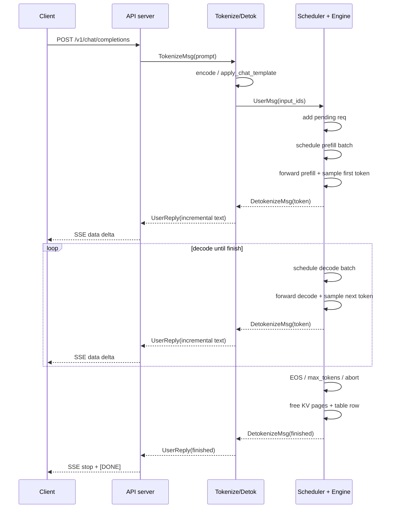

# 第 2 章：一次请求的完整旅程

> 第 1 章我们画了"静态拓扑图"——5 类进程通过 ZMQ + NCCL 连接。这一章把它变成"动态时序图"：一个 HTTP 请求进来后，每一跳的消息是什么、被谁处理、最终怎么变成增量 token 流回去。
>
> 读完后你应该能在脑子里跑一遍 [`api_server.py`](../../python/minisgl/server/api_server.py) → [`tokenize_worker`](../../python/minisgl/tokenizer/server.py) → [`Scheduler.run_forever`](../../python/minisgl/scheduler/scheduler.py) 的完整调用链。

---

## 2.1 用户视角的入口

mini-sglang 暴露的 HTTP 接口是 OpenAI 兼容的：

```bash
curl -N http://127.0.0.1:1919/v1/chat/completions \
    -H 'Content-Type: application/json' \
    -d '{
        "model": "Qwen/Qwen3-0.6B",
        "messages": [{"role": "user", "content": "你好"}],
        "max_tokens": 64,
        "stream": true
    }'
```

返回的是 SSE（server-sent events）流，每条事件 `data: {...}\n\n`，最后 `data: [DONE]`。

进入服务端的入口是 [`api_server.v1_completions`](../../python/minisgl/server/api_server.py:255-283)。整段函数本身只做 5 件事：

1. 申请一个全局唯一的 `uid`（FrontendManager 里的计数器自增）。
2. 构造 `TokenizeMsg(uid, text=messages, sampling_params=...)`。
3. `await state.send_one(msg)` —— 把消息塞进 ZMQ PUSH 队列。
4. 创建一个 `asyncio.Event`，挂在 `state.event_map[uid]` 上等下一步唤醒。
5. 返回 `StreamingResponse(stream_chat_completions(uid))`，由 FastAPI 调用这个 async generator 异步地读 reply。

注意第 4 步：**HTTP handler 不阻塞等结果**。每个请求只是把消息发出去、登记一个 event，然后立刻让出 asyncio 控制权。真正"听" detokenizer 回复的是后台一个常驻 task `FrontendManager.listen`（[`api_server.py:116-123`](../../python/minisgl/server/api_server.py)）：

```python
async def listen(self):
    while True:
        msg = await self.recv_tokenizer.get()
        for msg in _unwrap_msg(msg):
            if msg.uid not in self.ack_map:
                continue
            self.ack_map[msg.uid].append(msg)
            self.event_map[msg.uid].set()        # ← 唤醒 stream_chat_completions
```

这个设计的意义：**单个 listener 任务统一接管 ZMQ 收信，多个 HTTP 连接之间靠 event_map 解复用**。否则每个 HTTP handler 都建一个 ZMQ 连接，当并发 1000 时会爆炸。

---

## 2.2 Hop 1：API server → Tokenizer

发出的消息：

```python
TokenizeMsg(uid=42, text=[{"role": "user", "content": "你好"}], sampling_params=SamplingParams(...))
```

走的 socket：`zmq_tokenizer_addr`（ipc 路径见 [`ServerArgs.zmq_tokenizer_addr`](../../python/minisgl/server/args.py:30-35)）。`--num-tokenizer 0` 时，这个 socket 实际上就是 detokenizer socket，由共用进程接走。

Tokenizer 进程的主循环在 [`tokenize_worker`](../../python/minisgl/tokenizer/server.py:60-108)。一次循环会：

1. 阻塞 pull 一条消息（`recv_listener.get()`），如果 socket 上还有就连续取直到攒满 `local_bs` 条或队列空。
2. 把 batch 里的消息按类型分流：`DetokenizeMsg` / `TokenizeMsg` / `AbortMsg`。
3. 对 `TokenizeMsg`，调用 [`TokenizeManager.tokenize`](../../python/minisgl/tokenizer/tokenize.py)：
   ```python
   if isinstance(msg.text, list):
       prompt = self.tokenizer.apply_chat_template(msg.text, tokenize=False, add_generation_prompt=True)
   else:
       prompt = msg.text
   input_ids = self.tokenizer.encode(prompt, return_tensors="pt").view(-1).to(torch.int32)
   ```
4. 把结果包成 `UserMsg(uid, input_ids, sampling_params)`，PUSH 到 `backend_addr`（scheduler）。

> 这里有个细节：TokenizeMsg 的 `text` 字段类型是 `str | List[Dict[str, str]]`——前者是 `/generate` 的纯 prompt 路径，后者是 `/v1/chat/completions` 的消息列表，需要走 chat template 渲染。两种路径在 tokenizer 里只差一个 `apply_chat_template`。

---

## 2.3 Hop 2：Tokenizer → Scheduler rank 0

发出的消息（来自上一步打包）：

```python
UserMsg(uid=42, input_ids=tensor([...], dtype=torch.int32), sampling_params=SamplingParams(...))
```

走的 socket：`zmq_backend_addr`（ipc:///tmp/minisgl_0.pid=...）。

Scheduler 端在 [`SchedulerIOMixin.__init__`](../../python/minisgl/scheduler/io.py:27-66) 里建好接收端。一旦消息到达，[`Scheduler._process_one_msg`](../../python/minisgl/scheduler/scheduler.py:169-198) 会被调用：

```python
elif isinstance(msg, UserMsg):
    input_len, max_seq_len = len(msg.input_ids), self.engine.max_seq_len
    max_output_len = max_seq_len - input_len
    if max_output_len <= 0:
        return logger.warning_rank0(...)        # 输入超长直接拒
    if msg.sampling_params.max_tokens > max_output_len:
        msg.sampling_params.max_tokens = max_output_len
    self.prefill_manager.add_one_req(msg)       # ← 进入 pending list
```

这一步只是**把请求加进 PrefillManager 的 pending 列表**，并没有真的开始 prefill。真正决定什么时候开始的是下一节的调度循环。

> 多 TP 时还有一步：rank 0 在收到原始字节后，会同时通过 PUB socket 把 raw 字节广播给其它 rank，每个 rank 各自 decode、各自调用 `_process_one_msg`，从而保证所有 rank 看到的 `pending_list` 完全一致（[`io.py:_recv_msg_multi_rank0`](../../python/minisgl/scheduler/io.py)）。

---

## 2.4 Hop 3（核心）：Scheduler 的主循环

[`Scheduler.run_forever`](../../python/minisgl/scheduler/scheduler.py:120-131) 是引擎的"心跳"：

```python
@torch.inference_mode()
def run_forever(self):
    if ENV.DISABLE_OVERLAP_SCHEDULING:
        with self.engine_stream_ctx:
            self.engine.stream.wait_stream(self.stream)
            while True:
                self.normal_loop()
    else:
        ...
        data = None
        while True:
            data = self.overlap_loop(data)
```

不管走 normal_loop 还是 overlap_loop，单步都做这几件事：

1. **收消息**：`self.receive_msg(blocking=...)` —— blocking 的条件是"既没有 in-flight forward、也没有可调度的 prefill/decode"，否则非阻塞。
2. **调度**：`_schedule_next_batch()` 先问 prefill manager 能不能成 batch，不能再问 decode manager。
3. **准备张量**：`_prepare_batch(batch)` —— 算 positions / input mapping / write mapping，建 attn_metadata，padded。
4. **forward**：`Engine.forward_batch(batch, sample_args)`，跑模型 + sample 出下一个 token。
5. **善后**：`_process_last_data` 把上一步采到的 token 包成 `DetokenizeMsg` 发回，更新 cache、释放完成的请求。

第一次有请求进来时的时序大致是：

```
t0:  收到 UserMsg → prefill_manager.pending_list += [pending_req]
t1:  schedule_next_batch
       → prefill_manager: token budget OK + cache+table 都能分到 → 返回 Batch(reqs=[req], phase="prefill")
t2:  _prepare_batch
       → cache_manager.allocate_paged()  (按 page_size 给 KV 分页)
       → backend.prepare_metadata()      (填 cu_seqlens, page_table 等)
       → sampler.prepare()               (准备 temperatures / top_k / top_p 张量)
t3:  Engine.forward_batch
       → 跑 transformer forward → logits → sample → next_tokens_gpu / next_tokens_cpu
t4:  _process_last_data (针对**上一步**的 batch；首次是 None)
t5:  下一轮：req.cached_len 已被推到 device_len（complete_one），于是它进入 decode_manager.running_reqs
        prefill 队列空 → schedule decode → forward 一次 → 出第二个 token...
```

这里"上一步" / "本步"的错位，是 overlap scheduling 留下的痕迹——第 7 章细讲。

---

## 2.5 Hop 4：Scheduler rank 0 → Detokenizer

forward 完一步后，[`_process_last_data`](../../python/minisgl/scheduler/scheduler.py:138-167) 会构造一组 `DetokenizeMsg`：

```python
reply.append(DetokenizeMsg(uid=req.uid, next_token=next_token, finished=finished))
```

每条对应一个**已经完成本步采样的请求**（`ChunkedReq` 跳过——它们是 prefill 没 sample 完的中间块，第 10 章讲）。

发送由 [`_reply_tokenizer_rank0`](../../python/minisgl/scheduler/io.py:124-130) 处理：

- 如果只有 1 条，单独发出。
- 多条则包成 `BatchTokenizerMsg(data=...)`，省一次 ZMQ 系统调用。

走的 socket：`zmq_detokenizer_addr`（即 detokenize worker 监听的入口）。

注意：**只有 rank 0 发**。其它 rank 的 `_reply_tokenizer_rank1` 是个空函数（[`io.py:132-133`](../../python/minisgl/scheduler/io.py)）——所有 rank 都跑了 forward + sample，但它们采样结果都一样（没有随机性的话）或都被广播过来的（有随机性时，sampling 在 rank 0 之外的 rank 不被使用）。

---

## 2.6 Hop 5：Detokenizer → API server

Detokenize 比 tokenize 复杂一些——每次只来一个 token，要把它累加到这个 uid 的累计字符串里，但又得处理"BPE token 还不构成完整字符"的情况（特别是 utf-8 多字节字符 / 中文）。

[`DetokenizeManager.detokenize`](../../python/minisgl/tokenizer/detokenize.py:70-111) 用 `decoded_ids / read_offset / surr_offset / sent_offset` 四个偏移量做"安全地切完整 unicode 字符"：

```python
read_ids  = s.decoded_ids[s.surr_offset :]              # 最近一段
surr_ids  = s.decoded_ids[s.surr_offset : s.read_offset]  # 上次确认过的更短前缀
read_str  = tokenizer.batch_decode(read_ids)
surr_str  = tokenizer.batch_decode(surr_ids)
new_text  = read_str[len(surr_str):]
if new_text and not new_text.endswith("�"):              # 不以乱码替换符结尾，可放行
    s.surr_offset = s.read_offset
    s.read_offset = len(s.decoded_ids)
else:
    new_text = find_printable_text(new_text)             # 否则只发到上一个空格 / CJK 边界
```

逻辑是 "borrow from sglang"（注释里写明），效果是**永远不在一个不完整的 unicode 字符中间发**，但又不会因为等完整字符把延迟堆上来。

最终 detokenizer 把增量字符串包成 `UserReply(uid, incremental_output, finished)`，PUSH 回 API server 的 `frontend_addr`。

---

## 2.7 Hop 6：API server 流式返回客户端

回到 [`FrontendManager.listen`](../../python/minisgl/server/api_server.py:116-123)：消息到达后塞进 `ack_map[uid]` 并 `event.set()`。`stream_chat_completions(uid)` 这个 async generator 此前在 await 这个 event：

```python
async def wait_for_ack(self, uid):
    event = self.event_map[uid]
    while True:
        await event.wait()
        event.clear()
        pending = self.ack_map[uid]
        self.ack_map[uid] = []
        for ack in pending:
            yield ack
        if ack.finished:
            break
    del self.ack_map[uid]
    del self.event_map[uid]
```

每个 yield 上去就被 `stream_chat_completions` 包成 OpenAI 风格 chunk：

```python
chunk = {
    "id": f"cmpl-{uid}",
    "object": "text_completion.chunk",
    "choices": [{"delta": {"content": ack.incremental_output}, "index": 0, "finish_reason": None}],
}
yield f"data: {json.dumps(chunk)}\n\n".encode()
```

最后再发一个 `finish_reason="stop"` 的结束 chunk + `[DONE]`，HTTP 流就关闭了。

---

## 2.8 一张端到端时序图

把上面 6 跳全部画出来（`--tp 1 --num-tokenizer 0`）：



```
Client                     API server     Tokenize/Detok       Scheduler rank0+Engine
  │                              │                │                            │
  │── POST chat/completions ────►│                │                            │
  │                              │── TokenizeMsg ►│                            │
  │                              │                │── encode prompt ───────────│
  │                              │                │── UserMsg(input_ids) ─────►│
  │                              │                │                            │── add to pending_list
  │                              │                │                            │── schedule prefill batch
  │                              │                │                            │── forward (prefill)
  │                              │                │                            │── sample first token
  │                              │                │◄── DetokenizeMsg ──────────│
  │                              │                │── increment text ──────────│
  │                              │◄── UserReply ──│                            │
  │◄── data: {"delta":"..."} ────│                │                            │
  │                              │                │                            │── schedule decode batch
  │                              │                │                            │── forward (decode) → token
  │                              │                │◄── DetokenizeMsg ──────────│
  │                              │                │── increment text ──────────│
  │                              │◄── UserReply ──│                            │
  │◄── data: {"delta":"..."} ────│                │                            │
  │   ... 重复 N 次 ...
  │                              │                │                            │── token == EOS
  │                              │                │◄── DetokenizeMsg(finished) │── free req resources
  │                              │                │── final text ──────────────│
  │                              │◄── UserReply(finished) ─────────────────────│
  │◄── data: {"finish_reason":"stop"} ──────       │                            │
  │◄── data: [DONE] ─────────────│                │                            │
```

---

## 2.9 取消请求（Abort）的流程

客户端断开 SSE 连接时会触发取消。`stream_with_cancellation`（[`api_server.py:190-200`](../../python/minisgl/server/api_server.py)）每次 yield 之前 `await request.is_disconnected()`，检测到断开就抛 `CancelledError` 并发起：

```python
async def abort_user(self, uid):
    await asyncio.sleep(0.1)                # 给 in-flight 一点时间
    if uid in self.ack_map: del self.ack_map[uid]
    if uid in self.event_map: del self.event_map[uid]
    await self.send_one(AbortMsg(uid=uid))   # ← 走 ZMQ
```

`AbortMsg` 一路下到 scheduler，[`_process_one_msg`](../../python/minisgl/scheduler/scheduler.py:190-195) 收到后调用：
```python
req_to_free = self.prefill_manager.abort_req(uid) or self.decode_manager.abort_req(uid)
if req_to_free is not None:
    self._free_req_resources(req_to_free)
```

也就是说，只要请求当前在 pending list 或 running set 里，都能被干净拔掉，对应的 KV page 和 page table 槽位也会被立即归还。

---

## 2.10 检查清单

1. **API server 的 HTTP handler 为什么不直接 `await` ZMQ 收件，而是写一个 `listen` 后台任务 + asyncio.Event？**
   <details><summary>参考答案</summary>

   因为 ZMQ 是单生产者多消费者的设计——每个连接一个 socket 时，消息分发会被 ZMQ 自己 round-robin，但**调度顺序无法和具体的 HTTP handler 对齐**。
   单一 listener 把所有 reply 都收下来，再用 `ack_map[uid]` 做按 uid 的解复用，HTTP handler 只 await 自己的 event，**和 ZMQ 收发完全解耦**。这样并发 1000 个请求时也不会有 1000 个 socket。
   </details>

2. **从 `UserMsg` 进入 scheduler 到第一个 token 飞回 API server，最少跨了几次进程边界？**
   <details><summary>参考答案</summary>

   假设 `--num-tokenizer 0`：
   1. API server → Tokenizer/Detok（HTTP handler 写 ZMQ）
   2. Tokenizer/Detok → Scheduler rank 0（`UserMsg`）
   3. Scheduler rank 0 → Tokenizer/Detok（`DetokenizeMsg`）
   4. Tokenizer/Detok → API server（`UserReply`）

   一共 4 次进程跳转。如果 `--num-tokenizer ≥ 1`，把 1 和 4 的对端换成单独的 tokenizer 进程，跳数不变（但 socket 不同）。
   </details>

3. **`UserMsg` 和 `UserReply` 的方向是反的，但都用 `uid` 来对应。这个 uid 是谁分配的？为什么不是 tokenizer 或 scheduler 分？**
   <details><summary>参考答案</summary>

   API server 的 `FrontendManager` 分（[`api_server.py:109-114`](../../python/minisgl/server/api_server.py)）。原因：
   - **API server 是请求生命周期的真正起点和终点**——HTTP 进来后第一时间需要一个能挂在 `event_map` 上的 key，这个 key 一定是它生成的。
   - **下游进程不知道有几个外部连接**，让它们生成 uid 还得回传给 API server，多一次握手。

   tokenizer 和 scheduler 都是把 uid 作为黑盒透传——这种"在边界生成、内部透传"是分布式系统里识别请求的标准做法。
   </details>

4. **Detokenize 看到的 `next_token` 是单个 int，为什么解码逻辑这么复杂？直接 `tokenizer.decode([token])` 不行吗？**
   <details><summary>参考答案</summary>

   不行。BPE tokenizer 的输出可能是"半个字"（utf-8 多字节字符的中间几字节、或者一个中文需要两个 token 拼起来）。如果每个 token 单独 decode 然后字符串相加，会出现乱码或乱码替换符 `�`。

   `DetokenizeManager` 用三个偏移量：
   - `decoded_ids`：累计的所有 token id
   - `surr_offset`/`read_offset`：上次确认过 / 这次要尝试的 id 范围
   - `sent_offset`：已经发给客户端的字符长度

   每一步都把 `[surr:end]` 和 `[surr:read]` 各 decode 一次，差出"新增字符"。如果新增以 `�` 结尾说明还在多字节中间，就退到上一个 ASCII 空格或 CJK 字符边界发，等下个 token 再续。这样**永远不在不完整字符中间发**，但又不会因为等完整字符增加额外延迟。
   </details>

5. **客户端断开时 mini-sglang 怎么知道要释放 GPU 上的资源？**
   <details><summary>参考答案</summary>

   靠 `request.is_disconnected()` 在每次 `yield` 前检查。检测到断开后：
   1. `stream_with_cancellation` 抛 `CancelledError`，触发 `abort_user(uid)`。
   2. `abort_user` 发 `AbortMsg(uid)` → tokenizer → scheduler 转成 `AbortBackendMsg`。
   3. Scheduler 调 `prefill_manager.abort_req(uid)` 或 `decode_manager.abort_req(uid)`，然后 `_free_req_resources` 把 page_table 槽位还给 TableManager、把 KV page 还给 CacheManager。
   </details>

---

## 下一章预告

下一章我们离开"消息流转"，进到 mini-sglang 的"血液"——`Req`、`Batch`、`Context`、`SamplingParams` 这四个核心数据结构。每个字段的语义、`cached_len`/`device_len`/`extend_len` 之间的关系、`Context` 全局变量为什么这么写，是后续所有章节的基础。
