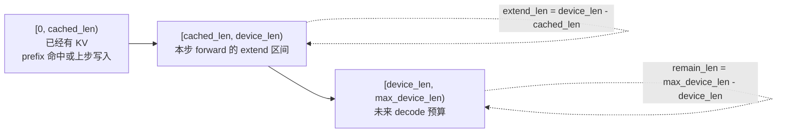

# 第 3 章：核心数据结构 Req / Batch / Context

> 整个引擎的所有调度、分配、forward 决策都围绕这四个数据结构转：`Req`、`Batch`、`Context`、`SamplingParams`。
>
> 这一章把每个字段拆开讲，特别要把 **`cached_len` / `device_len` / `max_device_len` / `extend_len`** 这套长度概念吃透——它是后面 KV 分配、attention metadata、调度判断的共同语言。
>
> 文件位置：[`python/minisgl/core.py`](../../python/minisgl/core.py)，整个文件不到 140 行，建议读完本章后整段重读一遍。

---

## 3.1 SamplingParams：采样参数

最简单的开始：

```python
@dataclass
class SamplingParams:
    temperature: float = 0.0
    top_k: int = -1
    top_p: float = 1.0
    ignore_eos: bool = False
    max_tokens: int = 1024

    @property
    def is_greedy(self) -> bool:
        return (self.temperature <= 0.0 or self.top_k == 1) and self.top_p == 1.0
```

注意几点：
- `temperature == 0.0` 视为 greedy（取 argmax，不走 flashinfer.sampling）。这一点决定了 [`Sampler.prepare`](../../python/minisgl/engine/sample.py:53-68) 在 batch 全 greedy 时返回 `BatchSamplingArgs(temperatures=None)`，省掉一次 softmax+sample。
- `ignore_eos` 用在希望生成"恰好 max_tokens"时——评测、benchmark、不想被 EOS 提前打断的场景。
- `max_tokens` 在 scheduler 收到时还会被裁剪：`max_tokens = min(max_tokens, max_seq_len - input_len)`，保证总长不超模型上限（[`scheduler.py:179-187`](../../python/minisgl/scheduler/scheduler.py)）。

**它是不变的**——一个请求的 SamplingParams 在整个生命周期里不会被修改（除了上面那个截顶）。

---

## 3.2 Req：一个请求的全部状态

```python
@dataclass(eq=False)
class Req:
    input_ids: torch.Tensor  # cpu tensor
    table_idx: int
    cached_len: int
    output_len: int
    uid: int
    sampling_params: SamplingParams
    cache_handle: BaseCacheHandle

    def __post_init__(self):
        assert self.input_ids.is_cpu
        self.device_len = len(self.input_ids)
        self.max_device_len = len(self.input_ids) + self.output_len
        assert 0 <= self.cached_len < self.device_len <= self.max_device_len
```

字段含义对照：

| 字段 | 含义 | 谁修改 |
|------|------|-------|
| `input_ids` | **CPU** 上的 int32 tensor，已知 token id 序列。包括 prompt + 已生成 token | `complete_one`/`append_host` |
| `table_idx` | 这个请求在全局 page_table 里占的行号（[0, max_running_req)） | TableManager |
| `cached_len` | **已经在 KV cache 里** 的 token 数（小于等于 device_len） | CacheManager + `complete_one` |
| `device_len` | **整个序列在 GPU 概念上的当前长度**（已 prefill 完 + 已 decode 完） | `complete_one` |
| `max_device_len` | 这个请求能达到的最大长度（`= input_len + output_len`） | 不变 |
| `cache_handle` | 这个请求当前持有的前缀缓存句柄（`NaiveCacheHandle` 或 `RadixCacheHandle`） | CacheManager |

派生属性：

```python
@property
def remain_len(self):    return self.max_device_len - self.device_len
@property
def extend_len(self):    return self.device_len - self.cached_len
@property
def can_decode(self):    return self.remain_len > 0
```

### 三个长度的关系图



```
input_ids (CPU):    ──┬─────────────────┬─────────────────┬─────
                       0           cached_len        device_len     max_device_len
                      ▲                  ▲                ▲
                      │                  │                │
                      ┝═══════════════════════════════════════════════━━━━━━━━━━━━━━━━━━━━━━━┥
                                                                                       max output frontier
                       │ 已经在 KV cache  │  本步要 prefill │  未来 decode 走到这里
                       │   ↑ 直接复用    │   ↑ extend_len   │
                       │  (无需算 K/V)   │ 这部分要送进网络  │
```

含义：
- `cached_len` 之前的 K/V 已经在 GPU 缓存里（要么是这次 prefix 命中、要么是上一步 prefill 结束后留下的）。
- `[cached_len, device_len)` 是"本步 forward 要 extend 的部分"。Prefill 时 `extend_len = chunk_size` 或全 prompt；decode 时 `extend_len = 1`。
- 之后 `[device_len, max_device_len)` 是未来 decode 还能走的余地。

### `complete_one` 推进游标

```python
def complete_one(self):
    self.cached_len = self.device_len     # 当前已经 forward 过的部分被认为入了 cache
    self.device_len += 1                  # 准备接收下一个新 token
```

它只在 [`Engine.forward_batch`](../../python/minisgl/engine/engine.py:199-200) 末尾调一次：每个请求每跑一次 forward，游标推进一格。

> **关键不变量**：调用 `complete_one` 后，`cached_len == 旧 device_len`。下一次调度时，如果这个请求被放进 decode batch，那 `extend_len = device_len - cached_len = (旧 device_len + 1) - 旧 device_len = 1`——这就是 decode 阶段每步只送 1 个 token 的来源。

### `append_host` 写新 token 到 CPU 端

```python
def append_host(self, next_token):
    self.input_ids = torch.cat([self.input_ids, next_token])
```

GPU 端 sample 出 next_token 之后，会 D2H 拷贝到 CPU，再 append 到 `input_ids`。这一步发生在 `_process_last_data`，由 [scheduler 处理上一步结果时调用](../../python/minisgl/scheduler/scheduler.py:151)。

为什么要在 CPU 端维护这个累积的 `input_ids`？两个原因：
- **chunked prefill 的下一段**：如果 prompt 很长被切成两段 prefill，第二段要从 CPU 端读出 `input_ids[chunk1:chunk1+chunk2]` 拷到 GPU 的 `token_pool` 里（[`prefill.py:_add_one_req`](../../python/minisgl/scheduler/prefill.py:79-81)）。
- **detokenize 不需要它**——detokenize 只看 `next_token` 单个，不读 input_ids。这部分主要是给调度逻辑自己看的。

### `ChunkedReq`：prefill 没干完的中间态

[`scheduler/prefill.py:23-29`](../../python/minisgl/scheduler/prefill.py)：

```python
class ChunkedReq(Req):
    def append_host(self, next_token):
        raise NotImplementedError("ChunkedReq should not be sampled")
    @property
    def can_decode(self):
        return False  # avoid being added to decode manager
```

它继承 Req 但行为不同：**不能被 sample（防御性 raise）**、**不能进 decode 队列**。当一段 prompt 被切成多段做 chunked prefill 时，前面的几段都用 `ChunkedReq` 表示，最后一段才用普通 `Req`。`_process_last_data` 看到 `isinstance(req, ChunkedReq)` 就 `continue` 跳过，不去 sample 它（[`scheduler.py:148-149`](../../python/minisgl/scheduler/scheduler.py)）。

第 10 章会详细讲 chunked prefill。

---

## 3.3 Batch：一组同 phase 的请求

```python
@dataclass
class Batch:
    reqs: List[Req]
    phase: Literal["prefill", "decode"]
    # 由 scheduler 填
    input_ids: torch.Tensor = field(init=False)
    positions: torch.Tensor = field(init=False)
    out_loc: torch.Tensor = field(init=False)
    padded_reqs: List[Req] = field(init=False)
    # 由 attention backend 填
    attn_metadata: BaseAttnMetadata = field(init=False)
```

### Batch 的两个不变量

1. **`phase` 字段是非此即彼**：要么全是 prefill（含 ChunkedReq），要么全是 decode。Scheduler 不会在一个 batch 里混 phase——见 [`_schedule_next_batch`](../../python/minisgl/scheduler/scheduler.py:219-225) "or" 链接：先 prefill manager，没有再 decode manager，永远不混。
2. **Batch 是一次性的**：每跑一步 forward 就构造一个新 Batch。**不要尝试在 batch 之间复用**，否则 `attn_metadata` 等字段是上一步残留。

### `padded_reqs` 与 `padded_size`

Decode 阶段使用 CUDA Graph，要求 batch size 必须是预先捕获过的几个固定值之一（默认 `[1, 2, 4, 8, 16, 24, ...]`）。`padded_reqs` 把 `reqs` 后面接上若干个 `dummy_req` 凑到下一个可用桶位：

```python
# graph.py:160-166
def pad_batch(self, batch):
    padded_size = (
        next(bs for bs in self.graph_bs_list if bs >= batch.size)
        if self.can_use_cuda_graph(batch)
        else batch.size
    )
    batch.padded_reqs = batch.reqs + [self.dummy_req] * (padded_size - batch.size)
```

之后所有"输入张量"用 `padded_reqs`、所有"sample/检测 finish 这种关心真实请求的事情"用 `reqs[: batch.size]`。这是个容易踩的细节：[`Engine.forward_batch`](../../python/minisgl/engine/engine.py:199-202) 末尾 `for req in batch.reqs` 推进游标——dummy 不在 reqs 里，不会被推。

### `out_loc`：写 KV cache 的位置

`batch.out_loc` 是一个一维 GPU int32 tensor，长度 = 本步要写入 cache 的 token 数（即 `sum(extend_len)`）。每个元素是这个 token 的 K/V 应该写到 KV cache 池的哪个 slot。

这个 tensor 由 scheduler 算，由 attention backend 用：

```python
# scheduler.py:_prepare_batch
input_mapping = _make_input_tuple(batch, self.device)   # (token→table_idx, position)
batch.out_loc = self.engine.page_table[input_mapping]   # 用 (table_idx, pos) 查全局 page_table 拿到 slot

# fa.py / fi.py / trtllm.py forward
self.kvcache.store_kv(k, v, batch.out_loc, layer_id)   # K/V 写到 out_loc 指定的位置
```

> 这里 `engine.page_table` 是个 `[max_running_req+1, aligned_max_seq_len]` 的全局 GPU 张量，**按 token 索引**（不是按 page），这样上面这种 `[table_idx, position]` 的二维高级索引就能直接拿到 slot id。第 4 章详细讲。

---

## 3.4 Context：每个引擎进程的全局状态

```python
@dataclass
class Context:
    page_size: int
    page_table: torch.Tensor      = field(init=False)
    attn_backend: BaseAttnBackend = field(init=False)
    moe_backend: BaseMoeBackend   = field(init=False)
    kv_cache: BaseKVCachePool     = field(init=False)
    _batch: Batch | None          = field(default=None, init=False)
```

设计意图：**模型层（Linear、Attention、MoE）写的时候不需要把 KV pool / attn backend / page_table 当 forward 参数传递，而是从 `get_global_ctx()` 拿**。

例如 [`AttentionLayer.forward`](../../python/minisgl/layers/attention.py:47-57)：

```python
def forward(self, qkv):
    ctx = get_global_ctx()
    q, k, v = qkv.split(...)
    q, k = self.rotary.forward(ctx.batch.positions, q, k)
    o = ctx.attn_backend.forward(q, k, v, self.layer_id, ctx.batch)
    return o.view(-1, self.qo_attn_dim)
```

如果要"层签名干净"地传，每个 forward 函数都得加 `ctx, batch` 参数；考虑到 LLM 一层 forward 要堆 4-5 个子模块、每个都得透传，最终大量样板代码。所以用了**模块全局变量**。

代价：
- **不可重入**：`forward_batch` 上下文管理器 [`core.py:115-122`](../../python/minisgl/core.py)) 用 `assert self._batch is None` 防御嵌套。一个进程一次只能跑一个 forward。
- **全局耦合**：set/get 必须谨慎，否则单元测试很难。

### `forward_batch` 上下文管理器

```python
@contextmanager
def forward_batch(self, batch):
    assert self._batch is None, "Nested forward_batch is not allowed"
    try:
        self._batch = batch
        yield
    finally:
        self._batch = None
```

只在两处会调用：
- [`Engine.forward_batch`](../../python/minisgl/engine/engine.py:191-197)：跑实际 forward 时。
- [`GraphRunner._capture_graphs`](../../python/minisgl/engine/graph.py:138-141)：捕获 CUDA graph 时（用 dummy batch）。

### `_GLOBAL_CTX` 单例

```python
_GLOBAL_CTX: Context | None = None

def set_global_ctx(ctx):       # 由 Engine.__init__ 调一次
    global _GLOBAL_CTX
    assert _GLOBAL_CTX is None, "Global context is already set"
    _GLOBAL_CTX = ctx

def get_global_ctx():
    assert _GLOBAL_CTX is not None
    return _GLOBAL_CTX
```

注意 set 时的 assert：**整个进程生命周期里只能 set 一次**。Engine 启动时 set，进程退出才会消失。这也是为什么 mini-sglang 是"一个进程一个 GPU 一个 Context"——TP rank 之间的 Context 是各自的。

---

## 3.5 PendingReq：还没分到资源的请求

[`scheduler/utils.py`](../../python/minisgl/scheduler/utils.py)：

```python
@dataclass
class PendingReq:
    uid: int
    input_ids: torch.Tensor
    sampling_params: SamplingParams
    chunked_req: ChunkedReq | None = None

    @property
    def input_len(self):  return len(self.input_ids)
    @property
    def output_len(self): return self.sampling_params.max_tokens
```

`PrefillManager.pending_list` 里存的就是 PendingReq——它**还没拿到 page_table 槽位、还没分到 KV page**。一旦被 `PrefillAdder.try_add_one` 接受并满足资源约束，就升级为 `Req`（或 `ChunkedReq`）放到 batch.reqs 里。

`chunked_req` 字段：如果上一轮被切成 chunked prefill 了，这个字段记着前面一段对应的 `ChunkedReq`——下次轮到它时不需要重新申请资源，直接接着切下一块（[`prefill.py:96-102`](../../python/minisgl/scheduler/prefill.py)）。

---

## 3.6 一张大表把所有数据结构串起来

| 类 | 生存期 | 拥有者 | 关键字段 |
|----|------|------|--------|
| `SamplingParams` | 不变 | 嵌入到每个 PendingReq / Req | temperature / top_k / top_p / max_tokens |
| `PendingReq` | 等待调度的请求 | `PrefillManager.pending_list` | input_ids (CPU)、chunked_req |
| `Req` | 已分到资源、in-flight | `Batch.reqs` 或 `DecodeManager.running_reqs` | table_idx, cached_len, device_len, cache_handle |
| `ChunkedReq` | prefill 中间块 | 短暂存在于 batch.reqs，下一轮再回到 PendingReq.chunked_req | 同 Req，但不能被 sample |
| `Batch` | 一步 forward 内 | `Scheduler._schedule_next_batch` 创建，forward 结束就丢 | reqs, padded_reqs, input_ids, positions, out_loc, attn_metadata |
| `Context` | 整个进程生命周期 | 每个 engine 进程独有一份 | page_size, page_table, attn_backend, moe_backend, kv_cache, _batch |

---

## 3.7 检查清单

1. **`extend_len` 在 prefill 和 decode 阶段分别等于多少？为什么？**
   <details><summary>参考答案</summary>

   - **Decode**：`extend_len = device_len - cached_len = 1`。每跑完一次 `complete_one`，`cached_len` 就被推到原 `device_len`，然后 `device_len` 加 1，下次调度时差刚好是 1。
   - **Prefill（首次）**：`extend_len = device_len - 0 = input_len`，要把整段 prompt 一次性算 K/V。如果命中 prefix cache，`cached_len = match_len`，`extend_len = input_len - match_len`。
   - **Chunked prefill**：`extend_len = chunk_size`，下一轮再算下一段。

   `extend_len` 是 attention metadata 里 `cu_seqlens_q` 的差分，是写 KV cache 的总 token 数（`out_loc.numel()`）。
   </details>

2. **为什么 `Req.input_ids` 在 CPU 上而不是 GPU 上？**
   <details><summary>参考答案</summary>

   - **GPU 上的副本是 `engine.token_pool`**（`[max_running_req+1, max_seq_len]` 的 int32 tensor，由 [`TableManager`](../../python/minisgl/scheduler/table.py:11) 持有）。`Batch.input_ids` 是从 `token_pool[input_mapping]` 索引出来的，每步 forward 用完即弃。
   - **CPU 副本用于调度逻辑**：chunked prefill 时把"下一段"再 H2D 到 token_pool；某些 prefix cache 命中时把 cached 部分 H2D 到 token_pool（[`prefill.py:60`](../../python/minisgl/scheduler/prefill.py)）。
   - **D2H next_token 后 append**：sample 出来的 token 先到 CPU，再 `req.append_host` 进 input_ids，等下一轮调度（chunked prefill）或调度结束（decode 时仅 cached_len 推进，不需要 input_ids 全长）使用。

   一句话总结：CPU 是"权威记账"，GPU 是"算力工作区"。
   </details>

3. **`Context._batch` 为什么不直接做成 `Engine` 的实例属性？**
   <details><summary>参考答案</summary>

   因为模型层（`AttentionLayer`、`MoELayer`、`ParallelLMHead` 等）需要在 forward 里读到当前 batch（拿 positions、attn_metadata、out_loc），但**模型层没有 Engine 的引用**——它们只在 `BaseOP` 里被组合，参数靠 `state_dict` 加载。

   把 batch 放在 `Context` 这个全局可见的位置 + `forward_batch` 上下文管理器，是"既不污染模型层签名、又能让任意层拿到当前 batch"的折中。代价是 `_batch` 不可重入（同一进程不能并行跑两个 batch）。
   </details>

4. **同一个 Req 在它的生命周期里 `cached_len` 会怎么变化？**
   <details><summary>参考答案</summary>

   ```
   create   :  cached_len = match_len（prefix cache 命中量，可能为 0）
   prefill  :  forward 完后 complete_one → cached_len = device_len = chunk1_end
   chunked2 :  forward 完后 complete_one → cached_len = chunk2_end
   ...
   prefill 全部跑完 :  cached_len = input_len
   decode 1 :  complete_one → cached_len = input_len + 1
   decode 2 :  complete_one → cached_len = input_len + 2
   ...
   finish   :  scheduler 释放资源前，调 cache_manager.cache_req(req, finished=True) 把 KV 插入 prefix cache；req 本身被 GC
   ```

   关键点：每次 `complete_one` 后 `cached_len = 旧 device_len`，然后 `device_len += 1`。这意味着**任意时刻你看到一个 Req，`cached_len` 表示的是"上次 forward 后的 device_len"**。
   </details>

5. **`Batch.padded_reqs` 和 `Batch.reqs` 的边界在哪些地方很关键？**
   <details><summary>参考答案</summary>

   关键边界点：

   - **构造输入张量时 → 用 padded_reqs**：`positions`、`input_mapping`、attn metadata 的 cu_seqlens / page_table 都按 padded_reqs 大小算，否则 CUDA Graph capture 时的形状对不上。
   - **写回 KV cache 时 → 用 reqs**（`_make_write_tuple`）：dummy 的 KV 不该被写到真实 page，[`scheduler.py:262-267`](../../python/minisgl/scheduler/scheduler.py) 里把 dummy 的 `device_len` 设为 `-1`，让 store kernel 跳过这条。
   - **sample 时 → 用 `logits[: batch.size]`**：[`engine.py:202`](../../python/minisgl/engine/engine.py)，padding 的 logits 不参与 sample。
   - **`complete_one` / `append_host` / 检测 finish 时 → 用 reqs**：`for req in batch.reqs`（不含 dummy）。

   写错任意一个都会导致 dummy 请求"污染"真实请求或反之。
   </details>

---

## 下一章预告

下一章我们打开 KV cache 池本身：`MHAKVCache` 在显存里到底长什么样、`page_table` 为什么是 token-level（而不是 page-level）、为什么要 `+1` 留一个 dummy page。建立"内存模型"后，第 5 章我们才能进入 `RadixCache` 的树结构。
