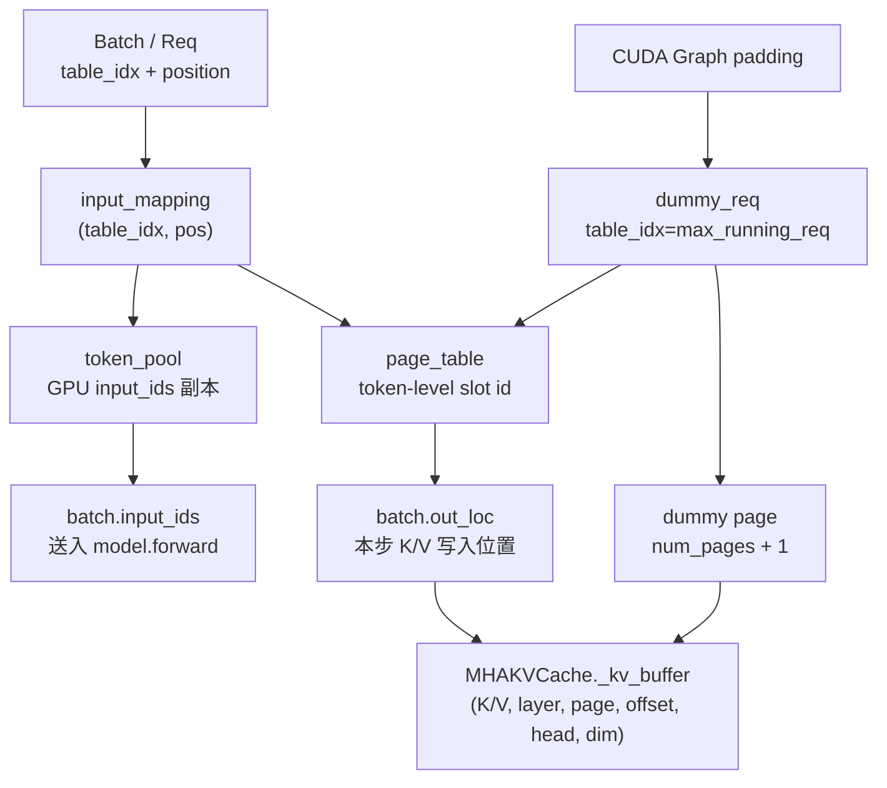

# 第 4 章：KV Cache 池与 Page 分配

> 上一章我们建立了 `cached_len / device_len / extend_len` 的长度概念。这一章讲清楚 **K/V 在显存里到底长什么样**：MHAKVCache 的张量布局、page_table 为什么是 token-level、为什么要多分一个 dummy page。
>
> 这是后续 attention backend 章节、CUDA Graph 章节、prefix cache 章节的物理基础。

---

## 4.1 一张大张量装下所有 KV：MHAKVCache

[`mha_pool.py`](../../python/minisgl/kvcache/mha_pool.py)：

```python
class MHAKVCache(BaseKVCachePool):
    def __init__(self, num_kv_heads, num_layers, head_dim, num_pages, page_size, dtype, device):
        tp_info = get_tp_info()
        local_kv_heads = div_even(num_kv_heads, tp_info.size, allow_replicate=True)
        self._kv_buffer = torch.empty(
            (2, num_layers, num_pages, page_size, local_kv_heads, head_dim),
            device=device, dtype=dtype,
        )
        ...
        self._k_buffer = self._kv_buffer[0]
        self._v_buffer = self._kv_buffer[1]
        self._storage_shape = (num_pages * page_size, local_kv_heads, head_dim)
```

整个 KV 池就是**一个 6 维大张量**：

```
shape = (2, num_layers, num_pages, page_size, local_kv_heads, head_dim)
         ↑     ↑           ↑           ↑              ↑              ↑
       K/V   层 id      page id    page 内 token   头 id（TP 切过） 每头维度
```

> **关于 layout 命名**：FlashInfer / TRT-LLM 文档里把 `[..., heads, head_dim]` 这种"head 维放在 head_dim 之前"的布局叫 **NHD**（N=tokens, H=heads, D=head_dim）；反之 `[..., head_dim, heads]` 叫 **HND**。mini-sglang 用的是 NHD（[`fi.py:95`](../../python/minisgl/attention/fi.py)、[`trtllm.py:73`](../../python/minisgl/attention/trtllm.py) 都显式 `kv_layout="NHD"`）。NHD 对 GQA 友好——`num_kv_heads * head_dim` 是访存连续维度，attention kernel 一次读一个完整 KV head 的所有 dim。
>
> 📚 **延伸阅读**：PagedAttention 概念由 **vLLM (Kwon et al., SOSP 2023, arXiv:2309.06180)** 提出。vLLM 自己的 KV layout 是 `(num_blocks, block_size, num_kv_heads, head_size)` 的 4D（K 和 V 两个独立张量），mini-sglang 多了 K/V 二选一这一维和 layer 维，并把所有层放在一个大 tensor 里——**这意味着 mini-sglang 一次 `torch.empty` 就能拿到全部 KV cache**，不像 vLLM 要循环每层各自 malloc。详见 [`references.md`](./references.md#efficient-memory-management-for-large-language-model-serving-with-pagedattention-vllm)。

举个例子：Llama-3.1-8B（32 层、8 个 KV head、head_dim=128，TP=2、page_size=64、num_pages=10000）：

```
shape = (2, 32, 10000, 64, 4, 128)        # local_kv_heads = 8/2 = 4
nbytes = 2 * 32 * 10000 * 64 * 4 * 128 * 2 (bf16) = 41.94 GB
```

`local_kv_heads` 用 `div_even(num_kv_heads, tp_size, allow_replicate=True)`：
- 当 `tp_size <= num_kv_heads`：每个 rank 拿 `num_kv_heads / tp_size` 个 head（必须整除）。
- 当 `tp_size > num_kv_heads`（GQA 头数少于 GPU 数）：每个 rank **复制**完整的 num_kv_heads（`allow_replicate=True` 的语义）。这是 GQA 的优化——KV head 不切分，只切 Q head。

### 切片访问

`k_cache(layer_id)` 和 `v_cache(layer_id)` 返回的是某一层的 KV 切片：

```python
def k_cache(self, index):
    return self._k_buffer[index]   # shape: (num_pages, page_size, local_kv_heads, head_dim)
```

对 attention backend 来说，它拿到的是单层的 page-aware 5D 张量，正好对得上 FlashAttention / FlashInfer 的 paged kv 接口。

### 写入：`store_kv`

```python
def store_kv(self, k, v, out_loc, layer_id):
    from minisgl.kernel import store_cache
    store_cache(
        k_cache=self._k_buffer[layer_id].view(self._storage_shape),  # 折叠成 (num_tokens, head, dim)
        v_cache=self._v_buffer[layer_id].view(self._storage_shape),
        indices=out_loc,           # int32 tensor of slot indices, len = total tokens to write
        k=k, v=v,
    )
```

`store_cache` 是个自定义 CUDA kernel（[`kernel/store.py`](../../python/minisgl/kernel/store.py)），效果是 `k_cache[indices[i]] = k[i]`、`v_cache[indices[i]] = v[i]`，并行做。

注意 `view(self._storage_shape)` 把 `(num_pages, page_size, ...)` 折成 `(num_pages * page_size, ...)`——也就是说，**KV 池在物理上就是一段连续的 token slot 数组**，page 边界只是个逻辑分组。这就是后面我们能用"token 级 indices"直接索引的关键。

---

## 4.2 `num_pages` 怎么算出来：动态测算

[`Engine._determine_num_pages`](../../python/minisgl/engine/engine.py:148-168)：

```python
def _determine_num_pages(self, old_free_memory, config):
    new_free_memory = self._sync_get_memory()[1]
    cache_per_page = (
        2  # K + V
        * config.model_config.head_dim
        * div_even(num_kv_heads, tp_size, allow_replicate=True)
        * page_size
        * dtype.itemsize
        * num_layers
    )
    if num_pages is None:
        model_memory = old_free_memory - new_free_memory
        available_memory = int(memory_ratio * old_free_memory) - model_memory
        num_pages = available_memory // cache_per_page
    ...
    return num_pages
```

逻辑：
1. **加载模型前**测一次 free memory（`init_free_memory`）。
2. **加载模型后**再测一次（`new_free_memory`）。
3. 二者差值 = 模型权重占用。
4. 总预算 = `memory_ratio * init_free_memory`（默认 0.9）减去模型占用，剩下的全留给 KV cache。
5. 单 page 大小由形状算出来；总预算除以单 page 大小 = 可分配的 page 数。

为什么不用静态预设？因为同样的模型在不同 TP / 不同 dtype / 不同 GPU 上，模型本身占用不同；而且 CUDA / NCCL workspace 也吃显存。这种"测一次、扣掉、剩下全要"的策略最简洁。

`memory_ratio` 默认 0.9 留出 10% 给 attention workspace、CUDA Graph buffer、临时张量等。如果你看到 OOM，先把 `--memory-ratio 0.85` 试一下。

---

## 4.3 `page_size` 的作用与选择

`page_size` 是"一个 page 包多少个 token 的 KV"。它是个调度细节，**不影响 KV 张量的总尺寸**（只影响 num_pages 的取值），但影响：

- **碎片**：每个序列至多浪费一个 page 末尾。`page_size=1` 几乎无碎片，`page_size=64` 最坏浪费 63 个 token slot。
- **kernel 友好度**：FlashAttention / FlashInfer 的 paged kv 内核对 `page_size` 是 16/32/64 时性能更好。
- **TRT-LLM 后端的硬约束**：[`engine/engine.py:_adjust_config:227-229`](../../python/minisgl/engine/engine.py)) 强制 `page_size ∈ {16, 32, 64}`，否则覆写为 64。
- **前缀复用粒度**：RadixCache 的"匹配"是按 page_size 对齐的（`align_down(match_len, page_size)`），page 越大粒度越粗，命中率越低。

默认 `page_size=1`，对小并发场景碎片最少、命中率最高；上 TRT-LLM 后端时被自动改成 64。

---

## 4.4 `page_table`：从 (request, position) 查到具体 slot

`page_table` 是一个二维 GPU int32 tensor：

```python
self.page_table = torch.zeros(
    (config.max_running_req + 1, aligned_max_seq_len),
    dtype=torch.int32, device=self.device,
)   # engine.py:69-73
```

形状 `(max_running_req + 1, aligned_max_seq_len)`，含义：
- 第 1 维：每个并发请求的"槽位"。`max_running_req` 是同时跑几个请求的上限，`+1` 是给 dummy。
- 第 2 维：序列里的 token 位置 `0..max_seq_len`，向上对齐到 32 的倍数（`_align_up_32`）——目的是让 cu_seqlens 之类的索引切片是 128 字节对齐的，硬件友好。

```python
def _align_up_32(num: int) -> int:
    return (num + 31) // 32 * 32
```

注释里说的 "aligned to 128 bytes"——32 个 int32 = 128 字节。

### 关键设计：**token-level indexing**

文件里的注释（[`core.py:103`](../../python/minisgl/core.py)、[`engine.py:66`](../../python/minisgl/engine/engine.py)）反复强调：

```python
# NOTE: 1. aligned to 128 bytes; 2. store raw locations instead of pages
```

意思是 `page_table[req_idx, pos]` 存的是**这个 token 的 K/V 应该放在 KV pool 里的哪个 slot 编号**（slot ∈ [0, num_pages * page_size)），**不是 page id**。

为什么这么做？看一下 [`scheduler.py:_prepare_batch:209-211`](../../python/minisgl/scheduler/scheduler.py)：

```python
input_mapping = _make_input_tuple(batch, self.device)
# input_mapping = (table_idx_tensor, position_tensor)
batch.out_loc = self.engine.page_table[input_mapping]
```

直接用 `(table_idx, position)` 二维高级索引一次拿到所有 slot——**因为 page_table 是 token-level 的，不需要再做 (page_id, intra_page_offset) 的二次解码**。代价是 page_table 占的内存比 page-level 大 `page_size` 倍，但相对于 KV cache 本身这个开销可忽略（page_table 是 int32，KV cache 是 bf16/fp16 + 几十层）。

### 写 page_table：分配新 page 时

[`scheduler/cache.py:_write_page_table:127-146`](../../python/minisgl/scheduler/cache.py)：

```python
def _write_page_table(page_table, allocated, allocation_info, page_size):
    # allocation_info: List[(table_idx, first_page, last_page)]
    needed_tokens = len(allocated)
    table_idx_host = torch.empty(needed_tokens, dtype=torch.int64, pin_memory=True)
    positions_host = torch.empty(needed_tokens, dtype=torch.int64, pin_memory=True)
    offset = 0
    for table_idx, first_page, last_page in allocation_info:
        first_pos, last_pos = first_page * page_size, last_page * page_size
        length = last_pos - first_pos
        table_idx_host[offset : offset + length].fill_(table_idx)
        torch.arange(first_pos, last_pos, out=positions_host[offset : offset + length])
        offset += length
    table_idxs = table_idx_host.to(page_table.device, non_blocking=True)
    offsets    = positions_host.to(page_table.device, non_blocking=True)
    page_table[table_idxs, offsets] = allocated
```

读这段代码：把"哪个请求、哪个位置应该写哪个 slot"先在 CPU 上 pin_memory 拼出来，再 H2D 拷过去做高级索引赋值。`pin_memory + non_blocking=True` 让这次 H2D 异步进行，不阻塞 CPU 调度路径。

---

## 4.5 dummy page 与 dummy req 的来历

[`Engine.__init__`](../../python/minisgl/engine/engine.py:54-110)：

```python
# 多分一个 page，专门给 dummy
self.kv_cache = create_kvcache_pool(num_pages=self.num_pages + 1, ...)
...
self.dummy_req = Req(
    input_ids=torch.tensor([0], ...),
    table_idx=config.max_running_req,    # 占用最后一行 page_table
    cached_len=0, output_len=1, uid=-1,
    sampling_params=None, cache_handle=None,
)
self.page_table[self.dummy_req.table_idx].fill_(num_tokens)   # 整行指向 dummy page 的第一个 slot
```

`dummy_req` 是为了 CUDA Graph **batch padding** 而存在的。第 8 章详细讲，先简单理解：

- CUDA Graph 必须固定 batch_size。比如真实有 13 个 decode 请求，但 Graph 只捕获了 16 这个尺寸，就要 pad 3 个 dummy。
- dummy 也得能跑 attention，所以也得有 page_table 行、有 KV slot——但它的"序列"全部指向同一个 dummy page，写进去也无所谓（不会被 sample，所以 KV 被覆盖也没关系）。
- 之所以 page_table 第一维是 `max_running_req + 1` 不是 `max_running_req`，就是为了塞下 `table_idx = max_running_req` 这个 dummy 行。
- 之所以 num_pages `+1`，就是为了那一个 dummy page。

填充值 `num_tokens`（= num_pages * page_size，刚好是 dummy page 的第一个 slot id）保证 dummy 的所有 token 都"指向" dummy page，互不干扰。

---

## 4.6 token_pool：和 page_table 同形的 input_ids 池

[`scheduler/table.py`](../../python/minisgl/scheduler/table.py)：

```python
class TableManager:
    def __init__(self, max_running_reqs, page_table):
        self._free_slots = list(range(max_running_reqs))
        self.page_table = page_table
        # NOTE: dummy request also use this pool to get the input ids, so we need to
        # make sure the token pool is initialized with valid values (token_id = 0).
        self.token_pool = torch.zeros_like(page_table, dtype=torch.int32)
```

`token_pool` 形状和 `page_table` 完全一样：`(max_running_req + 1, aligned_max_seq_len)`。每行就是某个请求的 input_ids（在 GPU 上的副本）。

这个 pool 的用途：

```python
# scheduler.py:228-231
def _forward(self, forward_input):
    batch, sample_args, input_mapping, output_mapping = forward_input
    batch.input_ids = self.token_pool[input_mapping]      # 用 (table_idx, pos) 一把取出
    forward_output = self.engine.forward_batch(batch, sample_args)
    self.token_pool[output_mapping] = forward_output.next_tokens_gpu   # sample 完写回
```

注意第 2 行 `token_pool[output_mapping] = next_tokens_gpu` 是个**关键的 GPU 端 in-place 写**——把 sample 出来的 next_token 直接写回 token_pool 对应位置，下一步 forward 时就能从 `token_pool[input_mapping]` 索引出来。**不需要 D2H 再 H2D**。

为什么 dummy req 也要用这个 pool？因为 CUDA Graph capture 时 dummy 也得有 input_ids，在 capture buffer 上读取——只要 pool 的初值是合法 token id（0 是任何 vocab 的 padding/EOS，不会让模型崩），dummy forward 就不会引发 IMA。

---

## 4.7 一张关系图

先看结构化版本。理解这张图的关键是：`token_pool` 管 token id，`page_table` 管 token 位置到 KV slot 的映射，`MHAKVCache` 才是真正存 K/V 的大池子。



```
┌──────────────────────────────────────────────────────┐
│ engine.token_pool (max_running_req+1, max_seq_len)   │  ← input_ids 的 GPU 副本
│   row 0  : req 0 的 input_ids                        │
│   row 1  : req 1 的 input_ids                        │
│   ...                                                  │
│   row L-1: req L-1                                    │
│   row L  : dummy_req（永远填 0）                      │
└──────────────────────────────────────────────────────┘
                ▲          ▲
                │          │ (table_idx, pos) → input_id
                │          │
       _make_input_tuple   │
                │          │
┌─────────────────────────────────────────────────────────────┐
│ engine.page_table (max_running_req+1, max_seq_len)          │  ← token → KV slot
│   row 0  [pos0_slot, pos1_slot, ...]                        │
│   row 1  [...]                                              │
│   ...                                                         │
│   row L  [num_tokens, num_tokens, ...]   ← dummy 全指 dummy page│
└─────────────────────────────────────────────────────────────┘
                │ (table_idx, pos) → slot id
                ▼
┌─────────────────────────────────────────────────────────────────┐
│ MHAKVCache._kv_buffer (2, num_layers, num_pages+1, page_size, ..)│
│ flatten 成 (num_pages+1) * page_size 个 slot                    │
│   slot 0..num_tokens-1 : 真实 page                              │
│   slot num_tokens..num_tokens+page_size-1 : dummy page         │
└─────────────────────────────────────────────────────────────────┘
```

每跑一步 forward：
1. CPU 端凑出 `(table_idx, pos)` 二维下标（`_make_input_tuple` / `_make_write_tuple`）。
2. 一次 `H2D` 拷过去，得到 `input_mapping` / `write_mapping`（在 scheduler.stream 上做）。
3. `token_pool[input_mapping]` → `batch.input_ids`（GPU 端 gather）。
4. `page_table[input_mapping]` → `batch.out_loc`（KV 写位置）。
5. 跑 attention，`store_kv(k, v, out_loc, layer_id)` 把 K/V 写到 KV pool。
6. Sample 完，`token_pool[write_mapping] = next_tokens_gpu`。

---

## 4.8 检查清单

1. **`MHAKVCache._kv_buffer` 是 6 维张量，第 1 维（K/V 二选一）和第 3 维（page）能不能调换？**
   <details><summary>参考答案</summary>

   不能。`self._k_buffer = self._kv_buffer[0]`、`self._v_buffer = self._kv_buffer[1]`——如果 K/V 不在最外层，无法做这种零开销 view。
   把 K 和 V 紧挨着放在最外层是为了 `store_kv` 时一次写 K 一次写 V 各自连续，更利于硬件 coalescing。
   而 page 是第 3 维（在 layer 之内），保证**同一层的所有 page 在内存里连续**——attention kernel 一次读一层 KV，page 跨度小，cache friendliness 好。
   </details>

2. **`page_table` 为什么存"token-level slot"而不是"page id"？多花的内存值得吗？**
   <details><summary>参考答案</summary>

   **省下的是查表开销**：每次 forward 都要把 `(table_idx, pos)` 转换成 KV slot；如果 page_table 存的是 page id，就需要算 `slot = page_table[req, pos // page_size] * page_size + pos % page_size`，这是一次 GPU 端 element-wise 计算（比直接索引慢，且不能直接喂给某些 kernel）。

   存 token-level slot 后，`page_table[input_mapping]` 一步就拿到 slot id，可以直接喂给 `store_cache` kernel。

   多花的内存：`(max_running_req+1) * aligned_max_seq_len * 4 bytes`。比如 256 个并发 + 32K 上下文：256 * 32K * 4 = 32 MB——对于 KV cache 自己几十 GB 来说完全可接受。
   </details>

3. **`num_pages + 1` 和 `max_running_req + 1` 是为同一个 dummy 服务吗？**
   <details><summary>参考答案</summary>

   是的，但分别在两个维度上为它服务：
   - `max_running_req + 1`：page_table 多一行给 dummy_req 的 `table_idx = max_running_req`；token_pool 也多一行对应。
   - `num_pages + 1`：KV pool 多一个 page 让 dummy_req 的所有 token 写到那里，不污染真实请求的 KV。

   两者必须同时 +1，否则 CUDA Graph 在 capture dummy batch 时会越界（IMA）。
   </details>

4. **如果你想把 page_size 从 1 改成 64，对 `engine.page_table` 的形状 / 内存占用 / `_make_input_tuple` 的代码有什么影响？**
   <details><summary>参考答案</summary>

   - **page_table 形状不变**：`(max_running_req+1, aligned_max_seq_len)`——它是 token-level 索引，与 page_size 无关。所以代码里的 `page_table[input_mapping]` 不变。
   - **内存占用不变**：page_table 还是这个尺寸。
   - **num_pages 缩 64 倍**：因为 `num_pages * page_size = 总 token slot 数`不变，page_size×64，num_pages÷64。
   - **`_make_input_tuple` 不变**：它只关心 token 位置，不关心 page。
   - **真正受影响的是 `CacheManager.allocate_paged`**：分配按 page 走，每个 page 拿 64 个连续 slot。
   - **Attention backend 受影响**：FA/FlashInfer/TRT-LLM 都要把 token-level page_table 转成 page-level（用 `[:, ::page_size] / page_size`），见 [`fa.py:92-97`](../../python/minisgl/attention/fa.py)。
   </details>

5. **为什么 `token_pool` 要在 GPU 上而不是 CPU 上？**
   <details><summary>参考答案</summary>

   - **避免 H2D 拷贝**：每跑一步 forward 都要从 input_ids 拿到 batch.input_ids。如果 token_pool 在 CPU，每步都要 H2D 拷贝（哪怕 pin_memory + async，也至少 N 个 token × 4 bytes 的拷贝）。
   - **decode 阶段写入 next_tokens_gpu 不需要回到 CPU**：sample 出来的 next_token 直接 in-place 写回 GPU 端 token_pool，省了一次 D2H + H2D。
   - **chunked prefill 时确实有 H2D**：[`prefill.py:80-81`](../../python/minisgl/scheduler/prefill.py) 把 CPU 端 input_ids 的下一段 pin_memory 后异步拷到 GPU 端 token_pool 对应行。这种"按需 H2D"比"每步全量拷"便宜得多。
   </details>

---

## 下一章预告

下一章我们终于进入 mini-sglang 最有特色的部分：**RadixCache**——把"前缀树"装进 KV 池，让相同 prompt 前缀跨请求复用。我们会拆解 `RadixTreeNode` 的结构、`split_at` 的写时分裂逻辑、`evict` 的 LRU 算法、引用计数怎么和 CacheManager 协作。
