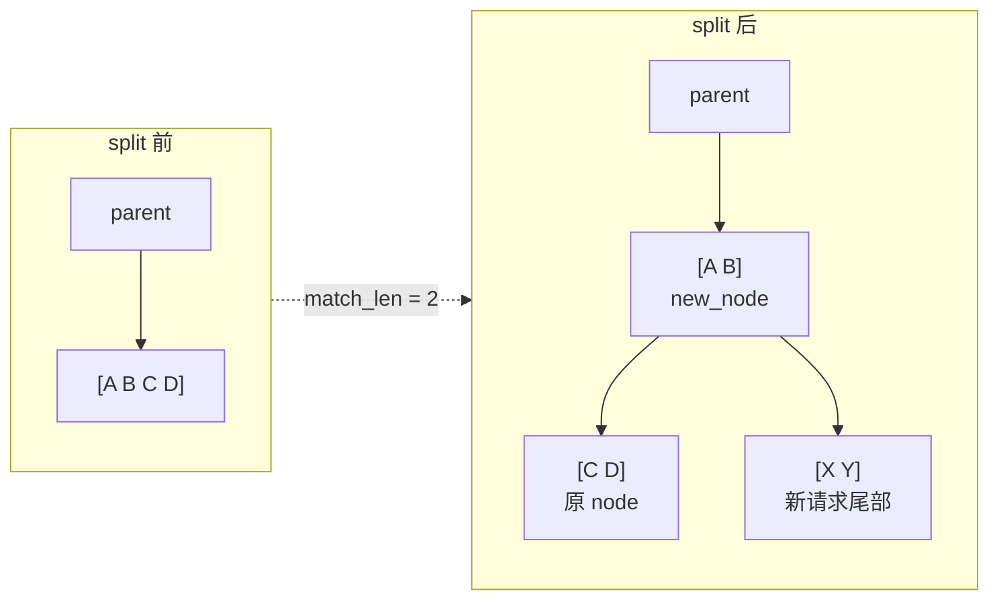

# 第 5 章：Radix Cache 与前缀复用

> 上一章我们建立了 KV cache 的物理布局。这一章讲清楚 **mini-sglang 如何让相同 prompt 前缀跨请求复用 KV**——这是它名字里"sglang"那部分的灵魂，也是面试常被问到的"vLLM/SGLang prefix cache 怎么实现"的标准答案。
>
> 入口文件：[`python/minisgl/kvcache/radix_cache.py`](../../python/minisgl/kvcache/radix_cache.py)。配套文件：[`scheduler/cache.py`](../../python/minisgl/scheduler/cache.py)、[`kvcache/base.py`](../../python/minisgl/kvcache/base.py)。
>
> 📚 **算法来源**：本章实现的就是 **SGLang (Zheng et al., NeurIPS 2024, arXiv:2312.07104)** 论文 §4 提出的 **RadixAttention** 算法。核心三件事 ① 用 radix tree（不是 hash chain）管理 cached prefix；② 引用计数避免 in-flight 请求被 evict；③ LRU eviction 配合 page-aligned 分配。论文 §8.2 实测在多轮对话 / few-shot prompt 场景比 vLLM v0 朴素 paged KV 提升 2-5×。详见 [`references.md`](./references.md#sglang-efficient-execution-of-structured-language-model-programs)。

---

## 5.1 直觉：什么样的前缀值得复用

观察 LLM 服务里的 prompts：

```
请求 A: [system: 你是一个助手] [user: 北京天气怎么样？]
请求 B: [system: 你是一个助手] [user: 上海天气怎么样？]
请求 C: [system: 你是一个助手] [user: 给我讲个笑话]
```

三个请求都有相同的 system prompt 前缀。在朴素方案下，每个请求各走一次完整 prefill；但其实它们前缀部分的 K/V 算出来都一样——能不能算一次、给三家用？

这就是 **prefix caching**。把"算完不丢"变成"算完插入到一个数据结构里、新请求来时先查一下"。

mini-sglang 实现了两种 prefix cache：
- **NaiveCache**（[`naive_cache.py`](../../python/minisgl/kvcache/naive_cache.py)）：什么都不做。`match_prefix` 永远返回 `cached_len=0`。
- **RadixCache**（[`radix_cache.py`](../../python/minisgl/kvcache/radix_cache.py)）：基于 radix tree（前缀压缩树）的真实实现。**默认值，也是本章主角**。

---

## 5.2 接口约定：`BasePrefixCache`

[`kvcache/base.py:67-135`](../../python/minisgl/kvcache/base.py)：

```python
class BasePrefixCache(ABC):
    @abstractmethod
    def match_prefix(self, input_ids) -> MatchResult: ...
    @abstractmethod
    def insert_prefix(self, input_ids, indices) -> InsertResult: ...
    @abstractmethod
    def evict(self, size) -> torch.Tensor: ...
    @abstractmethod
    def lock_handle(self, handle, unlock=False) -> None: ...
    @property @abstractmethod
    def size_info(self) -> SizeInfo: ...
```

理解这 5 个接口的语义就能理解 RadixCache 在干什么：

| 接口 | 输入 | 输出 | 时机 |
|------|------|-----|-----|
| `match_prefix(input_ids)` | 一条请求的 input_ids | `(handle, cached_len)` 表示已缓存多长前缀 | 调度时，决定 extend_len |
| `insert_prefix(input_ids, indices)` | 这次 prefill 完毕的 input_ids 和它们的 KV slot | 新 handle | prefill 跑完后回插 |
| `evict(size)` | 要释放至少多少 token slot | 被释放的 slot 列表 | KV pool 不够用时 |
| `lock_handle(handle, unlock)` | 锁/解锁某个 handle | - | 防止 in-flight 请求引用的节点被驱逐 |
| `size_info` | - | `SizeInfo(evictable_size, protected_size)` | 调度时算可用空间 |

接下来重点拆 RadixCache。

---

## 5.3 数据结构：RadixTreeNode

[`radix_cache.py:17-85`](../../python/minisgl/kvcache/radix_cache.py)：

```python
class RadixTreeNode:
    def __init__(self, key_fn, tic=None):
        self.children: Dict[Any, RadixTreeNode] = {}    # key 是 token id（page_size=1）或 tuple（page_size>1）
        self._parent: RadixTreeNode | None = None
        self.ref_count: int = 0
        self.timestamp = tic or time.monotonic_ns()      # LRU 用
        # set_key_value() 之后填的：
        self._key:    torch.Tensor   # 这条边对应的 token id 序列（CPU）
        self._value:  torch.Tensor   # 对应的 KV slot 序列（GPU）
        self._length: int            # = len(key) = len(value)
```

Radix tree（前缀压缩树）的特点是"每条边可以代表多个字符（这里是 token），不像普通 trie 每条边一个字符"。例如下图：

```
                 root
              /      \
         "你 好"    "今 天"
         /    \           \
   ", 我 是"  "！"         " 天 气 ..."
   /
"小 明"
```

每个节点记录"父→自己"这条边上的 token 序列（`_key`）和对应的 KV slot 序列（`_value`）。从 root 到任意节点串一遍 `_key`，就是"这一支前缀"的完整 token id；串一遍 `_value` 就是对应的 KV slot。

mini-sglang 的实现要点：

1. **`children` 用 dict 索引**：但 key 不是整条 `_key`，而是 `key_fn(_key)`——它取第一个 token（page_size=1）或前 page_size 个 token 的元组（page_size>1）。这样查"是否有以 `t0` 开头的子节点"是 O(1) hash 查找。
2. **`_key` 在 CPU、`_value` 在 GPU**：因为 `_key` 用来匹配 input_ids（CPU 端），`_value` 是要传给 attention kernel 的 KV slot（必须在 GPU）。
3. **`ref_count`**：有几个 in-flight 请求引用着这条边。>0 时不能 evict。
4. **`timestamp`**：节点最近一次被访问的时间。`evict` 时优先驱逐 timestamp 老的节点（LRU）。

---

## 5.4 `_tree_walk`：怎么匹配前缀

[`radix_cache.py:205-231`](../../python/minisgl/kvcache/radix_cache.py)：

```python
def _tree_walk(self, input_ids):
    prefix_len = 0
    indice_len = len(input_ids)
    node = self.root_node
    tic = time.monotonic_ns()

    while prefix_len < indice_len:
        child_node = node.children.get(self.key_fn(input_ids[prefix_len:]))
        if child_node is None:
            return node, prefix_len   # 走不下去了，返回当前节点

        node = child_node
        match_len = node.get_match_len(input_ids[prefix_len:])  # 用 fast_compare_key 算最长公共前缀
        match_len = align_down(match_len, self.page_size)        # 必须按 page 对齐
        prefix_len += match_len

        if match_len != node.length:
            # 这条边没完全匹配上，要把节点 split
            node = node.split_at(match_len)
            node.timestamp = tic
            return node, prefix_len

        node.timestamp = tic   # 完整命中本节点的边，继续往下
    return node, prefix_len
```

逐步看：
1. 从 root 出发，看 `input_ids[0]`（或 `input_ids[:page_size]`）能不能在 children 里找到对应的子节点。
2. 找到后，调 [`get_match_len`](../../python/minisgl/kvcache/radix_cache.py:63-67) 比较这条边的 `_key` 和 `input_ids[prefix_len:]` 的最长公共前缀（用自定义 CUDA kernel `fast_compare_key`，比 Python 循环快得多）。
3. 把匹配长度向下对齐到 `page_size`——保证只复用"完整 page"，因为 KV cache 的写入是按 page 做的。
4. 如果匹配长度等于这条边的全长，就走过这条边继续找下一层；否则要 **split**。

### `split_at`：写时分裂

下面这张图对应"树里已有 `[A B C D]`，新请求是 `[A B X Y]`"的情况。`split_at(2)` 不是复制整条路径，而是把一条长边拆成"公共前缀边 + 原尾部边"，然后在公共前缀节点下挂新尾部。



```python
def split_at(self, pos):
    parent = self.parent
    new_node = RadixTreeNode(self.key_fn, self.timestamp)
    new_node.set_key_value(self._key[:pos], self._value[:pos])
    new_node.set_parent(parent)
    new_node.ref_count = self.ref_count

    self.set_key_value(self._key[pos:], self._value[pos:])  # 自己留尾巴
    self.set_parent(new_node)                                # 重挂为 new_node 的子
    return new_node
```

举例：树里已有 `["A", "B", "C", "D"]` 的边，现在来了 `["A", "B", "X", "Y"]`：
- 走到该边，匹配长度 2。
- 在 pos=2 处 split：
  ```
  原: parent → [A B C D] (node)
  新: parent → [A B] (new_node) → [C D] (node, 原节点)
                          ↑ ref_count 复制给 new_node 一份；node 也保留
  ```
- 返回 `new_node`，外面的 `insert_prefix` 会在它下挂一条新边 `[X Y]`。

> **Timestamp 复刻**：`new_node` 用了 `self.timestamp`——继承原节点的访问时间，避免分裂出来后立刻被 evict。
>
> **ref_count 也复制**：原本指向 node 的所有 handle 现在路径多了一段，**它们的引用还是要算到祖先身上**。`lock_handle` 的实现里会一路向上 `node.ref_count += 1`，所以 split 后的 new_node 自然继承到原节点的 ref count。

---

## 5.5 `match_prefix` 与 `RadixCacheHandle`

```python
def match_prefix(self, input_ids):
    node, prefix_len = self._tree_walk(input_ids)
    return MatchResult(RadixCacheHandle(prefix_len, node))
```

返回的 `handle.cached_len = prefix_len`。这就是请求的"已经在 cache 里"的 token 数。

`RadixCacheHandle.get_matched_indices`（[`radix_cache.py:91-98`](../../python/minisgl/kvcache/radix_cache.py)）：

```python
def get_matched_indices(self):
    node = self.node
    value_list = []
    while not node.is_root():
        value_list.append(node.value)
        node = node.parent
    value_list.reverse()
    return torch.cat(value_list)
```

从匹配到的叶子节点一路回到 root，把每条边的 `_value`（KV slot）串起来，就是"前缀部分对应的所有 KV slot"——这些会被 [`PrefillAdder._try_allocate_one`](../../python/minisgl/scheduler/prefill.py:39-63) 用来填 page_table 里"已 cached 的部分"，从而免去重新算这部分 K/V。

> 注意 `get_matched_indices` 每次调用都做一次 `torch.cat`——它不是常驻的拼接结果。所以**只在 prefill 准备阶段用一次**，不要在循环里反复调。

---

## 5.6 `insert_prefix`：把新算的 KV 装回树

prefill 跑完后，scheduler 会把 `[0, req.cached_len)` 的 KV 插回 prefix cache（[`scheduler/cache.py:cache_req:55-79`](../../python/minisgl/scheduler/cache.py)）。RadixCache 的 [`insert_prefix`](../../python/minisgl/kvcache/radix_cache.py:136-146)：

```python
def insert_prefix(self, input_ids, indices):
    insert_len = align_down(len(input_ids), self.page_size)
    input_ids, indices = input_ids[:insert_len], indices[:insert_len]
    node, prefix_len = self._tree_walk(input_ids)
    if prefix_len != insert_len:                        # NOTE: prefix_len < insert_len
        new_node = RadixTreeNode(self.key_fn)
        new_node.set_key_value(input_ids[prefix_len:], indices[prefix_len:].clone())
        new_node.set_parent(node)
        self.evictable_size += new_node.length
        node = new_node
    return InsertResult(prefix_len, RadixCacheHandle(insert_len, node))
```

逻辑：
1. 算可对齐的插入长度。
2. 先 walk 一遍，看树里已有多少前缀（如果别的请求并发也走完了同样的 prefill，可能已经有一部分在树里）。
3. 如果还有"完全新"的部分（`prefix_len < insert_len`），新建一个节点挂上去，把新增 token 的 indices clone 过去（必须 clone——因为 indices 是 page_table 的视图，请求结束后会被释放，但树要持有这份数据）。
4. 返回的 `cached_len = prefix_len` 是"插入前已存在的部分"——CacheManager 会用这个值决定哪些 indices 是冗余的、可以释放掉。

`InsertResult` 的语义在 [`scheduler/cache.py:cache_req`](../../python/minisgl/scheduler/cache.py:55-79) 的注释里讲得很细，第 6 章会详细讲整个 `cache_req` 的复杂状态机。

---

## 5.7 `evict`：LRU 驱逐

```python
def evict(self, size):
    if size == 0: return self.empty_tensor
    leave_nodes = self._collect_leave_nodes_for_evict()  # 所有 ref_count==0 的叶子
    heapq.heapify(leave_nodes)                            # 按 timestamp 排序的最小堆
    evicted_indices = []
    evicted_size = 0

    while evicted_size < size:
        node = heapq.heappop(leave_nodes)                # 最老的叶子
        evicted_size += node.length
        evicted_indices.append(node.value)
        self.evictable_size -= node.length
        parent = node.parent
        del parent.children[self.key_fn(node._key)]      # 从树里摘掉
        if parent.is_leaf() and parent.ref_count == 0:
            heapq.heappush(leave_nodes, parent)          # 父节点变成新叶子，可能也要 evict

    return torch.cat(evicted_indices)
```

注意几点：

1. **只 evict 叶子**：因为叶子才能"安全摘下来"——内部节点被人当作前缀引用的可能性更高，且它的 KV 被祖先路径用着。
2. **基于 timestamp 的 LRU**：`heapq.heappop` 弹出 timestamp 最小（最老）的。
3. **链式驱逐**：摘掉一个叶子后，父节点可能变成新叶子，再次塞回堆里继续 evict。
4. **`ref_count > 0` 的节点不参与 `_collect_leave_nodes_for_evict`**——这就是 prefix cache "锁住正在用的前缀"的机制。

---

## 5.8 `lock_handle`：让 in-flight 请求免于被 evict

[`radix_cache.py:113-130`](../../python/minisgl/kvcache/radix_cache.py)：

```python
def lock_handle(self, handle, unlock=False):
    node = handle.node
    if unlock:
        while not node.is_root():
            node.ref_count -= 1
            if node.ref_count == 0:
                self.evictable_size += node.length
                self.protected_size -= node.length
            node = node.parent
    else:
        while not node.is_root():
            if node.ref_count == 0:
                self.evictable_size -= node.length
                self.protected_size += node.length
            node.ref_count += 1
            node = node.parent
```

逻辑：从 handle 持有的节点一路向上到 root，把路径上每个节点的 ref_count 增/减 1。**ref_count 从 0 变 1 时**把节点从 evictable 移到 protected；**从 1 变 0 时**反向。

这两个统计量决定了 `size_info`：

```python
@property
def size_info(self):
    return SizeInfo(evictable_size=self.evictable_size, protected_size=self.protected_size)
```

`evictable_size` 是"如果 evict 我能拿回多少 slot"。`available_size`（[`scheduler/cache.py:33-34`](../../python/minisgl/scheduler/cache.py)）= `evictable_size + free_slots * page_size`——在调度判断"还能不能再加新请求"时，evictable 部分也算可用，因为不够时可以临时驱逐。

---

## 5.9 CacheManager：把 RadixCache 接入 KV pool

[`scheduler/cache.py:CacheManager`](../../python/minisgl/scheduler/cache.py) 是 RadixCache 和真实 KV pool 之间的胶水层。它持有：
- `free_slots`：还没被任何节点占用的 KV slot 列表（**page-aligned**——元素是 page 起始 slot id，间隔 `page_size`）。
- `prefix_cache`：上面讲的 RadixCache 实例。

### `_allocate`：先找 free，再 evict

[`cache.py:106-113`](../../python/minisgl/scheduler/cache.py)：

```python
def _allocate(self, needed_pages):
    if needed_pages > (free_pages := len(self.free_slots)):
        evicted = self.prefix_cache.evict((needed_pages - free_pages) * self.page_size)
        self.free_slots = torch.cat([self.free_slots, evicted[::self.page_size]])
        assert len(self.free_slots) >= needed_pages, "Eviction did not free enough space."
    allocated = self.free_slots[:needed_pages]
    self.free_slots = self.free_slots[needed_pages:]
    return allocated
```

策略是 **lazy eviction**：只有在 free 不够时才去驱逐。这样 RadixCache 的命中机会最大化（不主动清理）。

### `cache_req`：把 in-flight 的 KV 收回

最复杂的函数，注释里画了张表（[`cache.py:55-79`](../../python/minisgl/scheduler/cache.py)）：

```
# ==================================== valid cache region ====================================
# [0, req.cached_len)                       This part is valid for attention kernel read/write.
# [0, old_handle.cached_len)                This part is in the prefix cache before prefill.
# [old_handle.cached_len, req.cached_len)   This part is allocated by cache manager for this request.
# ================================== allocated cache region ==================================
# [old_handle.cached_len, cached_len)       This part was not in the prefix cache when prefill,
#                                           but later cached by other requests.
#                                           We must free them to avoid memory leak.
# [cached_len, new_handle.cached_len)       This part is newly inserted into the prefix cache.
# [new_handle.cached_len, req.cached_len)   This part is tailing part that can not be inserted
#                                           into the prefix cache. We should free it if the request
#                                           has finished.
```

逐步看代码：

```python
def cache_req(self, req, *, finished):
    insert_ids = req.input_ids[: req.cached_len]
    page_indices = self.page_table[req.table_idx, : req.cached_len]
    old_handle = req.cache_handle
    cached_len, new_handle = self.prefix_cache.insert_prefix(insert_ids, page_indices)

    self.unlock(old_handle)                                          # ① 旧 handle 解锁
    self._free(page_indices[old_handle.cached_len : cached_len])     # ② 重复部分回收
    if finished:
        self._free(page_indices[new_handle.cached_len :])            # ③ 不能成 page 的尾巴回收
    else:
        req.cache_handle = new_handle                                # ④ 切换到新 handle
        self.lock(new_handle)
```

四种情况都要正确处理：
- **①**：旧 handle 是 prefill 开始前 match 到的，prefill 期间被锁住。现在请求要么结束、要么进入 decode 阶段，都不再需要这个旧 handle，先解锁。
- **②**：本请求 prefill 期间，可能有别的请求并发跑了同样的前缀并把它们插进了树里。`old_handle.cached_len` 之前是它进 prefill 时已 cached 的，`cached_len`（insert_prefix 返回的）是 insert 时已 cached 的——中间这段表示"被别人也插了一份"，本请求的副本是冗余的，必须 free 防止泄露。
- **③**：如果请求结束，且尾部有不够一个 page 的部分（`new_handle.cached_len < req.cached_len`），这部分没法插树（必须 page-aligned），直接 free 掉。
- **④**：请求未结束（要继续 decode），把 cache_handle 换成新插入的 handle 并锁住——这样后续 decode 时这条树的边不会被 evict。

> 这段是整个 mini-sglang 里最容易写错的地方。注释非常详尽，建议读代码时把注释当伪代码来看。

### `lazy_free_region`：把 free 操作攒起来

[`cache.py:93-104`](../../python/minisgl/scheduler/cache.py)：

```python
@contextmanager
def lazy_free_region(self):
    def lazy_free(indices):
        lazy_free_list.append(indices[::self.page_size])
    lazy_free_list = []
    try:
        self._free = lazy_free
        yield
    finally:
        del self._free
        self.free_slots = torch.cat([self.free_slots] + lazy_free_list)
```

`_process_last_data`（[`scheduler.py:146`](../../python/minisgl/scheduler/scheduler.py)）调用时被这个 context manager 包着。一次处理一组 reply 时，所有 `_free` 调用都被攒起来，最后一次性 `torch.cat` 拼回 `free_slots`——避免每个请求都做一次小规模 cat（GPU 上 cat 开销不便宜）。

---

## 5.10 检查清单

1. **如果 `page_size=4`，请求 A 的 prompt 是 `[t0, t1, t2, t3, t4]`（5 个 token），prefill 完后 `insert_prefix` 会插入多长？**
   <details><summary>参考答案</summary>

   **4 个 token**。`insert_prefix` 第一行就 `align_down(5, 4) = 4`，把不够一个 page 的尾巴丢掉。剩下的 `[t0..t3]` 这 4 个 token + 对应的 4 个 KV slot 组成一条新边。

   **t4 的 K/V 还在 page_table 里、attention kernel 还能正确读到**——只是 cache 不持有它。如果请求结束，t4 的 slot 走 `cache_req(finished=True)` 里的"③ 尾巴回收"路径被释放回 free_slots。
   </details>

2. **两个并发请求 A 和 B，都用同样的 system prompt 前缀。它们各自命中树时，得到的 `RadixCacheHandle.node` 是同一个吗？引用计数怎么变化？**
   <details><summary>参考答案</summary>

   **是同一个节点**——RadixCache 不为每个请求复制，只是返回路径上同一个尾节点的引用。

   ref_count 变化：
   - A 进 prefill 时：`PrefillAdder._try_allocate_one` 调 `cache_manager.lock(handle_A)`，路径上每个节点 ref_count +1。
   - B 进 prefill 时：同样 lock，又 +1。此时这些节点 ref_count = 2，protected_size 不会重复加（因为只有从 0 变 1 才加；维持的过程不算）。
   - A 完成、unlock：每个节点 -1，回到 1。
   - B 完成、unlock：每个节点 -1，回到 0。这时 evictable_size 才把这段加回来。
   </details>

3. **为什么 RadixCache 的 `match_prefix` 必须 `align_down(match_len, page_size)`？如果不对齐会出什么问题？**
   <details><summary>参考答案</summary>

   因为 KV cache 的写入和分配都是按 page 进行的——一个 page 要么完整属于某条边的 value，要么完整不属于。如果允许"半个 page"匹配，会出现：
   - 同一个 page 既被某条边的 value 持有（一部分 token 在树里），又被同一请求的"未匹配 tail"持有（另一部分 token 不在树里）——所有权混淆。
   - evict 时该 page 算 evictable 还是 protected？如果半属于树半属于活跃请求，逻辑会非常乱。

   对齐到 page_size 强制了"page 是树的最小数据单位"，所有权清晰、evict 逻辑简洁。代价是命中长度可能比理论最长前缀少几个 token，影响很小。
   </details>

4. **`RadixCache.evict` 用 `heapq` 而不是简单的 list.sort()，差别在哪？**
   <details><summary>参考答案</summary>

   `heapq.heappop` + `heappush` 是 O(log n)，且支持"动态加入新叶子"——驱逐一个叶子后，它的父节点可能变成新叶子，要塞回堆里继续淘汰。这是个**动态堆**的场景。

   如果用 `list.sort()`，每加入新叶子都得重排，O(n log n)；遍历过程中堆需要不断维护，sort 没法做。

   实际还有个小细节：`RadixTreeNode.__lt__` 比较的是 `timestamp`，所以堆是按 timestamp 升序、最老的优先弹出。
   </details>

5. **`cache_req` 注释里说"被并发请求插了一份所以要 free"是怎么发生的？给个例子。**
   <details><summary>参考答案</summary>

   场景：
   - t0：请求 A 进 prefill，prompt = [t0..t999]。`match_prefix` 返回 cached_len=0，分配 1000 个 slot 算 K/V。
   - t1：请求 B 进 prefill，prompt = [t0..t999]（一样）。`match_prefix` 也返回 cached_len=0（A 还没插完）。也分配 1000 个 slot 算 K/V。
   - t2：A 跑完 prefill，调 `cache_req(finished=False)`：`insert_prefix` 一查，树里没有，新建节点持有 A 的 1000 个 slot。`old_handle.cached_len = 0`、`new_handle.cached_len = 1000`。中间这段 `(0, 0)` 是空的，没东西要 free。
   - t3：B 跑完 prefill，调 `cache_req(finished=False)`：`insert_prefix` 一查，**树里已经有 A 的版本了**——`prefix_len = 1000`。返回 `cached_len = 1000`、`new_handle.cached_len = 1000`，但 `new_handle.node` 指向 A 的那个节点。
   - 此时 B 的 `page_indices[0:1000]` 是它自己分配的 slot（指向 B 算出来的 K/V），但树里持有 A 的版本——B 的这一份冗余了。
   - `_free(page_indices[old_handle.cached_len(0) : cached_len(1000)])` 就是把 B 自己算的那 1000 个 slot 全释放掉，让它们回到 free_slots。

   这种"并发插入冗余"是 prefix cache 的一个典型 race，被 `cache_req` 的 `[old_handle.cached_len, cached_len)` 段优雅处理掉了。
   </details>

---

## 下一章预告

下一章我们登堂入室进入 **`Scheduler` 主循环**：四个 Manager（Prefill / Decode / Cache / Table）怎么协作、`_schedule_next_batch` 的 prefill-first 策略、token budget 的计算、pending list 怎么转换成 Batch。
