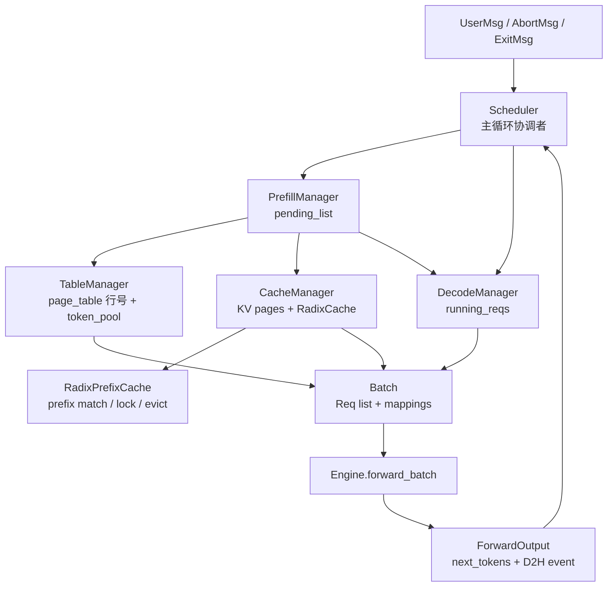

# 第 6 章：Scheduler 与四个 Manager

> 上几章我们建立了：消息流（第 2 章）、数据结构（第 3 章）、KV 物理布局（第 4 章）、前缀复用（第 5 章）。这一章把它们绑起来——`Scheduler` 怎么用 4 个 Manager 在每一步之间分发资源、决定下一步 batch 是什么。
>
> 入口：[`scheduler/scheduler.py`](../../python/minisgl/scheduler/scheduler.py)、[`scheduler/prefill.py`](../../python/minisgl/scheduler/prefill.py)、[`scheduler/decode.py`](../../python/minisgl/scheduler/decode.py)、[`scheduler/cache.py`](../../python/minisgl/scheduler/cache.py)、[`scheduler/table.py`](../../python/minisgl/scheduler/table.py)。

---

## 6.1 四个 Manager 的分工

把第 0 章里那张"矛盾→组件"的表细化：

| Manager | 管什么 | 数据 | 主要操作 |
|---------|------|-----|--------|
| `PrefillManager` | 还没开始算的请求 | `pending_list: List[PendingReq]` | `add_one_req` / `schedule_next_batch(budget)` / `abort_req` |
| `DecodeManager` | 已 prefill 完、正在 decode 的请求 | `running_reqs: Set[Req]` | `filter_reqs` / `schedule_next_batch` / `abort_req` |
| `CacheManager` | KV slot 池子 + 前缀复用树 | `free_slots`、`prefix_cache` | `match_req` / `lock` / `unlock` / `allocate_paged` / `cache_req` / `evict` |
| `TableManager` | 序列槽位（page_table 的行号） | `_free_slots: List[int]`（行号池） | `allocate` / `free` |

`Scheduler` 不持有"业务状态"，它是**协调者**——4 个 Manager 各自管一类资源，Scheduler 在主循环里把它们组合起来。



实例化在 [`Scheduler.__init__`](../../python/minisgl/scheduler/scheduler.py:46-77)：

```python
self.engine = Engine(config)
self.table_manager = TableManager(config.max_running_req, self.engine.page_table)
self.cache_manager = CacheManager(
    self.engine.num_pages, config.page_size, self.engine.page_table, config.cache_type
)
self.decode_manager = DecodeManager(config.page_size)
self.prefill_manager = PrefillManager(
    self.cache_manager, self.table_manager, self.decode_manager
)
```

注意 `PrefillManager` **持有** cache/table/decode manager 的引用——因为它在选 batch 时要询问"我们还有没有 KV slot"、"还有没有空闲 table 行"、"目前 in-flight decode 占用了多少未来 token"。这是 mini-sglang 里耦合最深的一处。

---

## 6.2 `TableManager`：最简单的资源池

[`scheduler/table.py`](../../python/minisgl/scheduler/table.py)：

```python
class TableManager:
    def __init__(self, max_running_reqs, page_table):
        self._max_running_reqs = max_running_reqs
        self._free_slots = list(range(max_running_reqs))
        self.page_table = page_table
        self.token_pool = torch.zeros_like(page_table, dtype=torch.int32)

    @property
    def available_size(self):
        return len(self._free_slots)

    def allocate(self):
        return self._free_slots.pop()

    def free(self, slot):
        self._free_slots.append(slot)
```

仅仅是一个**行号池**——分配出去就是一个 `int`（page_table 的行号），还回来 push 回去。`token_pool` 是 GPU 上和 page_table 同形状的 input_ids 副本（第 4.6 节），由 TableManager 持有不奇怪——一个对象管"序列槽位"的所有元数据。

`max_running_req` 默认 256（[`engine/config.py`](../../python/minisgl/engine/config.py)），意思是 mini-sglang 同时最多 256 个 in-flight 请求；超过的会留在 PrefillManager 的 pending_list 里等。

---

## 6.3 `DecodeManager`：running set + inflight tokens

[`scheduler/decode.py`](../../python/minisgl/scheduler/decode.py)：

```python
@dataclass
class DecodeManager:
    page_size: int
    running_reqs: Set[Req] = field(default_factory=set)

    def filter_reqs(self, reqs):
        self.running_reqs = {req for req in self.running_reqs.union(reqs) if req.can_decode}

    def schedule_next_batch(self):
        if not self.runnable: return None
        return Batch(reqs=sorted(self.running_reqs, key=lambda req: req.uid), phase="decode")

    @property
    def inflight_tokens(self):
        tokens_reserved = (self.page_size - 1) * len(self.running_reqs)
        return sum(req.remain_len for req in self.running_reqs) + tokens_reserved
```

几个值得注意的点：

### 为什么 `schedule_next_batch` 要按 `uid` 排序

`running_reqs` 是一个 **`Set[Req]`**，而 Python set 的迭代顺序是由对象 hash 决定的、**进程间不保证一致**。在 TP > 1 时，每个 rank 是一个独立进程、各自维护自己的 `DecodeManager`；如果直接 `list(self.running_reqs)`，不同 rank 排出来的 decode batch 里请求顺序可能不同。

这会出问题：batch 里请求的排列顺序决定了它们在 KV page table、attention metadata、采样输出里的**行号**。各 rank 顺序不一致 → 同一个 token 在不同 rank 上被算进了不同的 slot → all-reduce/all-gather 时对不齐 → 输出错乱甚至 hang。

修复（[#113](https://github.com/sgl-project/mini-sglang/pull/113)）很简单：[`decode.py:35`](../../python/minisgl/scheduler/decode.py) 用 `sorted(self.running_reqs, key=lambda req: req.uid)` 把顺序钉死。`uid` 全局唯一且各 rank 一致（rank 0 广播 `UserMsg` 时带的就是同一个 uid），于是所有 rank 排出来的 decode batch 顺序必然相同。prefill batch 不需要这层处理，因为它是顺序遍历 `pending_list`（FIFO list，本身有序）构造的。

> 小结：**凡是跨 TP rank 必须逐字节一致的结构，都不能依赖 set/dict 的迭代顺序**——要么用有序容器，要么显式 sort by 一个各 rank 一致的 key。这是分布式推理里很典型的一类坑。

### `filter_reqs` 是怎么被调用的

[`scheduler.py:_forward:228-233`](../../python/minisgl/scheduler/scheduler.py)：

```python
def _forward(self, forward_input):
    ...
    forward_output = self.engine.forward_batch(batch, sample_args)
    ...
    self.decode_manager.filter_reqs(forward_input.batch.reqs)
    return forward_output
```

每跑完一步 forward，都把这次 batch 里的 reqs **并入** running_reqs，然后过滤掉 `can_decode == False` 的（即生成已经达到 max_device_len，但还没正式收尾）。

为什么是"并入"而不是"替换"？因为：
- 如果是 prefill batch：里面的 req 第一次出现，进来后就该开始 decode → 加入 running_reqs。
- 如果是 decode batch：里面的 req 本来就在 running_reqs 里，并入是 idempotent。
- 如果是 ChunkedReq：`can_decode` 永远是 `False`（[`prefill.py:28-29`](../../python/minisgl/scheduler/prefill.py)），自动被过滤掉，不会进入 running set。

### `inflight_tokens`：未来还会写多少 KV

```python
def inflight_tokens(self):
    tokens_reserved = (self.page_size - 1) * len(self.running_reqs)
    return sum(req.remain_len for req in self.running_reqs) + tokens_reserved
```

含义：**所有正在 decode 的请求，未来还会消耗多少 KV slot**。

- `sum(req.remain_len)`：每个请求剩下还能 decode 的 token 数。
- `(page_size - 1) * len(running_reqs)`：每个请求最坏情况下要新分配一个 page，但只用了 1 个 token，浪费 page_size-1 个 slot——为这种碎片留出余量。

`PrefillManager` 在判断"能不能再加新请求"时要把这部分**预扣**掉，不然把所有可用 slot 给新 prefill 了，后面 decode 会不够用。这就是 `PrefillAdder.reserved_size` 的来源（[`prefill.py:131-135`](../../python/minisgl/scheduler/prefill.py)）。

---

## 6.4 `PrefillManager` 与 `PrefillAdder`：选 batch 的核心

最复杂的一部分。先看 `PrefillManager`（[`prefill.py:116-162`](../../python/minisgl/scheduler/prefill.py)）：

```python
@dataclass
class PrefillManager:
    cache_manager: CacheManager
    table_manager: TableManager
    decode_manager: DecodeManager
    pending_list: List[PendingReq] = field(default_factory=list)

    def add_one_req(self, req: UserMsg):
        self.pending_list.append(PendingReq(req.uid, req.input_ids, req.sampling_params))

    def schedule_next_batch(self, prefill_budget):
        if len(self.pending_list) == 0: return None

        adder = PrefillAdder(
            token_budget=prefill_budget,
            reserved_size=self.decode_manager.inflight_tokens,
            cache_manager=self.cache_manager,
            table_manager=self.table_manager,
        )
        reqs, chunked_list = [], []
        for pending_req in self.pending_list:
            if req := adder.try_add_one(pending_req):
                pending_req.chunked_req = None
                if isinstance(req, ChunkedReq):
                    pending_req.chunked_req = req
                    chunked_list.append(pending_req)
                reqs.append(req)
            else:
                break  # 加不进去，跳出循环——后面的也大概率加不进
        if len(reqs) == 0: return None
        self.pending_list = chunked_list + self.pending_list[len(reqs):]
        return Batch(reqs=reqs, phase="prefill")
```

逻辑总结：
1. 创建 `PrefillAdder`，传入两个全局预算：
   - `token_budget = max_extend_tokens`（默认 8192）：本次 prefill batch 一共能算多少 token（chunked prefill 的总尺寸限制）。
   - `reserved_size = decode_manager.inflight_tokens`：要留出来给未来 decode 的 KV 余量。
2. 顺序遍历 pending_list（FIFO），每个请求让 adder 尝试加：
   - 加成功 → 进 batch；如果是 chunked prefill 的中间块，把 PendingReq 留在前面（下次再轮到它）。
   - 加失败 → break。
3. 把"成功成 chunked"的 + "还没轮到的"重新拼成新的 pending_list。
4. 返回 batch。

### `PrefillAdder.try_add_one`：单个请求的资源协议

[`prefill.py:92-113`](../../python/minisgl/scheduler/prefill.py)：

```python
def try_add_one(self, pending_req):
    if self.token_budget <= 0: return None
    if chunked_req := pending_req.chunked_req:
        # 上次已经分到资源、是 chunked 的中间块，继续切下一段
        return self._add_one_req(
            pending_req=pending_req,
            cache_handle=chunked_req.cache_handle,
            table_idx=chunked_req.table_idx,
            cached_len=chunked_req.cached_len,
        )
    if resource := self._try_allocate_one(pending_req):
        cache_handle, table_idx = resource
        return self._add_one_req(
            pending_req=pending_req,
            cache_handle=cache_handle,
            table_idx=table_idx,
            cached_len=cache_handle.cached_len,
        )
    return None
```

两条路径：
1. **已 chunked**（中间块）：直接复用上次的 `cache_handle` 和 `table_idx`，只切下一段。
2. **新请求**：调 `_try_allocate_one` 检查并占用资源。

### `_try_allocate_one`：资源检查与占用

[`prefill.py:39-63`](../../python/minisgl/scheduler/prefill.py)：

```python
def _try_allocate_one(self, req):
    if self.table_manager.available_size == 0:
        return None    # 没有空闲 table 行

    handle = self.cache_manager.match_req(req).cuda_handle
    cached_len = handle.cached_len
    extend_len = req.input_len - cached_len
    estimated_len = extend_len + req.output_len

    if estimated_len + self.reserved_size > self.cache_manager.available_size:
        return None    # 估计需要的 KV + 给 decode 留的预扣 > 总可用，加不进
    self.cache_manager.lock(handle)
    if estimated_len + self.reserved_size > self.cache_manager.available_size:
        return self.cache_manager.unlock(handle)   # 锁了之后再 check 一遍（lock 会改 protected/evictable）
    ...
    table_idx = self.table_manager.allocate()
    if cached_len > 0:
        # 把 cached 部分的 page_table 行写好
        device_ids = self.table_manager.token_pool[table_idx][:cached_len]
        page_entry = self.table_manager.page_table[table_idx][:cached_len]
        device_ids.copy_(req.input_ids[:cached_len].pin_memory(), non_blocking=True)
        page_entry.copy_(handle.get_matched_indices())
    return handle, table_idx
```

逐行看：

1. **table_manager**: 先检查有没有空闲行。
2. **match_req**: 在 RadixCache 里查这个请求 prompt 的最长前缀（注意 `req.input_ids[:input_len-1]`——最后一个 token 不查，因为它一定要 forward 才能拿到 logits）。
3. **`estimated_len`** = 还要算的 token + 还要 decode 的 token = 总 KV 占用上限。
4. **`estimated_len + reserved_size`** vs **`available_size`**: 前者是"我要的 + 给现有 decode 留的"，后者是"目前可用（含可 evict）"。不够 → 拒绝。
5. **lock 后再检一次**：因为 `cache_manager.lock(handle)` 把这部分从 evictable 移到 protected，这会**减小** `evictable_size`，进而减小 `available_size`（[`cache.py:33-34`](../../python/minisgl/scheduler/cache.py) 的定义里 evictable 是可计入的）。如果 lock 后不够用了，要回滚。
6. **table_manager.allocate()**: 拿一个行号。
7. **如果有 cached 部分**: 把 cached 部分的 input_ids 拷到 GPU 端 token_pool（pin_memory + async），把 cached 部分对应的 KV slot 写到 page_table。`get_matched_indices()` 一把把树里的 slot list 拼出来。

### `_add_one_req`：构造 Req 对象

[`prefill.py:65-90`](../../python/minisgl/scheduler/prefill.py)：

```python
def _add_one_req(self, pending_req, cache_handle, table_idx, cached_len):
    remain_len = pending_req.input_len - cached_len
    chunk_size = min(self.token_budget, remain_len)
    is_chunked = chunk_size < remain_len
    CLS = ChunkedReq if is_chunked else Req
    self.token_budget  -= chunk_size
    self.reserved_size += remain_len + pending_req.output_len
    _slice = slice(cached_len, cached_len + chunk_size)
    device_ids = self.table_manager.token_pool[table_idx, _slice]
    device_ids.copy_(pending_req.input_ids[_slice].pin_memory(), non_blocking=True)
    return CLS(
        input_ids=pending_req.input_ids[: cached_len + chunk_size],
        table_idx=table_idx,
        cached_len=cached_len,
        output_len=pending_req.output_len,
        uid=pending_req.uid,
        cache_handle=cache_handle,
        sampling_params=pending_req.sampling_params,
    )
```

关键点：
1. 计算本次能切多少：`chunk_size = min(budget, remain_len)`。如果 `chunk_size < remain_len`，是 ChunkedReq。
2. **`reserved_size += remain_len + output_len`**：扣掉这个请求未来还要算的部分（包括没切完的部分 + 后续 decode）——保证下一个 pending_req 在 `_try_allocate_one` 时能看到正确的 `available_size`。
3. **拷贝 input_ids 的本块到 GPU 端 token_pool**: 这是 chunked prefill 的核心机制，每次只把"这一块"拷过去，而不是整个 prompt 一次性拷。
4. 注意 `Req.input_ids = pending_req.input_ids[: cached_len + chunk_size]`——CPU 端的 input_ids **只到本块结束**，下次再切时再扩展。

---

## 6.5 `_schedule_next_batch`：prefill 优先

[`scheduler.py:219-225`](../../python/minisgl/scheduler/scheduler.py)：

```python
def _schedule_next_batch(self):
    # TODO: support other policies: e.g. DECODE first
    batch = (
        self.prefill_manager.schedule_next_batch(self.prefill_budget)
        or self.decode_manager.schedule_next_batch()
    )
    return self._prepare_batch(batch) if batch else None
```

**Prefill 永远优先 decode**——只要 PrefillManager 能成 batch（有 pending、有资源），就先跑 prefill；不能再 decode。

为什么？两个原因：
1. **Prefill 的延迟敏感性更高**：用户发请求后第一个 token 出现的时间（TTFT）决定主观体验。让 pending 多积累的代价是用户等首 token 等更久。
2. **避免 decode 把所有 KV 占满**：如果先把 decode 全跑了，KV 用完，新请求一直进不来——TTFT 变得不可控。

代价是：在并发请求多的时候，decode batch 可能很久才能成 batch（被 prefill 反复打断），decode 吞吐稍低。但这是个可接受的权衡——用户更在意首 token 速度，吞吐次之。

> 注释里的 `TODO: support other policies` 说明作者也意识到这是个可调参数。SGLang 的工业版本里有更细致的策略（比如设置 prefill : decode 的比例、动态切换 priority）。

---

## 6.6 `_prepare_batch`：从 reqs 到 GPU 张量

[`scheduler.py:204-217`](../../python/minisgl/scheduler/scheduler.py)：

```python
def _prepare_batch(self, batch):
    self.engine.graph_runner.pad_batch(batch)              # 1. 决定 padded_size，挂 dummy
    self.cache_manager.allocate_paged(batch.reqs)          # 2. 分配本步要新写的 page
    batch.positions = _make_positions(batch, self.device)  # 3. 构造 positions 张量
    input_mapping = _make_input_tuple(batch, self.device)  # 4. (table_idx, position) 用于 input
    write_mapping = _make_write_tuple(batch, self.device)  # 5. (table_idx, device_len) 用于写 next_token
    batch.out_loc = self.engine.page_table[input_mapping]  # 6. 拿到本步要写 KV 的 slot
    self.engine.attn_backend.prepare_metadata(batch)       # 7. 让 backend 构造自己的 metadata
    return ForwardInput(
        batch=batch,
        sample_args=self.engine.sampler.prepare(batch),
        input_tuple=input_mapping,
        write_tuple=write_mapping,
    )
```

**步骤 1（pad_batch）**: 第 4.6 节讲过，只在 decode batch 且能用 CUDA Graph 时 pad，否则 `padded_reqs = reqs`。

**步骤 2（allocate_paged）**: [`cache.py:42-53`](../../python/minisgl/scheduler/cache.py)：

```python
def allocate_paged(self, reqs):
    needed_pages = 0
    allocation_info = []
    for req in reqs:
        first_page = div_ceil(req.cached_len, self.page_size)
        last_page  = div_ceil(req.device_len, self.page_size)
        if last_page > first_page:
            needed_pages += last_page - first_page
            allocation_info.append((req.table_idx, first_page, last_page))
    if needed_pages > 0:
        allocated = self._page_to_token(self._allocate(needed_pages))
        _write_page_table(self.page_table, allocated, allocation_info, self.page_size)
```

只为 `[cached_len, device_len)` 这部分新 token 分配 page（已经在 cache 里的不再分配；prefix 命中部分已在 `_try_allocate_one` 里写过 page_table）。

`div_ceil(cached_len, page_size)` 和 `div_ceil(device_len, page_size)` 都是向上对齐——保证一个 page 要么全分配要么不分配，不会出现"半个 page"。

**步骤 3（_make_positions）**: 给每个要 forward 的 token 算它的位置编号。

```python
def _make_positions(batch, device):
    needed_size = sum(r.extend_len for r in batch.padded_reqs)
    indices_host = torch.empty(needed_size, dtype=torch.int32, pin_memory=True)
    offset = 0
    for req in batch.padded_reqs:
        length = req.extend_len
        torch.arange(req.cached_len, req.device_len,
                     dtype=torch.int32,
                     out=indices_host[offset : offset + length])
        offset += length
    return indices_host.to(device, non_blocking=True)
```

每个请求贡献 `[cached_len, device_len)` 这一段位置编号。把所有请求的位置串起来（CPU pin_memory），然后 H2D 拷过去——这就是 RoPE 用的 `positions` 张量。

**步骤 4（_make_input_tuple）**: 第 4 章讲过，每个 token 标注它属于哪个请求 / 第几个位置。

**步骤 5（_make_write_tuple）**:

```python
def _make_write_tuple(batch, device):
    mapping_list = [req.table_idx for req in batch.reqs]
    mapping_host = torch.tensor(mapping_list, dtype=torch.int64, pin_memory=True)
    write_list = [(req.device_len if req.can_decode else -1) for req in batch.reqs]
    write_host = torch.tensor(write_list, dtype=torch.int64, pin_memory=True)
    ...
```

注意这里用的是 `batch.reqs`（不含 dummy）。`device_len` 是"下一个要写入的位置"（因为 sample 出 next_token 时要写到 `token_pool[table_idx, device_len]`，下一轮 forward 时再从这里读）。

**`-1` 哨兵**：对于 `can_decode == False` 的请求（已经达到 max_tokens），给它的位置写 `-1`，让 store kernel 跳过这条——避免覆盖到 dummy 或越界。这个语义在 [PR #106](https://github.com/sgl-project/mini-sglang/pull/106)（`document -1 sentinel in ForwardInput.write_tuple`）里被显式记入文档。

**步骤 7（prepare_metadata）**: 不同的 attention backend 各自构造自己的 metadata（第 9 章详细讲）。

---

## 6.7 `_process_last_data`：处理上一步结果

[`scheduler.py:138-167`](../../python/minisgl/scheduler/scheduler.py)：

```python
def _process_last_data(self, last_data):
    if last_data is None: return
    batch, (_, next_tokens_cpu, copy_done) = last_data[0].batch, last_data[1]
    copy_done.synchronize()    # 等 D2H 拷贝结束

    reply, new_finished_reqs = [], set()
    with self.cache_manager.lazy_free_region():
        for i, req in enumerate(batch.reqs):
            if isinstance(req, ChunkedReq): continue
            next_token = next_tokens_cpu[i]
            req.append_host(next_token.unsqueeze(0))
            next_token = int(next_token.item())
            finished = not req.can_decode
            if not req.sampling_params.ignore_eos:
                finished |= next_token == self.eos_token_id
            reply.append(DetokenizeMsg(uid=req.uid, next_token=next_token, finished=finished))

            if finished and req not in self.finished_reqs:
                self.decode_manager.remove_req(req)
                self._free_req_resources(req)
                new_finished_reqs.add(req)
            elif batch.is_prefill:
                self.cache_manager.cache_req(req, finished=False)

    self.finished_reqs = new_finished_reqs
    self.send_result(reply)
```

逐层看：

1. **`copy_done.synchronize()`**：等 GPU → CPU 的 next_tokens 拷贝完成（这是 [`engine.py:204-205`](../../python/minisgl/engine/engine.py) 里 record 的事件）。
2. **`lazy_free_region`** 包整段：所有 `_free` 操作攒一波，最后一次 cat（第 5.9 节）。
3. **`isinstance(req, ChunkedReq): continue`**：chunked prefill 中间块不 sample，不发 reply。
4. **`finished` 判断**：达到 max_tokens（`not req.can_decode`），或者 next_token 是 EOS（且没 ignore_eos）。
5. **finish 路径**：从 decode_manager 摘除、释放 page_table 行 + 把 KV 回插到树（`_free_req_resources` 内部调 `cache_req(finished=True)`）。
6. **`req not in self.finished_reqs` 这层防御**：在 overlap 调度下，一个请求可能在两步之间被释放两次——见下一节。
7. **prefill 非 finish 路径**：调用 `cache_req(req, finished=False)`，把这次 prefill 出的 KV 插入树。Decode 步骤**不调用** `cache_req`，因为 decode 中的 KV 还会继续增长，等请求结束时统一插。

---

## 6.8 `finished_reqs` 防御：双 free 问题

[`scheduler.py:67-68`](../../python/minisgl/scheduler/scheduler.py)、[`158-162`](../../python/minisgl/scheduler/scheduler.py):

```python
self.finished_reqs: Set[Req] = set()
...
if finished and req not in self.finished_reqs:
    self.decode_manager.remove_req(req)
    self._free_req_resources(req)
    new_finished_reqs.add(req)
...
self.finished_reqs = new_finished_reqs
```

这是 overlap 调度专属的防御。第 7 章会详细讲，先建立直觉：

在 overlap 模式下，`step k` 的 `_process_last_data` 处理的是 `step k-1` 的结果。如果一个请求在 `step k-1` 已经 finish 了，但 `step k` 又被 PrefillManager 重新 schedule 了同一个 req（理论上不该，但要防御边缘情况），就会双 free。

通过把 `step k-1` 中刚 finish 的 reqs 保存在 `self.finished_reqs`，下一次（即 `step k+1` 处理 `step k` 结果）时如果再次看到，就跳过释放。`new_finished_reqs` 只记录"当前这次新发现的 finish"，下次循环开始时 `self.finished_reqs = new_finished_reqs` 滚动一格。

**别去掉这段代码**——除非你完全理解 overlap 调度（第 7 章）。注释里 [`scheduler.py:158`](../../python/minisgl/scheduler/scheduler.py) 也明确写着 `# NOTE: overlap scheduling may make the request freed twice, skip second free`。

---

## 6.9 一张完整的"一步"时序图

把单步 scheduler 的所有调用画出来（normal_loop 模式下）：

```
normal_loop():
 ├─ receive_msg(blocking=...)
 │   └─ 阻塞或非阻塞地从 ZMQ 拿 msg list
 │
 ├─ for msg in msgs: _process_one_msg(msg)
 │   ├─ UserMsg     → prefill_manager.add_one_req(msg)  (push 进 pending_list)
 │   ├─ AbortMsg    → prefill_manager.abort_req | decode_manager.abort_req → _free_req_resources
 │   └─ ExitMsg     → raise KeyboardInterrupt
 │
 ├─ forward_input = _schedule_next_batch()
 │   ├─ batch = prefill_manager.schedule_next_batch(prefill_budget) or decode_manager.schedule_next_batch()
 │   ├─ if batch is None: return None
 │   └─ _prepare_batch(batch):
 │       ├─ graph_runner.pad_batch(batch)        # decode 时挂 dummy
 │       ├─ cache_manager.allocate_paged(reqs)   # 分新 page，写 page_table
 │       ├─ batch.positions = _make_positions(batch)
 │       ├─ input_tuple = _make_input_tuple(batch)
 │       ├─ write_tuple = _make_write_tuple(batch)
 │       ├─ batch.out_loc = engine.page_table[input_tuple]
 │       ├─ engine.attn_backend.prepare_metadata(batch)
 │       └─ sample_args = engine.sampler.prepare(batch)
 │
 ├─ ongoing_data = (forward_input, _forward(forward_input))
 │   ├─ batch.input_ids = engine.token_pool[input_tuple]
 │   ├─ engine.forward_batch(batch, sample_args)
 │   │   ├─ ctx.forward_batch(batch):
 │   │   │   ├─ if can_use_cuda_graph: graph_runner.replay(batch)
 │   │   │   └─ else: model.forward()
 │   │   ├─ for req in batch.reqs: req.complete_one()
 │   │   └─ next_tokens = sampler.sample(logits[:bs], sample_args)
 │   ├─ engine.token_pool[write_tuple] = next_tokens_gpu
 │   └─ decode_manager.filter_reqs(batch.reqs)  # 把新 prefill 的纳入 running_reqs
 │
 └─ _process_last_data(ongoing_data):
     ├─ copy_done.synchronize()
     ├─ for req in batch.reqs:
     │   ├─ if ChunkedReq: continue
     │   ├─ req.append_host(next_token)
     │   ├─ if finished: free resources; new_finished_reqs.add(req)
     │   └─ elif prefill: cache_manager.cache_req(req, finished=False)
     └─ send_result(reply)
```

normal_loop vs overlap_loop 的差异：
- **normal_loop**: 上图的 `_forward` 和 `_process_last_data` 是**串行**的——本步 forward 跑完，立刻处理本步结果。
- **overlap_loop**: `_forward` dispatch 给 engine.stream 后**不等**，立刻去 `_process_last_data` 处理上一步的结果——这就是为什么 `_process_last_data(last_data)` 接收的是上一步的 `ForwardData`。第 7 章详细讲。

---

## 6.10 检查清单

1. **Prefill 永远优先 decode 的策略，在什么场景会出问题？**
   <details><summary>参考答案</summary>

   - **大量短 prompt 持续涌入**：每步都先跑 prefill，导致 decode 不停被打断、首 token 延迟好但每 token 间隔（ITL）变大。
   - **公平性问题**：早进来的请求一直在 decode，但被新进来的 prefill 反复打断；最终它的总耗时 = decode 时间 × (1 + 新请求频率 / decode 频率)。
   - **deadlock-like 卡住**：极端情况下，新请求把 KV 占完，老 decode 请求需要 evict，但 RadixCache 里被新 in-flight 的 prefix 锁住的部分越来越大——可能导致 decode 卡很久。

   工业级 SGLang 用更细致的策略调和：FCFS、按 ITL 限速、控制 prefill batch 大小等。mini-sglang 留了个 `TODO: DECODE first` 给读者动手。
   </details>

2. **`PrefillAdder` 第二次 `available_size` 检查是为什么？**
   <details><summary>参考答案</summary>

   `cache_manager.lock(handle)` 把命中前缀的部分从 evictable 移到 protected。`available_size = evictable + free_pages * page_size`——锁完后，evictable 减少，**available_size 也减少**！

   如果第一次检查时 `estimated_len + reserved_size <= available_size` 刚好达标（差一点点），lock 之后可能就不达标了。所以要再检一次，发现不行就 unlock 回滚。

   这是个微妙的 race-free 设计，但容易让人困惑。
   </details>

3. **`DecodeManager.inflight_tokens` 加了 `(page_size - 1) * len(running_reqs)` 是为什么？**
   <details><summary>参考答案</summary>

   每个 in-flight decode 请求，最坏情况下生成下一个 token 时正好跨 page 边界，要分配一整个新 page，但只用了 1 个 token，浪费 page_size-1 个 slot。

   `reserved_size` 用来给 PrefillManager 算"还剩多少能给新请求"，所以要按最坏情况预扣。否则可能 admit 了新 prefill，结果 decode 步骤里这些请求就 OOM 了。

   这个保守预扣会让 `available_size` 看起来更紧——但比"乐观估计 → 偶尔 OOM"安全得多。
   </details>

4. **如果 chunked prefill 中途 abort 怎么处理？**
   <details><summary>参考答案</summary>

   Abort 会调 [`PrefillManager.abort_req(uid)`](../../python/minisgl/scheduler/prefill.py:153-158)：

   ```python
   def abort_req(self, uid):
       for i, req in enumerate(self.pending_list):
           if req.uid == uid:
               self.pending_list.pop(i)
               return req.chunked_req      # 返回它的 chunked_req（可能是 None，可能不是）
       return None
   ```

   如果 `chunked_req is None`：还没分到资源，直接 pop 掉就行。
   如果 `chunked_req is not None`：已经分了 table_idx + KV 的前几段，`Scheduler._free_req_resources` 会接着释放。

   这套设计里，**chunked 中间态是个一等公民**——abort 可以发生在任何时刻，资源都能干净回收。
   </details>

5. **如果我把 `_schedule_next_batch` 改成 "先 decode 再 prefill"，要改哪里？有什么副作用？**
   <details><summary>参考答案</summary>

   只需要改一处：

   ```python
   batch = (
       self.decode_manager.schedule_next_batch()
       or self.prefill_manager.schedule_next_batch(self.prefill_budget)
   )
   ```

   副作用：
   - **TTFT 变差**：新请求一直在 pending_list 里，decode 不结束就轮不到。
   - **整体吞吐可能更高**：decode batch 更大、CUDA graph 命中更稳定。
   - **资源不够时容易卡死**：如果 KV 用完、decode 也跑不下去，按当前实现 prefill manager 也分不到资源——除非加个"如果 decode 当前不能 schedule，就尝试 prefill"的回退。

   所以工业引擎的"decode-first"策略实际是 hybrid：以 decode 为主，但当 pending 队列长 / pending 中有 high-priority 请求时切到 prefill。
   </details>

---

## 下一章预告

下一章是 mini-sglang 的"招牌特性"：**Overlap Scheduling**。我们详细拆 `overlap_loop` vs `normal_loop` 的代码差异、两个 CUDA stream 怎么协同、`ForwardData` 在两步之间怎么流动、`finished_reqs` 防双 free 的真正原因。读完这章，第 6 章里那段 "TODO: support DECODE first" 你应该能自己改了。
