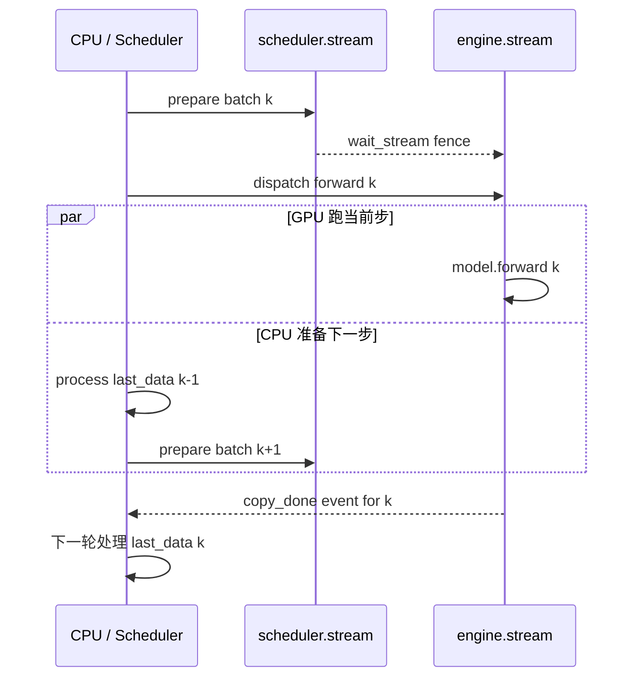

# 第 7 章：Overlap Scheduling

> mini-sglang 的招牌特性。`MINISGL_DISABLE_OVERLAP_SCHEDULING=1` 关掉它，吞吐会显著下降——这一章讲清楚它在重叠什么、为什么需要、代码上有哪些必须的小心点。
>
> 入口：[`Scheduler.run_forever`](../../python/minisgl/scheduler/scheduler.py:120-131)、[`overlap_loop`](../../python/minisgl/scheduler/scheduler.py:83-106)、[`normal_loop`](../../python/minisgl/scheduler/scheduler.py:108-118)。

---

## 7.1 问题：CPU 调度 vs GPU forward 的时间比

先量化一下。一个典型 decode batch 的 step 包含：

| 阶段 | 谁干的 | 大致时间（A100/H100，small model） |
|------|------|---------|
| ① 收 ZMQ msg | CPU | 5-10 µs |
| ② Schedule + prepare batch | CPU | 几百 µs ~ 几 ms（attn metadata 计算 + H2D 拷贝最重） |
| ③ Forward + sample | GPU | 几 ms（小模型）~ 几十 ms（大模型） |
| ④ Process last data | CPU | 几百 µs（D2H 同步 + cache_req） |

对小模型来说，② 和 ③ 是同一量级。如果它们串行执行，GPU 一半时间在等 CPU。

**Overlap 的核心想法**：把 ② 和 ③ 在两个 CUDA stream 上并行执行——这一步的 ② 和上一步的 ③ 重叠。

---

## 7.2 两个 stream 的设计

[`Scheduler.__init__:48-55`](../../python/minisgl/scheduler/scheduler.py)：

```python
# 这是 scheduler 自己的 stream
self.stream = torch.cuda.Stream(device=self.device)
# engine.stream 是 forward 跑的 stream（在 Engine.__init__ 里建）
self.engine_stream_ctx = torch.cuda.stream(self.engine.stream)
# 默认进 scheduler 的 stream
torch.cuda.set_stream(self.stream)
```

两个 stream 的分工：

```
┌─────────────────────────────────────────────────────────────────┐
│ scheduler.stream                                                │
│  ↳ H2D 拷贝（_make_positions / _make_input_tuple / metadata）    │
│  ↳ index 操作（page_table[input_mapping]）                      │
│  ↳ 任何 prepare_batch / process_last_data 中的 GPU 操作          │
└─────────────────────────────────────────────────────────────────┘
┌─────────────────────────────────────────────────────────────────┐
│ engine.stream                                                   │
│  ↳ model.forward()                                              │
│  ↳ store_kv kernel                                              │
│  ↳ Sampler 调用                                                  │
└─────────────────────────────────────────────────────────────────┘
```

每跑一步 forward，scheduler.stream 在准备**下一步**的输入，engine.stream 在跑**当前步**的 forward——两个 stream 并行。stream 之间需要的同步用 `wait_stream` / `cuda.Event` 处理。

---

## 7.3 `overlap_loop` 单步执行流程

[`scheduler.py:83-106`](../../python/minisgl/scheduler/scheduler.py)：

```python
def overlap_loop(self, last_data):
    blocking = not (
        last_data is not None
        or self.prefill_manager.runnable
        or self.decode_manager.runnable
    )
    for msg in self.receive_msg(blocking=blocking):
        self._process_one_msg(msg)

    forward_input = self._schedule_next_batch()
    ongoing_data = None
    if forward_input is not None:
        with self.engine_stream_ctx:
            self.engine.stream.wait_stream(self.stream)
            ongoing_data = (forward_input, self._forward(forward_input))

    self._process_last_data(last_data)
    return ongoing_data
```

关键点逐行解读：

### `blocking` 的判定

```python
blocking = not (
    last_data is not None         # 有上一步结果待处理
    or self.prefill_manager.runnable
    or self.decode_manager.runnable
)
```

只有当**这三件事都没有**时（没活干），才 blocking 等 ZMQ 消息。否则非阻塞地拉新消息然后立刻去干活。

为什么不一直 blocking？因为 receive_msg blocking=True 会阻塞 CPU——但 `last_data` 处理 / forward dispatch 都不依赖新消息，应该尽早开干。

### `with self.engine_stream_ctx + wait_stream`

```python
with self.engine_stream_ctx:                     # 切到 engine.stream
    self.engine.stream.wait_stream(self.stream)  # 等 scheduler.stream 完成 prepare
    ongoing_data = (forward_input, self._forward(forward_input))
```

`engine_stream_ctx = torch.cuda.stream(self.engine.stream)`，进入这个 with 块后，**新发起的 GPU op 都进 engine.stream**。

`wait_stream` 是关键：scheduler.stream 上的 `prepare_batch`（H2D 拷贝、index 操作）必须在 forward 开始之前完成；用 `wait_stream` 让 engine.stream 等 scheduler.stream 把这些活做完，再跑 forward。

> **注意**：`wait_stream` 不阻塞 CPU——它只是在 engine.stream 上插了一个"等 scheduler.stream"的 fence event。CPU 立刻继续。

### `_forward` dispatch 之后立刻处理上一步数据

```python
ongoing_data = (forward_input, self._forward(forward_input))
self._process_last_data(last_data)               # ← 这里处理的是上一步的 last_data，不是本步的！
```

这是 overlap 的精华：**dispatch forward 后 CPU 不等 GPU**，立刻去处理上一步留下的数据（D2H 同步、构造 reply、释放完成的请求）。这部分跟 GPU forward 是重叠的。

返回的 `ongoing_data` 是本步的 forward_input 和 forward_output——会在下一次 overlap_loop 调用时作为 `last_data` 传进来。

### 主循环驱动

```python
def run_forever(self):
    if ENV.DISABLE_OVERLAP_SCHEDULING:
        ...  # normal_loop 路径
    else:
        assert torch.cuda.current_stream() == self.stream
        data = None
        while True:
            data = self.overlap_loop(data)   # ← data 在两步之间流动
```

第一次循环 `data=None`，所以 `_process_last_data(None)` 什么都不做，正常进入 schedule + forward；第二次循环开始，`data` 是上一次返回的 ongoing_data，`_process_last_data(data)` 处理它。

---

## 7.4 一张时间轴图

把 4 步 step 画在一根时间线上（normal vs overlap）：



```
Normal Loop (DISABLE_OVERLAP_SCHEDULING=1):
─CPU──────────────────────────────────────────────────────────────────→
   recv | schedule | prepare | dispatch | wait | process_last | recv | ...
─GPU───────────────────────────────────|═════════|──────────────────→
                                       ↑ forward 期间 CPU 完全空闲

Overlap Loop:
─CPU──┬─────────────────┬──────────────┬──────────────┬─────────────→
       recv  schedule    process_last_k recv schedule   process_last_(k+1)
       prepare batch_k+1                prepare batch_k+2

─sched.stream─ H2D 拷贝 ────H2D 拷贝────────────────────H2D 拷贝──→
─engine.stream────|═════ forward k ═══|═══ forward k+1 ═══|═══ forward k+2 ══════→

时间轴上 forward k+1 和 (CPU + sched.stream 的 prepare batch_k+2 + process_last_k) 同时发生
```

观察：
- normal_loop 里 CPU 等 GPU forward；GPU 等 CPU prepare。**两个互相阻塞**。
- overlap_loop 里 CPU 一旦 dispatch forward k+1 就立即开始 prepare batch_k+2、处理 last_k——和 GPU 完全并行。

---

## 7.5 必须小心的 5 个边角

Overlap 让代码变快，但也带来了一系列需要小心的不变量。

### 7.5.1 `last_data` 持有 Python 对象，要让 GC 等到 D2H 完成

`last_data = (ForwardInput, ForwardOutput)`。`ForwardInput.batch.reqs` 持有 `Req` 对象、`Req` 持有 `cache_handle`、`cache_handle` 持有 RadixTreeNode……这些都不能在 forward 跑完前被 GC——否则 GC 走的时候可能调到 `RadixCache` 的逻辑修改 free_slots 之类的状态。

`overlap_loop` 把 `data = self.overlap_loop(data)` 一直循环传——每次返回的 `ongoing_data` 是当前步的引用，会一直存活到下一次循环结束（处理完后才会被 reassign）。

### 7.5.2 D2H 拷贝的同步：`copy_done_event`

[`engine.py:202-206`](../../python/minisgl/engine/engine.py)：

```python
next_tokens_gpu = self.sampler.sample(logits[:bs], args).to(torch.int32)
next_tokens_cpu = next_tokens_gpu.to("cpu", non_blocking=True)
copy_done_event = torch.cuda.Event()
copy_done_event.record(self.stream)
return ForwardOutput(next_tokens_gpu, next_tokens_cpu, copy_done_event)
```

`next_tokens_cpu` 是非阻塞 D2H——拷贝是异步的，CPU 立刻拿到 tensor 但内容还没填好。`copy_done_event` 在 engine.stream 上记录"D2H 完成"的时间点。

`_process_last_data` 一开始就：

```python
batch, (_, next_tokens_cpu, copy_done) = last_data[0].batch, last_data[1]
copy_done.synchronize()    # ← 阻塞 CPU 直到 D2H 完成
```

如果不 synchronize，下一行 `next_tokens_cpu[i]` 读到的可能是垃圾。

### 7.5.3 finished_reqs：双 free 防御

我们在第 6 章提了一下，现在解释清楚为什么会有"双 free"。

考虑这个时序（overlap 模式）：

```
step N:
  schedule → batch_N（含 req X）
  forward batch_N → req X 这步 sample 出 EOS
  ongoing_data_N = (input_N, output_N)
  return ongoing_data_N

step N+1:
  receive_msg
  process_last_data(ongoing_data_N):
    for req X:
      finished = True
      _free_req_resources(req X)     # ← 第一次释放
      finished_reqs.add(req X)

  schedule → batch_(N+1)
    （req X 已经被 finished、不在任何 manager 里，正常情况下不会出现在新 batch）
    但是！！如果有 abort_msg 在这一步收到说"abort req X"，会怎样？
    abort_req(X) 找 prefill 队列没找到、找 decode 队列也没找到（已经被释放） → return None
    没事。

  ...其他场景 ...
```

实际场景可能更隐蔽：当 process_last_data 还在跑、新 message 已经被 receive 了，scheduler 内部状态有个微小的窗口期；finished_reqs 这个集合是对此窗口的额外防御——`if finished and req not in self.finished_reqs:` 保证即使同一个 req 被检测到 finish 两次也只释放一次。

> 一个更具体的双 free 路径来自 `decode_manager.filter_reqs`：[`scheduler.py:_forward:232`](../../python/minisgl/scheduler/scheduler.py) 在 forward 后把 batch.reqs 并入 running_reqs；如果某个 req 在本 step 已经 finish，`filter_reqs` 会把它过滤掉。但如果 forward 还没跑完它就被 process_last_data 处理了，可能在下一个 step 它又被并进 running_reqs。这种环绕逻辑下 finished_reqs 给一道保险。
>
> **关键**：注释里 [`scheduler.py:158`](../../python/minisgl/scheduler/scheduler.py) 写得很明确——别去掉这层防御，除非你重写了整个时序。

### 7.5.4 `decode_manager.filter_reqs` 必须在 forward 之后

[`scheduler.py:_forward:232`](../../python/minisgl/scheduler/scheduler.py)：

```python
self.decode_manager.filter_reqs(forward_input.batch.reqs)
```

为什么放在 forward 之后？因为 `forward_batch` 内部会调 `req.complete_one()` 推进 device_len。`can_decode` 依赖 `remain_len > 0` 即 `device_len < max_device_len`——`complete_one` 之后才能正确判断。

如果放在 forward 之前，所有 req 的 `can_decode` 都没更新，filter 会出错。

### 7.5.5 `prepare_batch` 里的 H2D 必须在 scheduler.stream 上做

[`_make_positions`](../../python/minisgl/scheduler/scheduler.py:236-249)、[`_make_input_tuple`](../../python/minisgl/scheduler/scheduler.py:252-259) 等都通过 `pin_memory + non_blocking=True` 做 H2D 拷贝。它们在 scheduler.stream 上 enqueue（因为 `torch.cuda.set_stream(self.stream)` 把默认 stream 设过来了）。

forward 在 engine.stream 上跑，但要读这些拷贝结果。所以 `wait_stream(self.stream)` 让 engine.stream 等 scheduler.stream 完成。

如果你在 prepare_batch 里不小心写出"在 engine.stream 上做的 H2D"（比如显式 `torch.cuda.set_stream(engine.stream)`），就违反了 overlap 设计——CPU 会 implicitly 等 engine.stream。

---

## 7.6 normal_loop：关掉 overlap 的对照

[`scheduler.py:108-118`](../../python/minisgl/scheduler/scheduler.py)：

```python
def normal_loop(self):
    blocking = not (self.prefill_manager.runnable or self.decode_manager.runnable)
    for msg in self.receive_msg(blocking=blocking):
        self._process_one_msg(msg)

    forward_input = self._schedule_next_batch()
    ongoing_data = None
    if forward_input is not None:
        ongoing_data = (forward_input, self._forward(forward_input))

    self._process_last_data(ongoing_data)         # ← 注意：ongoing_data 不是 last_data
```

最后一行的 `_process_last_data(ongoing_data)`——传的是**本步**的 data，不是上一步的。

为什么 normal 模式下能这么写？因为：
- `run_forever` 在 normal 模式启动时已经把 default stream 切到了 engine.stream（`with self.engine_stream_ctx + wait_stream(self.stream)`），所有操作（prepare + forward + process）都在 engine.stream 上串行执行。
- `process_last_data` 里 `copy_done.synchronize()` 会阻塞等 forward 完成，本步结果可以立即用。

这种模式简单清晰，吞吐略低（CPU 不和 GPU 重叠），但调试方便。`MINISGL_DISABLE_OVERLAP_SCHEDULING=1` 在 benchmark 里被 [`benchmark/offline/bench.py`](../../benchmark/offline/bench.py) 用来对照。

---

## 7.7 ForwardData / ForwardInput 类型解读

[`scheduler.py:35-42`](../../python/minisgl/scheduler/scheduler.py)：

```python
class ForwardInput(NamedTuple):
    batch: Batch
    sample_args: BatchSamplingArgs
    input_tuple: Indice2D    # (token_mapping, positions)
    write_tuple: Indice2D    # (req_mapping, seq_lens or -1)

ForwardData: TypeAlias = "Tuple[ForwardInput, ForwardOutput]"
```

为什么 `ForwardInput` 单独打包？因为 overlap 模式下，`forward_input` 必须**同时给** `_forward`（用 input_tuple 取 input_ids）和 `_process_last_data`（用 batch 检查 finished）。把它们放在 NamedTuple 里就避免了散乱传参。

`Indice2D = Tuple[torch.Tensor, torch.Tensor]`——两个 GPU 张量构成的二维高级索引（tuple 索引在 PyTorch 里就是高级索引）。

为什么注释里写 "we also need to cache some other data to avoid IMA"？因为这些张量被生命周期绑定到 ForwardInput。如果 GC 提前释放了 input_tuple/write_tuple 的两个 tensor，但 forward 在 engine.stream 上还要用它们，就会 IMA（illegal memory access）。把它们装进 NamedTuple 让外层的 `data` 持有，就不会被提前 GC。

---

## 7.8 关闭 overlap 应该出现什么差别

跑 [`benchmark/offline/bench.py`](../../benchmark/offline/bench.py) 时设 `MINISGL_DISABLE_OVERLAP_SCHEDULING=1`，应该看到：

- **吞吐显著下降**：小模型（如 Qwen3-0.6B）下降可达 25-40%；大模型（Llama-70B）下降 10-15%（因为大模型 GPU forward 占比大、CPU 调度占比小）。
- **每步耗时变长**：normal_loop 是串行 prepare → forward → process_last，而 overlap_loop 把 prepare 和 process 隐藏在 forward 后面。
- **GPU 利用率下降**：normal_loop 下 nvtop 看到 GPU SM utilization 周期性掉到 0；overlap_loop 几乎一直高位。

> 这是 mini-sglang 比 nano-vllm 在小模型场景吞吐高的最大原因之一。

---

## 7.9 检查清单

1. **如果你把 `_process_last_data(last_data)` 错改成 `_process_last_data(ongoing_data)`，会怎么样？**
   <details><summary>参考答案</summary>

   - **正确性**：单步看似没问题——本步 forward 完成、本步处理 result。但 forward 是 dispatch 到 engine.stream 的，CPU 没等它完成；`copy_done.synchronize()` 在 process_last_data 里会强制 CPU 等 forward 全部跑完。
   - **性能**：CPU 等 forward = 重新串行化，overlap 失效。等于退回到 normal_loop。
   - **隐蔽性**：吞吐少 30%，但功能正常——很难从功能测试里发现。所以代码注释和命名都强调 "overlap"。

   `normal_loop` 是显式承认这种串行的——它在外面套一层 `with engine_stream_ctx + wait_stream`，把所有操作都拉到 engine.stream 上做，这样 process 和 forward 是同 stream 串行，CPU 也只在最后一次 sync——结构上反而更简单。
   </details>

2. **CUDA Event vs `wait_stream` 各用在哪？**
   <details><summary>参考答案</summary>

   - **`wait_stream(other)`**：让当前 stream 等 other stream 上**已经 enqueue 的所有 op** 完成。轻量、自动同步多操作。在 mini-sglang 用于"engine.stream 等 scheduler.stream 准备完输入"。
   - **`Event.record(stream)` + `Event.synchronize()`**：精确锚定一个时间点。`record` 在 stream 上插入一个 marker，`synchronize` 阻塞 CPU 直到 marker 通过。在 mini-sglang 用于 D2H 完成的精确等待——必须在 process_last_data 里 sync next_tokens_cpu 才能用。
   - **`Event.record(stream)` + `other_stream.wait_event(event)`**：让另一个 stream 等这个 event。比 wait_stream 粒度更细。

   一句话：要 GPU stream 之间同步用 `wait_stream / wait_event`；要 CPU 等 GPU 用 `Event.synchronize`。
   </details>

3. **对一个超大模型（如 Llama-3.1-405B），overlap scheduling 还有意义吗？**
   <details><summary>参考答案</summary>

   收益**显著降低**。理由：

   - **forward 时间 >> CPU 调度时间**：Llama-405B 一次 decode forward 可能 100+ ms，而 CPU 调度还是几 ms。隐藏 5 ms 在 100 ms 后面，吞吐提升 < 5%。
   - **TP 通信变成瓶颈**：大模型每层有 NCCL all-reduce，模型 forward 时间被通信主导，CPU 调度的相对占比进一步缩小。
   - **chunked prefill 的影响放大**：大模型 prefill 也是几十 ms 量级，scheduler 的 prepare batch 占比小。

   所以工业部署时大模型常选**不开 overlap**——简单稳定，吞吐损失很小。但调试和正确性测试时还是建议关掉看清逻辑。
   </details>

4. **`set_global_ctx` 是 idempotent 的吗？为什么 `Engine.__init__` 里只 set 一次？**
   <details><summary>参考答案</summary>

   不是。[`core.py:128-131`](../../python/minisgl/core.py)：

   ```python
   def set_global_ctx(ctx):
       global _GLOBAL_CTX
       assert _GLOBAL_CTX is None, "Global context is already set"
       _GLOBAL_CTX = ctx
   ```

   重复 set 直接 assert error。原因：模型层（AttentionLayer 等）在 `__init__` 时不持有 Engine 引用，靠全局变量拿到 attn_backend / kv_cache。如果 set 多次，前一次 set 后已经 init 完的 layer 还指向旧 Context——它的 attn_backend、kv_cache 都是旧的，会失效。

   所以 mini-sglang 选择**一个进程一个 Context**——TP=4 时是 4 个进程，每个进程独立 set 自己的 Context。这样不需要"切换 Context"的概念，简单且不会出错。
   </details>

5. **如果你想在主流程里加一个 metrics 收集（每步记录 GPU 时间、batch 大小），最佳位置在哪？**
   <details><summary>参考答案</summary>

   最简单的：在 `_forward` 后加 NVTX range 或 `cuda.Event`：

   ```python
   def _forward(self, forward_input):
       start = torch.cuda.Event(enable_timing=True); start.record(self.engine.stream)
       batch, sample_args, input_mapping, output_mapping = forward_input
       batch.input_ids = self.token_pool[input_mapping]
       forward_output = self.engine.forward_batch(batch, sample_args)
       end = torch.cuda.Event(enable_timing=True); end.record(self.engine.stream)
       self.token_pool[output_mapping] = forward_output.next_tokens_gpu
       self.decode_manager.filter_reqs(forward_input.batch.reqs)
       # 记录到 metrics（注意 elapsed 必须在下一步 sync 之后才能读，否则阻塞）
       self.metrics_buffer.append((start, end, batch.size, batch.is_prefill))
       return forward_output
   ```

   注意：**别在这里 `end.synchronize()`**——会阻塞 CPU 等 forward 完成，破坏 overlap。把 `start/end` 攒起来，等下一步 process_last_data 里 D2H sync 完了顺便也读它（那时 forward 一定完成了）。

   另一种方式：直接用 NVTX range（[`utils/__init__.py` 的 `nvtx_annotate`](../../python/minisgl/utils/__init__.py)），让 nsight 自己分析，不需要侵入 metrics buffer。
   </details>

---

## 下一章预告

下一章我们打开 `Engine.forward_batch` 内部，看看 forward 一步在做什么：模型 forward → 走或不走 CUDA Graph → Sampler 怎么处理 batch 里 mixed sampling params → forward_output 的三个字段分别在干什么。
