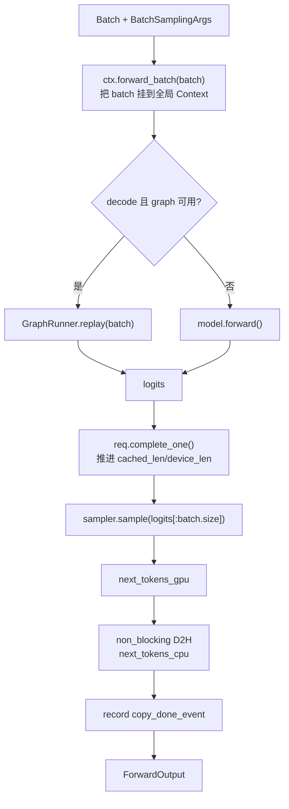

# 第 8 章：Engine 与 forward_batch

> 上一章我们站在 Scheduler 的视角看 forward 怎么被 dispatch。这一章进 Engine 内部：模型 forward 怎么跑、CUDA Graph 什么时候用、Sampler 如何处理一个 batch 里混合的 sampling params、ForwardOutput 三个字段各做什么。
>
> 入口：[`engine/engine.py`](../../python/minisgl/engine/engine.py)、[`engine/sample.py`](../../python/minisgl/engine/sample.py)、[`engine/graph.py`](../../python/minisgl/engine/graph.py)。

---

## 8.1 Engine 在初始化时做了什么

[`Engine.__init__`](../../python/minisgl/engine/engine.py:30-110) 是个长函数，按 5 个阶段读：

```python
class Engine:
    def __init__(self, config):
        # 阶段 1：进程级 GPU + dist 初始化
        set_tp_info(rank=config.tp_info.rank, size=config.tp_info.size)
        _adjust_config(config)            # auto 选 attn 后端 / 强制 page_size
        self.device = torch.device(f"cuda:{config.tp_info.rank}")
        torch.cuda.set_device(self.device)
        torch.manual_seed(42)
        self.stream = torch.cuda.Stream() # engine 自己的 forward stream
        torch.cuda.set_stream(self.stream)
        self.dtype = config.dtype
        self.ctx = Context(config.page_size)
        set_global_ctx(self.ctx)

        # 阶段 2：建 NCCL / pynccl 通信
        self.tp_cpu_group = self._init_communication(config)
        init_free_memory = self._sync_get_memory()[1]
        ...

        # 阶段 3：模型加载（meta tensor → 真正权重）
        set_rope_device(self.device)
        with torch.device("meta"), torch_dtype(config.dtype):
            self.model = create_model(config.model_config)       # 在 meta device 上构造，不分配权重
        self.model.load_state_dict(self._load_weight_state_dict(config))   # 流式加载到 device

        # 阶段 4：KV cache + page_table + attention/MoE backend + sampler
        self.num_pages = self._determine_num_pages(init_free_memory, config)
        self.kv_cache = create_kvcache_pool(...)
        self.ctx.kv_cache = self.kv_cache
        self.max_seq_len = min(config.max_seq_len, num_tokens)
        aligned_max_seq_len = _align_up_32(self.max_seq_len)
        self.page_table = torch.zeros(...); self.ctx.page_table = self.page_table
        self.ctx.attn_backend = self.attn_backend = create_attention_backend(...)
        if config.model_config.is_moe:
            self.ctx.moe_backend = self.moe_backend = create_moe_backend(...)
        self.sampler = Sampler(self.device, config.model_config.vocab_size)

        # 阶段 5：CUDA Graph capture
        self.dummy_req = Req(...)
        self.page_table[self.dummy_req.table_idx].fill_(num_tokens)
        self.graph_runner = GraphRunner(...)
```

逐阶段重点：

### 阶段 1：进程级初始化必须按这个顺序

- `set_tp_info` 一定要在 `cuda.set_device` 之前——否则别的代码 import 时拿不到 tp 信息。
- `_adjust_config` 早早做掉，把 `attention_backend` 的 "auto" / `moe_backend` 的 "auto" / TRT-LLM 强制 page_size 这些自动决策提前定下来。

### 阶段 3：meta tensor + 流式加载

```python
with torch.device("meta"), torch_dtype(config.dtype):
    self.model = create_model(config.model_config)
self.model.load_state_dict(self._load_weight_state_dict(config))
```

**为什么用 meta 设备构造？** 因为模型有几十亿到几百亿参数，在 GPU 上一次性 `torch.empty` 出来需要的显存峰值很高，且加载完后被 weight 替代，浪费显存。Meta 设备只构造形状元数据，不分配实际内存。

`_load_weight_state_dict` 内部走 [`load_weight`](../../python/minisgl/models/weight.py:75-124) 这个 generator，**流式**逐文件读 safetensors、分片到本 rank、返回 (name, tensor)。`load_state_dict` 一收到就把对应 layer 的参数替换成实际 tensor。

> 流式加载的好处：CPU 内存峰值 = 一个文件 + 一个合并 buffer，不需要先把整个模型读入内存。第 13 章详细讲。

### 阶段 5：dummy req 的最后一步

`page_table[max_running_req].fill_(num_tokens)` 把 dummy req 行全填成 dummy page 的第一个 slot id（第 4.5 节）。这一步必须在创建 GraphRunner 之前完成，因为 capture graph 时要用 dummy_req 跑 forward。

---

## 8.2 NCCL 通信初始化

[`_init_communication`](../../python/minisgl/engine/engine.py:112-137)：

```python
def _init_communication(self, config):
    if config.tp_info.size == 1 or config.use_pynccl:
        torch.distributed.init_process_group(
            backend="gloo",
            rank=config.tp_info.rank, world_size=config.tp_info.size,
            timeout=timedelta(seconds=config.distributed_timeout),
            init_method=config.distributed_addr,
        )
        tp_cpu_group = torch.distributed.group.WORLD
        ...
        enable_pynccl_distributed(config.tp_info, tp_cpu_group, max_bytes)
    else:
        torch.distributed.init_process_group(
            backend="nccl",
            ...
        )
        tp_cpu_group = torch.distributed.new_group(backend="gloo")
    return tp_cpu_group
```

两种模式：

| 模式 | 启用条件 | CPU 通信 group | GPU 通信 |
|------|--------|-------------|--------|
| pynccl（默认） | `tp_size == 1` 或 `--use_pynccl` | gloo（WORLD） | mini-sglang 的自定义 pynccl wrapper |
| torch nccl | `--disable-pynccl` 时 | 单独 new gloo group | torch.distributed nccl |

**为什么默认用 pynccl 而不是 torch nccl？** 

torch.distributed.nccl 的实现有些行为不友好——比如 `all_reduce` 会做隐式的 `cudaStreamSynchronize`，会破坏 CUDA Graph capture（capture 时不能有同步点）。

mini-sglang 自己写了一个 [`PyNCCLCommunicator`](../../python/minisgl/kernel/pynccl.py)（C++/CUDA + NCCL 库直接绑定），通过 `tvm-ffi` JIT 编译加载，绕开 torch.distributed 那层。NCCL collective 在自己的 stream 上跑、不做隐式同步、和 CUDA Graph 兼容。第 11 章详细讲。

`tp_cpu_group` 用 gloo 是因为 NCCL 不支持 CPU 张量——CPU 端的 broadcast / barrier 必须用 gloo。`_recv_msg_multi_rank0` 里同步消息数量就用它。

---

## 8.3 forward_batch 的主线流程

[`engine.py:191-206`](../../python/minisgl/engine/engine.py)：



```python
def forward_batch(self, batch, args):
    assert torch.cuda.current_stream() == self.stream
    with self.ctx.forward_batch(batch):
        if self.graph_runner.can_use_cuda_graph(batch):
            logits = self.graph_runner.replay(batch)
        else:
            logits = self.model.forward()

    for req in batch.reqs:
        req.complete_one()

    next_tokens_gpu = self.sampler.sample(logits[: batch.size], args).to(torch.int32)
    next_tokens_cpu = next_tokens_gpu.to("cpu", non_blocking=True)
    copy_done_event = torch.cuda.Event()
    copy_done_event.record(self.stream)
    return ForwardOutput(next_tokens_gpu, next_tokens_cpu, copy_done_event)
```

5 步：

1. **`assert current_stream == self.stream`**：保证调用方进了 engine.stream。`overlap_loop` 用 `with engine_stream_ctx` 显式切；normal_loop 在 `run_forever` 入口已经切过一次（[`scheduler.py:122-124`](../../python/minisgl/scheduler/scheduler.py)）。
2. **`with self.ctx.forward_batch(batch)`**：把 batch 挂到 Context._batch 上，layer 内部通过 `get_global_ctx().batch` 拿到（第 3.4 节）。
3. **走 graph 还是直接 forward**：`can_use_cuda_graph` 判断条件 = `is_decode and batch.size <= max_graph_bs`（[`graph.py:149-150`](../../python/minisgl/engine/graph.py)）。能走就 replay graph，否则直接 `model.forward()`。
4. **`req.complete_one()`**：每个真实请求推进游标（第 3.2 节）。注意是 `batch.reqs`（真实请求）不是 `batch.padded_reqs`（含 dummy）——dummy 的游标推进没意义。
5. **Sample + D2H + record event**：取真实 bs 的 logits，sample 出 next_tokens，异步 D2H，记录完成事件。

---

## 8.4 模型 forward 的入口：`model.forward()`

为什么是 `model.forward()` 不是 `model.forward(input_ids)`？因为 [`BaseLLMModel.forward`](../../python/minisgl/models/base.py:12-14) 的签名是 `forward(self) -> Tensor`：

```python
class BaseLLMModel(ABC, BaseOP):
    @abstractmethod
    def forward(self) -> torch.Tensor: ...
```

子类（如 [`Qwen3ForCausalLM`](../../python/minisgl/models/qwen3.py:77-80)）实现：

```python
def forward(self):
    output = self.model.forward(get_global_ctx().batch.input_ids)
    logits = self.lm_head.forward(output)
    return logits
```

`input_ids` 不通过参数传，是从全局 Context 拿——这就是第 3.4 节讲的"全局变量"设计。带来的好处：模型层全是 `forward(self)` 这种统一签名，CUDA Graph capture 时也是无参调用，干净。

---

## 8.5 Sampler：BatchSamplingArgs 和 sample_impl

[`sample.py:Sampler`](../../python/minisgl/engine/sample.py:48-75)：

```python
@dataclass
class Sampler:
    device: torch.device
    vocab_size: int

    def prepare(self, batch):
        params = [r.sampling_params for r in batch.reqs]
        if all(p.is_greedy for p in params):
            return BatchSamplingArgs(temperatures=None)

        MIN_P = MIN_T = 1e-6
        ts = [max(0.0 if p.is_greedy else p.temperature, MIN_T) for p in params]
        top_ks = [p.top_k if p.top_k >= 1 else self.vocab_size for p in params]
        top_ps = [min(max(p.top_p, MIN_P), 1.0) for p in params]
        temperatures = make_device_tensor(ts, torch.float32, self.device)
        top_k = top_p = None
        if any(k != self.vocab_size for k in top_ks):
            top_k = make_device_tensor(top_ks, torch.int32, self.device)
        if any(p < 1.0 for p in top_ps):
            top_p = make_device_tensor(top_ps, torch.float32, self.device)
        return BatchSamplingArgs(temperatures, top_k=top_k, top_p=top_p)

    def sample(self, logits, args):
        if args.temperatures is None:
            return torch.argmax(logits, dim=-1)
        return sample_impl(logits.float(), args.temperatures, args.top_k, args.top_p)
```

设计要点：

### Greedy 优化

如果 batch 里所有请求都是 greedy（`temperature ≤ 0` 或 `top_k == 1`），直接 `torch.argmax`——比 softmax + sampling 快很多。

### per-request 不同 sampling params

Mini-sglang 支持**每个请求独立的 temperature/top_k/top_p**——这是 OpenAI API 的需求。`BatchSamplingArgs` 把它们打包成 1D GPU tensor（每个元素对应一个请求）。

`sample_impl` 走 [`flashinfer.sampling`](https://github.com/flashinfer-ai/flashinfer)：

```python
def sample_impl(logits, temperatures, top_k, top_p):
    import flashinfer.sampling as sampling
    probs = sampling.softmax(logits, temperatures, enable_pdl=is_sm90_supported())
    if top_k is None and top_p is None:
        return sampling.sampling_from_probs(probs)
    if top_p is None:  return sampling.top_k_sampling_from_probs(probs, top_k)
    if top_k is None:  return sampling.top_p_sampling_from_probs(probs, top_p)
    return sampling.top_k_top_p_sampling_from_probs(probs, top_k, top_p)
```

flashinfer 的 sampling 内核接受 per-row 不同的 temperature / top_k / top_p（tensor 输入），一个 kernel 跑完——不需要把 batch 按 sampling 参数拆开。

### top_k 默认 vocab_size 表示"不裁"

```python
top_ks = [p.top_k if p.top_k >= 1 else self.vocab_size for p in params]
```

`top_k = -1` 在 SamplingParams 里表示"不限"。这里把它映射成 vocab_size——等价于 top_k 把所有 token 都留下，没有裁剪。这样就不需要写"top_k = -1 时走另一条路"的分支。

只有当 `any(k != self.vocab_size)` 才真的把 top_k tensor 构造出来——批里全是 -1 时省掉这步。

### `logits[: batch.size]`

只 sample 真实请求的 logits（不含 padding）。`batch.size` 是真实数量，`batch.padded_size` 是 padding 后的数量。

---

## 8.6 ForwardOutput 的三个字段

[`engine.py:23-26`](../../python/minisgl/engine/engine.py)：

```python
class ForwardOutput(NamedTuple):
    next_tokens_gpu: torch.Tensor
    next_tokens_cpu: torch.Tensor
    copy_done_event: torch.cuda.Event
```

每个字段的用途：

- **`next_tokens_gpu`**：`shape = [batch.size]`，dtype=int32。**用于下一步 forward 直接喂回模型**——`scheduler._forward` 把它写到 `token_pool[write_tuple]`，下一轮 `token_pool[input_mapping]` 就能读到。**完全不经过 CPU**。
- **`next_tokens_cpu`**：异步 D2H 的副本，给 `_process_last_data` 用——detokenize 必须知道具体 token id（int），所以最终要回到 CPU。
- **`copy_done_event`**：在 engine.stream 上记录 D2H 完成的事件。`_process_last_data` 调用 `copy_done.synchronize()` 等它完成才读 next_tokens_cpu（第 7.5.2 节）。

> 这三个字段的设计本身就是 overlap scheduling 的产物：next_tokens_gpu 让 forward 链不被 D2H 阻断，next_tokens_cpu + event 让 process_last_data 能"按需"等。

---

## 8.7 `_sync_get_memory`：跨 rank 内存测量

[`engine.py:170-189`](../../python/minisgl/engine/engine.py)：

```python
def _sync_get_memory(self):
    torch.cuda.synchronize(self.device)
    torch.cuda.empty_cache()
    torch.cuda.reset_peak_memory_stats(self.device)
    free_memory = get_free_memory(self.device)
    free_mem_tensor = torch.tensor([free_memory, -free_memory], device="cpu", dtype=torch.int64)
    torch.distributed.all_reduce(
        free_mem_tensor, op=torch.distributed.ReduceOp.MIN, group=self.tp_cpu_group
    )
    min_free_memory = int(free_mem_tensor[0].item())
    max_free_memory = -int(free_mem_tensor[1].item())
    if max_free_memory - min_free_memory > 2 * 1024 * 1024 * 1024:
        raise RuntimeError("Memory across TP ranks are imbalanced")
    return min_free_memory, max_free_memory
```

巧妙的一步：`tensor([free, -free])`，对它做 `all_reduce(MIN)`：
- 第 0 元素：`min(free)` = 各 rank 中最小的可用内存。
- 第 1 元素：`min(-free) = -max(free)`，取负号 = `max(free)`。

一次通信拿到 min 和 max。如果差超过 2 GB，说明各 rank 的内存使用差异太大（可能某个 rank 的 weight load 出错），早期报错比后期 OOM 要好诊断。

为什么要用 `tp_cpu_group`（gloo）而不是 NCCL？因为 `free_mem_tensor` 在 CPU 上——NCCL 只支持 GPU 张量。

---

## 8.8 `shutdown`：关机顺序很重要

[`engine.py:208-211`](../../python/minisgl/engine/engine.py)：

```python
def shutdown(self):
    self.graph_runner.destroy_cuda_graphs()    # ← 必须先于 NCCL 销毁
    torch.distributed.destroy_process_group()
    destroy_distributed()                      # 销毁 pynccl plugins
```

`destroy_cuda_graphs` 注释里写 [`graph.py:168`](../../python/minisgl/engine/graph.py)：

```python
# NOTE: This must be called before freeing NCCL resources to prevent program hang
def destroy_cuda_graphs(self):
    del self.graph_map
    gc.collect()
```

为什么？因为 CUDA Graph capture 时 NCCL collective 也被 capture 了——这些 NCCL op 持有 NCCL 通信子的引用。如果先销毁 NCCL，CUDA Graph 析构时再去 release 这些 op 会引用已销毁的资源、卡住或 segfault。

正确顺序：先 `del graph_map + gc.collect()` 强制释放所有 captured ops、再销毁 NCCL。

---

## 8.9 一张完整的"一步 forward"调用栈

```
Scheduler._forward(forward_input):
 ├─ batch.input_ids = engine.token_pool[input_mapping]      # GPU gather
 │
 ├─ Engine.forward_batch(batch, sample_args):
 │   ├─ assert current_stream == engine.stream
 │   ├─ with ctx.forward_batch(batch):
 │   │   ├─ if can_use_cuda_graph(batch):
 │   │   │   ├─ buffer.copy_from(batch)         # 把 input_ids/positions/out_loc 拷到 capture buffer
 │   │   │   ├─ attn_backend.prepare_for_replay(batch)
 │   │   │   ├─ graph.replay()                  # 跑 captured graph
 │   │   │   └─ logits = buffer.logits[:bs]
 │   │   └─ else:
 │   │       └─ logits = model.forward()        # 逐层跑 transformer
 │   │
 │   ├─ for req in batch.reqs: req.complete_one()
 │   ├─ next_tokens_gpu = sampler.sample(logits[:bs], args).to(int32)
 │   ├─ next_tokens_cpu = next_tokens_gpu.to("cpu", non_blocking=True)
 │   ├─ copy_done_event = Event(); copy_done_event.record(stream)
 │   └─ return ForwardOutput(...)
 │
 ├─ engine.token_pool[write_mapping] = forward_output.next_tokens_gpu
 ├─ decode_manager.filter_reqs(batch.reqs)
 └─ return forward_output
```

---

## 8.10 检查清单

1. **`Engine.__init__` 中 `with torch.device("meta"), torch_dtype(config.dtype)` 是干什么？省略掉会有什么影响？**
   <details><summary>参考答案</summary>

   两层 context manager 同时作用：
   - `torch.device("meta")`：当前 block 内 `torch.empty / torch.zeros` 等创建操作走 meta device，只记录形状不分配显存。
   - `torch_dtype(config.dtype)`（[`utils/__init__.py`](../../python/minisgl/utils/__init__.py) 的 helper）：设置默认 dtype。

   `create_model` 内部会构造很多 `torch.empty(local_osize, local_isize)` 这种参数（[`linear.py:28-29`](../../python/minisgl/layers/linear.py)）。在 meta device 下，这些都没有真实显存。

   省略掉会怎样？模型权重会先在 GPU 上分配一遍（占 model 大小的显存），然后被 `load_state_dict` 替换成新加载的 tensor——前一份立刻被释放，但**显存峰值 = 2 倍模型大小**，对大模型可能直接 OOM。
   </details>

2. **`assert current_stream == self.stream` 为什么放在 `forward_batch` 入口？删掉会出什么问题？**
   <details><summary>参考答案</summary>

   防御编程。三个理由：
   - **避免静默错误**：如果调用方忘了 `with engine_stream_ctx`，forward 在错误的 stream 上跑，CUDA Graph 的 stream 关联会错（capture 在 engine.stream，replay 在 default stream → CUDA 报错或行为未定义）。
   - **保证 NCCL 行为可预测**：pynccl 的 collective 默认在当前 stream 上发，必须是 engine.stream，否则各 rank 的 collective 在不同 stream，会死锁。
   - **CUDA Graph 静态 stream 假设**：capture graph 在 engine.stream，replay 也必须在那。

   删掉之后：很多场景下还是工作的，但偶发的"调用方写错"会变成沉默的 bug——比如 stream 不一致的两个操作交叉，看似没事但 nsight 显示乱七八糟。assert 让错误**早暴露在调用栈里**。
   </details>

3. **`Sampler.sample` 里 `logits.float()` 为什么把它强转成 fp32？**
   <details><summary>参考答案</summary>

   两个原因：
   - **数值稳定性**：softmax 需要 `exp`，bf16/fp16 的 exp 容易上溢/下溢（特别是大 logit 差的情况），fp32 安全得多。
   - **flashinfer.sampling 的 API 要求**：内核针对 fp32 做了优化，bf16 输入会被内部转换、效果一样且不快。

   greedy 路径不需要 `.float()`——`argmax` 不涉及指数运算，直接在 bf16 上比较就行。
   </details>

4. **如果 batch 里有 100 个请求，70 个 greedy、30 个 sampling，Sampler 怎么处理？**
   <details><summary>参考答案</summary>

   走"全 batch 一起 sampling"的路径。`Sampler.prepare` 里 `if all(p.is_greedy)` 不满足，构造 `temperatures` tensor——其中 70 个 greedy 的请求被填入 `MIN_T = 1e-6`：

   ```python
   ts = [max(0.0 if p.is_greedy else p.temperature, MIN_T) for p in params]
   ```

   这意味着 greedy 请求实际走 softmax with temperature ~0，几乎所有概率质量集中在最大值上——sample_from_probs 出来的就是 argmax 结果（几乎确定）。

   代价：比纯 argmax 慢一点（多了 softmax 和 sampling 的 overhead），但**避免了"按 sampling 类型把 batch 拆成两份"的复杂度**。当 batch 里全是 greedy 时（评测场景）才走真正的 argmax fast path。
   </details>

5. **如果 `forward_batch` 的最后一步 D2H 用 `non_blocking=False`，会出什么问题？**
   <details><summary>参考答案</summary>

   ```python
   next_tokens_cpu = next_tokens_gpu.to("cpu", non_blocking=False)   # blocking
   ```

   `non_blocking=False` 让 CPU **阻塞等 D2H 完成**——立刻拿到正确的 CPU tensor，不需要后面再 `copy_done.synchronize()`。

   坏处：在 overlap 模式下，CPU 直接被锁住等 GPU forward + D2H 全部完成——overlap 失效，相当于退回到 normal_loop。

   优势：代码简化，可以去掉 `copy_done_event` 字段。但吞吐损失大（小模型 30%+），mini-sglang 选择保留 event 这套机制。
   </details>

---

## 下一章预告

下一章我们打开 attention 层：FA / FlashInfer / TRT-LLM 三种后端的接口约定、`prepare_metadata` 在做什么、`HybridBackend` 如何让 prefill 和 decode 用不同后端、为什么 metadata 要在 CPU 上构造再 H2D。
