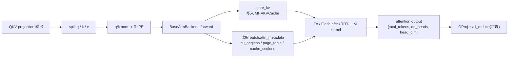

# 第 9 章：Attention 后端抽象与三种实现

> mini-sglang 支持三个 attention 后端：FlashAttention（fa）、FlashInfer（fi）、TensorRT-LLM（trtllm）。它们形状各异、接口各异、性能强项也不同，但被一个统一的抽象封起来。
>
> 这一章讲清楚抽象长什么样、三种实现各自的特点、为什么 prefill 和 decode 可以用不同后端。
>
> 入口：[`attention/base.py`](../../python/minisgl/attention/base.py)、[`attention/__init__.py`](../../python/minisgl/attention/__init__.py)、[`fa.py`](../../python/minisgl/attention/fa.py)、[`fi.py`](../../python/minisgl/attention/fi.py)、[`trtllm.py`](../../python/minisgl/attention/trtllm.py)。
>
> 📚 **算法谱系**（详见 [`references.md`](./references.md#flashattention-fa1)）：
> - **FlashAttention 1** (Dao 2022, NeurIPS 2022)：把 softmax(QKᵀ)V 改成 IO-aware 的 tiled 版本，避免显存里物化 N² 的 attention matrix——这是后续所有 attention 的地基。
> - **FlashAttention 2** (Dao 2023)：改进 FA1 的 work partitioning，A100 上 230 TFLOPs。FlashInfer 内部的 prefill/decode wrapper（`backend="fa2"`）就是 FA2 实现。
> - **FlashAttention 3** (Shah 2024)：用 Hopper 的 TMA + WGMMA 异步指令，让 GEMM 和 softmax 重叠，FP16 740 TFLOPs。**SM90+ only**。这就是 [`fa.py:_fa_sgl_impl:46`](../../python/minisgl/attention/fa.py) 里 `version=4 if SM100 else 3` 的来源——SM100 (Blackwell) 进一步上 FA4。
> - **PagedAttention** (Kwon 2023, vLLM)：把 KV 切 page；FA/FlashInfer/TRT-LLM 的 paged 接口都是 PagedAttention 的工程化实现。
> - **FlashInfer** (Ye 2025)：专为推理设计的 attention 引擎，提出 plan/run 分离 + 多种 mask + CUDA Graph capture-friendly。

---

## 9.1 后端要做的事

attention 层 ([`layers/attention.py:47-57`](../../python/minisgl/layers/attention.py)) 调用后端：

```python
def forward(self, qkv):
    ctx = get_global_ctx()
    q, k, v = qkv.split(...)
    if self.q_norm: self.q_norm.forward_inplace(q.view(-1, num_qo_heads, head_dim))
    if self.k_norm: self.k_norm.forward_inplace(k.view(-1, num_kv_heads, head_dim))
    q, k = self.rotary.forward(ctx.batch.positions, q, k)
    q = q.view(-1, self.num_qo_heads, self.head_dim)
    o = ctx.attn_backend.forward(q, k, v, self.layer_id, ctx.batch)
    return o.view(-1, self.qo_attn_dim)
```

后端要做：
1. 把这一层的 K/V 写到对应 KV cache slot（`store_kv`）。
2. 跑 attention（带因果 mask、paged kv、ragged batch）。
3. 返回 `[total_tokens, num_qo_heads, head_dim]` 的 output。



而**输入**是已经经过 RMSNorm（可选 q/k norm）+ RoPE 的 q/k/v。**输出**是单层 attention 的结果，会被 OProj 和 residual add 接走。

---

## 9.2 接口：`BaseAttnBackend`

[`base.py:18-34`](../../python/minisgl/attention/base.py)：

```python
class BaseAttnBackend(ABC):
    @abstractmethod
    def forward(self, q, k, v, layer_id, batch) -> torch.Tensor: ...

    @abstractmethod
    def prepare_metadata(self, batch) -> None: ...

    @abstractmethod
    def init_capture_graph(self, max_seq_len, bs_list) -> None: ...
    @abstractmethod
    def prepare_for_capture(self, batch) -> None: ...
    @abstractmethod
    def prepare_for_replay(self, batch) -> None: ...
```

5 个方法分两组：

**业务组**（每步都调）：
- `prepare_metadata(batch)`：构造 metadata（cu_seqlens / page_table / cache_seqlens 等），存到 `batch.attn_metadata`。在 `_prepare_batch` 阶段调用。
- `forward(q, k, v, layer_id, batch)`：跑 attention。每层调一次。

**CUDA Graph 组**（仅 capture 时调）：
- `init_capture_graph(max_seq_len, bs_list)`：建 capture buffer。
- `prepare_for_capture(batch)`：capture 期间用 dummy batch 时构造 metadata。
- `prepare_for_replay(batch)`：replay 时把真实 metadata 拷到 capture buffer。

第 10 章详细讲 CUDA Graph 路径。这一章重点看业务组。

---

## 9.3 metadata 长什么样

每个后端有自己的 metadata 结构。共同特征是 `BaseAttnMetadata`（[`base.py:12-15`](../../python/minisgl/attention/base.py)）：

```python
@dataclass
class BaseAttnMetadata(ABC):
    @abstractmethod
    def get_last_indices(self, bs: int) -> torch.Tensor: ...
```

`get_last_indices` 用于 prefill 时取每个序列的最后一个 token logits（[`embedding.py:ParallelLMHead.forward`](../../python/minisgl/layers/embedding.py:88-95)）：

```python
if batch.is_prefill:
    indices = batch.attn_metadata.get_last_indices(bs)
    x = x[indices].contiguous()
```

为什么需要这个？因为 prefill batch 的 hidden states 长度 = `sum(extend_len)`，但 sample 只需要每个序列**最后一个**的 logits。`get_last_indices` 返回这些"最后一个 token"在 hidden states 里的偏移量。

具体实现都用 `cu_seqlens_q` 算：

```python
def get_last_indices(self, bs):
    return self.cu_seqlens_q[1 : 1 + bs] - 1
```

`cu_seqlens_q[i+1] - 1` 是第 i 个序列的最后一个 token 在 packed sequence 里的位置。

---

## 9.4 FlashAttention 后端

[`fa.py:FlashAttentionBackend`](../../python/minisgl/attention/fa.py)：

### Metadata

```python
@dataclass
class FAMetadata(BaseAttnMetadata):
    cu_seqlens_k: torch.Tensor       # 累计的 K 长度，[bs+1]
    cu_seqlens_q: torch.Tensor       # 累计的 Q 长度，[bs+1]
    cache_seqlens: torch.Tensor      # 每个序列的 K 长度（含 cache），[bs]
    max_seqlen_k: int                # 最大 K 长度（标量）
    max_seqlen_q: int                # 最大 Q 长度
    page_table: torch.Tensor         # [bs, max_pages]
```

### `prepare_metadata`

[`fa.py:67-105`](../../python/minisgl/attention/fa.py)：

```python
def prepare_metadata(self, batch):
    reqs = batch.padded_reqs
    padded_size = len(reqs)
    seqlens_q = [req.extend_len for req in reqs]
    seqlens_k = [req.device_len for req in reqs]
    cached_lens = [req.cached_len for req in reqs]
    max_seqlen_k = max(seqlens_k)
    max_seqlen_q = max(seqlens_q)

    cache_seqlens = torch.tensor(seqlens_k, **CPU_KWARGS).to(device, non_blocking=True)
    cu_seqlens_k  = torch.tensor([0] + seqlens_k, **CPU_KWARGS).cumsum_(0).to(device, non_blocking=True)

    if max_seqlen_q == 1:
        cu_seqlens_q = torch.arange(0, padded_size + 1, device=device, dtype=torch.int32)
    elif all(l == 0 for l in cached_lens):
        cu_seqlens_q = cu_seqlens_k                      # prefill no cache hit: q 和 k 长度一样
    else:
        cu_seqlens_q = torch.tensor([0] + seqlens_q, **CPU_KWARGS).cumsum_(0).to(device, non_blocking=True)

    page_table = get_global_ctx().page_table
    new_page_table = torch.stack(
        [page_table[req.table_idx, :max_seqlen_k:self.page_size] for req in reqs]
    )
    if self.page_size > 1:
        new_page_table.div_(self.page_size, rounding_mode="floor")
    batch.attn_metadata = FAMetadata(...)
```

逐段拆：

#### `cu_seqlens_q` 三个分支

```python
if max_seqlen_q == 1:                           # decode batch
    cu_seqlens_q = arange(0, bs+1)              # [0, 1, 2, ..., bs]
elif all(l == 0 for l in cached_lens):           # prefill 全无前缀命中
    cu_seqlens_q = cu_seqlens_k                  # q 和 k 一样长
else:                                            # 部分命中前缀的 prefill / chunked prefill
    cu_seqlens_q = cumsum([0, q1, q2, ...])
```

为什么要分支？性能优化——分支 1、2 可以避免一次额外的 `cumsum` 和 H2D 拷贝。

特别是分支 2：当 batch 里所有请求都没 cache 命中时，`extend_len = device_len = input_len`，q 长度和 k 长度完全一样，直接复用 `cu_seqlens_k`。这种"复用 tensor"在 metadata 构造里到处都是。

#### `page_table` 切片

```python
new_page_table = torch.stack(
    [page_table[req.table_idx, :max_seqlen_k:self.page_size] for req in reqs]
)
```

`engine.page_table` 是 token-level 索引（第 4.4 节）。FA 的 paged kv 接口需要的是 page-level：每个序列一行 page id。

切片操作：`[req.table_idx, :max_seqlen_k:page_size]` 取第 `table_idx` 行的前 `max_seqlen_k` 个 slot，按 `page_size` 间隔。结果还是**每隔 page_size 拿一个 token-level slot**。

```python
if self.page_size > 1:
    new_page_table.div_(self.page_size, rounding_mode="floor")
```

把 token-level slot 转成 page id。

> 这种 token-level 设计的代价就在这里——每个 attention layer 都要做一次切片 + 除法。但这个开销在小 batch 上几十微秒，相对于 attention 本身的几毫秒可忽略。

#### `forward`

[`fa.py:48-65`](../../python/minisgl/attention/fa.py)：

```python
def forward(self, q, k, v, layer_id, batch):
    metadata = batch.attn_metadata
    self.kvcache.store_kv(k, v, batch.out_loc, layer_id)
    return _fa_sgl_impl(
        q=q,
        k_cache=self.kvcache.k_cache(layer_id),  # [num_pages, page_size, kv_heads, head_dim]
        v_cache=self.kvcache.v_cache(layer_id),
        page_table=metadata.page_table,
        cache_seqlens=metadata.cache_seqlens,
        cu_seqlens_q=metadata.cu_seqlens_q,
        cu_seqlens_k=metadata.cu_seqlens_k,
        max_seqlen_q=metadata.max_seqlen_q,
        softmax_scale=self.scale,
        version=self.version,             # FA3 / FA4
    )
```

直接叫 `flash_attn_with_kvcache`（来自 `sgl_kernel`）。`version=4` 在 SM100（H100/H200）上启用 FA4，否则 FA3。

---

## 9.5 FlashInfer 后端

[`fi.py:FlashInferBackend`](../../python/minisgl/attention/fi.py)：

### 与 FA 的本质差异：plan / run 两阶段

FlashInfer 的 wrapper 必须**先调 `plan` 再调 `run`**：

```python
metadata.wrapper.plan(
    qo_indptr=cu_seqlens_q_cpu,
    paged_kv_indptr=cu_seqlens_k_cpu,
    paged_kv_indices=indices,
    paged_kv_last_page_len=last_page_len_cpu,
    num_qo_heads=..., num_kv_heads=..., head_dim_qk=..., page_size=1,
    pos_encoding_mode="NONE",
    seq_lens=seq_len_cpu,
    q_data_type=dtype, kv_data_type=dtype,
    non_blocking=True,
    causal=True,
)
...
metadata.wrapper.run(q=q, paged_kv_cache=kv_cache)
```

`plan` 做的事是预计算每个序列的工作分布（哪些 tile 给哪个 SM、各序列的边界等），存在 wrapper 内部 buffer 里。`run` 时只用这些预计算结果。

关键点：**plan 只需要一次，所有 layer 共享**。FlashInfer 后端在第一层 forward 时调一次 plan，后续层直接 run。

[`fi.py:_initialize_metadata_once:123-166`](../../python/minisgl/attention/fi.py)：

```python
def _initialize_metadata_once(self, metadata):
    if metadata.initialized: return
    metadata.initialized = True
    self.last_event.synchronize()    # 等上次 plan 用的 host buffer 释放
    if isinstance(metadata.wrapper, BatchDecodeWithPagedKVCacheWrapper):
        metadata.wrapper.plan(...)
    else:
        metadata.wrapper.plan(...)
    self.last_event.record()
```

`metadata.initialized = True` 在第一次调用后置位，后续层调进来直接 return。

> 为什么注释说"FlashInfer planning reuses a pinned host staging buffer"？因为 FlashInfer 内部用同一个 host buffer 做 plan，并发跑两个 plan 会写坏数据。`last_event.synchronize()` 等上一次 plan 完成才允许新 plan。

### Metadata 字段（多 + 复杂）

```python
@dataclass
class FIMetadata(BaseAttnMetadata):
    cu_seqlens_q_cpu, cu_seqlens_k_cpu          # 给 plan 用，必须在 CPU
    cu_seqlens_q_gpu                             # 给 get_last_indices 用，在 GPU
    indices                                       # 拼接的 paged_kv_indices，GPU
    last_page_len_cpu                            # 每个序列最后一页用了多少，CPU
    num_qo_heads, num_kv_heads, head_dim         # 标量
    page_size: Literal[1]                        # FlashInfer 当前只支持 page_size=1
    pos_encoding_mode: str
    seq_lens_cpu
    dtype, wrapper
    initialized: bool = False
```

注意 `page_size: Literal[1]`——FlashInfer 后端在 mini-sglang 里**只支持 page_size=1**（[`fi.py:66`](../../python/minisgl/attention/fi.py)）。这是个限制，TRT-LLM 后端则要求 page_size ∈ {16, 32, 64}。FA 兼容任意 page_size。

### `indices`：扁平化的 paged_kv_indices

```python
indices=torch.cat([page_table[req.table_idx, :req.device_len] for req in reqs])
```

不是 `[bs, max_k]` 矩阵（FA 的形状），而是 `[total_k]` 一维——所有序列的 KV slot 按顺序串起来，搭配 `cu_seqlens_k`（offset 数组）就能切出每个序列的 slot 列表。这是 ragged batch 的标准表达。

### `use_tensor_cores`

```python
@cached_property
def use_tensor_cores(self):
    if (val := ENV.FLASHINFER_USE_TENSOR_CORES.value) is not None:
        return val
    GQA = self.config.num_qo_heads // self.config.num_kv_heads
    return GQA >= 4
```

FlashInfer 的 decode wrapper 有两种模式：tensor cores（吞吐高）vs CUDA cores（小 GQA 比时延迟低）。GQA 比 ≥ 4（如 Llama-3 32:8）走 tensor cores 受益大；GQA 比 1（如 MQA）走 CUDA cores 更快。

可以用环境变量 `MINISGL_FLASHINFER_USE_TENSOR_CORES=1/0` 强制覆盖。

### CUDA Graph capture：为每个 bs 各建一个 wrapper

[`fi.py:prepare_for_capture:244-264`](../../python/minisgl/attention/fi.py)：

```python
def prepare_for_capture(self, batch):
    bs = batch.size
    self.graph_wrappers[bs] = CUDAGraphBatchDecodeWithPagedKVCacheWrapper(
        ...,
        indptr_buffer=capture.cu_seqlens_k[:bs+1],   # ← capture 时用 capture.cu_seqlens_k
        indices_buffer=capture.indices,
        last_page_len_buffer=capture.one_tensor[:bs],
    )
    self.graph_wrappers[bs]._backend = "fa2"
    self.prepare_metadata(batch)
    metadata.wrapper = self.graph_wrappers[bs]
    self._initialize_metadata_once(metadata)
```

每个 capture 出来的 graph 都 bind 到一个 `CUDAGraphBatchDecodeWithPagedKVCacheWrapper`——它的 buffer 用 `capture.indices` / `capture.cu_seqlens_k`，**replay 时只要把这些 buffer 内容更新就行**。

`prepare_for_replay` 把这一步真实 batch 的 metadata copy 进 capture.indices 等 buffer：

```python
def prepare_for_replay(self, batch):
    bs = batch.padded_size
    metadata.wrapper = self.graph_wrappers[bs]
    self._initialize_metadata_once(metadata)
```

`_initialize_metadata_once` 这次会用真实 batch 的 cu_seqlens_k_cpu / indices 来 plan——但 wrapper 是 graph 的那个 wrapper，所以 plan 把数据写到 capture buffer 里。然后 replay graph 时拿到的就是真实数据。

---

## 9.6 TensorRT-LLM 后端

[`trtllm.py`](../../python/minisgl/attention/trtllm.py)：

### Metadata 几乎和 FA 一样

```python
@dataclass
class TRTLLMMetadata(BaseAttnMetadata):
    cu_seqlens_k, cu_seqlens_q, cache_seqlens
    max_seqlen_k, max_seqlen_q
    page_table
```

`prepare_metadata` 也几乎一样（只少了 `cu_seqlens_q_cpu` 之类）。

### 强制 page_size ∈ {16, 32, 64}

[`engine.py:_adjust_config:227-229`](../../python/minisgl/engine/engine.py)：

```python
if "trtllm" in config.attention_backend and config.page_size not in [16, 32, 64]:
    override("page_size", 64)
    logger.warning_rank0("Page size is overridden to 64 for TRTLLM backend")
```

TRT-LLM 内核只支持这三种 page size——选 16 时碎片少、命中率高；选 64 时性能最好。

### prefill 和 decode 用不同函数

```python
def forward(self, q, k, v, layer_id, batch):
    from flashinfer.decode  import trtllm_batch_decode_with_kv_cache
    from flashinfer.prefill import trtllm_batch_context_with_kv_cache
    ...
    if batch.is_prefill:
        return trtllm_batch_context_with_kv_cache(query=q, kv_cache=kv_cache, ...)
    else:
        return trtllm_batch_decode_with_kv_cache(query=q, kv_cache=kv_cache, ...)
```

两个函数不同——TRT-LLM 的 prefill kernel 和 decode kernel 完全不同的实现。FA 和 FlashInfer 也分但是接口统一。

### 适用场景

TRT-LLM 后端在 SM100（H100/B200）上一般是性能最强的；老 GPU（A100/L40 = SM80/89）不支持。

`_adjust_config` 的 auto 选择逻辑（[`engine.py:222-225`](../../python/minisgl/engine/engine.py)）：

```python
backend = "trtllm" if is_sm100_supported() else ("fa,fi" if is_sm90_supported() else "fi")
```

- SM100：`"trtllm"`
- SM90：`"fa,fi"`（fa for prefill, fi for decode——见下一节）
- 其他：`"fi"`

---

## 9.7 HybridBackend：让 prefill 和 decode 用不同后端

[`base.py:HybridBackend:37-63`](../../python/minisgl/attention/base.py)：

```python
class HybridBackend(BaseAttnBackend):
    def __init__(self, prefill_backend, decode_backend):
        self.prefill_backend = prefill_backend
        self.decode_backend  = decode_backend

    def forward(self, q, k, v, layer_id, batch):
        backend = self.prefill_backend if batch.is_prefill else self.decode_backend
        return backend.forward(q, k, v, layer_id, batch)

    def prepare_metadata(self, batch):
        backend = self.prefill_backend if batch.is_prefill else self.decode_backend
        return backend.prepare_metadata(batch)

    # CUDA Graph 相关只走 decode backend
    def init_capture_graph(self, ...): self.decode_backend.init_capture_graph(...)
    def prepare_for_capture(self, batch): self.decode_backend.prepare_for_capture(batch)
    def prepare_for_replay(self, batch):  self.decode_backend.prepare_for_replay(batch)
```

简单的 dispatcher——按 batch.phase 选哪个底层后端。

CUDA Graph 部分只走 decode backend，因为 mini-sglang 只对 decode batch 做 CUDA Graph（prefill 形状变化大，graph 收益不明显且 capture 成本高）。

CLI 用法：

```bash
python -m minisgl --attn fa,fi      # prefill 用 fa, decode 用 fi
python -m minisgl --attn fi         # 全用 fi
```

[`__init__.py:create_attention_backend:52-68`](../../python/minisgl/attention/__init__.py) 解析 `","`：

```python
def create_attention_backend(backend, config):
    if "," in backend:
        p_backend, d_backend = backend.split(",", 1)
        if p_backend != d_backend:
            return HybridBackend(create_attention_backend(p_backend, config),
                                  create_attention_backend(d_backend, config))
        backend = p_backend  # 同名退化
    return SUPPORTED_ATTENTION_BACKENDS[backend](config)
```

为什么 SM90 默认 `fa,fi`？因为：
- **FA 在 prefill 上更快**：长 q 的 batched ragged attention，FA 对 SM90 优化得很好。
- **FlashInfer 在 decode 上更快**：plan/run 分离 + use_tensor_cores 在 GQA 模型上吞吐很高。

---

## 9.8 三种后端对比表

| 维度 | FlashAttention (fa) | FlashInfer (fi) | TensorRT-LLM (trtllm) |
|------|------|------|------|
| 实现来源 | sgl_kernel.flash_attn | flashinfer | flashinfer.{decode,prefill} |
| 接口 | 单调用 `flash_attn_with_kvcache` | plan + run 两阶段 | 两个独立 prefill/decode 函数 |
| page_size 支持 | 任意 | 仅 1 | {16, 32, 64} |
| 是否对应 GPU | SM90+（FA3）/ SM100+（FA4） | SM80+ | SM100+ |
| 性能强项 | prefill | decode（GQA 大模型） | 两个都强（在 SM100 上） |
| `prepare_metadata` 复杂度 | 中（cu_seqlens + page_table 切片） | 高（plan 半步在 init_once 里） | 中（同 fa） |
| CUDA Graph 友好度 | 高 | 中（每个 bs 一个 wrapper） | 中 |

mini-sglang `--attn auto`（默认）的选择策略：

```
SM100 (B200/B100/H200 partial) →  trtllm
SM90 (H100, H200)              →  fa,fi (prefill=fa, decode=fi)
SM80 (A100), SM89 (L40, RTX 4090) → fi
```

---

## 9.9 检查清单

1. **为什么 mini-sglang 把 `prepare_metadata` 单独抽成一个方法，而不是放在 `forward` 里？**
   <details><summary>参考答案</summary>

   两个原因：
   - **每层 forward 都调一次 attention，但 metadata 只需要算一次**：30 层模型，metadata 只算 1 次，attention forward 跑 30 次。把 metadata 提到 forward 之外避免重复计算。
   - **CUDA Graph 兼容**：metadata 构造里有 `torch.tensor(...).to(...)` 这种 host→device 的拷贝，capture 时不能这样做（capture 期间 host 端代码不进 graph）。所以 metadata 必须在 capture 之外构造，graph 只 replay forward。

   设计上 metadata 计算属于 scheduler 端的"prepare_batch"，跑在 scheduler.stream 上；forward 跑在 engine.stream 上——参见第 7 章。
   </details>

2. **FlashInfer 的 `_initialize_metadata_once` 为什么用 `last_event.synchronize()`？删了会怎样？**
   <details><summary>参考答案</summary>

   FlashInfer 的 `plan(non_blocking=True)` 把 host 端的 cu_seqlens / seq_lens 拷贝到自己的 staging buffer，再异步 H2D。这个 staging buffer 是 wrapper 实例共享的——同一个 wrapper 上连续两次 plan 会用到同一个 buffer。

   如果不 sync 上一次的 event，下一次 plan 在第一次的拷贝还没完成时就**修改了 staging buffer**——拷贝过去的数据是混合的，attention 会出错。

   sync 让 CPU 等到上一次 plan 的 H2D 完成，再开始新一次的拷贝。开销很小（plan 之间间隔通常很大），但去掉它就有概率性的 silent 错误。
   </details>

3. **`HybridBackend.init_capture_graph` 为什么只调 `decode_backend.init_capture_graph`？prefill backend 不也要 capture 吗？**
   <details><summary>参考答案</summary>

   不需要。mini-sglang 只对 decode batch 用 CUDA Graph：

   - **decode batch shape 稳定**：每个序列的 q 长度都是 1，不同 step 的差别只在 batch_size 和 cache 长度——前者用 padding 解决，后者通过 graph buffer 的最大 size + replay 时拷贝实际值解决。
   - **prefill batch shape 动态**：每个序列的 q 长度不同（input_len 差异大），无法 padding 到固定 shape；硬要 capture 一堆不同 shape 的 graph 会爆炸。

   所以 capture 只在 decode 后端上做。HybridBackend 透传过去即可。
   </details>

4. **如果你想加一个第四种后端 "xformers"，要做哪些事？**
   <details><summary>参考答案</summary>

   1. 新建 `attention/xformers.py`，实现 `XFormersBackend(BaseAttnBackend)`：5 个方法都要实现。设计 `XFormersMetadata`。
   2. 在 [`attention/__init__.py`](../../python/minisgl/attention/__init__.py) 用装饰器注册：
      ```python
      @SUPPORTED_ATTENTION_BACKENDS.register("xformers")
      def create_xformers_backend(config):
          from .xformers import XFormersBackend
          return XFormersBackend(config)
      ```
   3. 如果它有特殊的 page_size / dtype 限制，在 `engine._adjust_config` 里加约束。
   4. 如果想纳入 `auto` 选择逻辑，改 `engine._adjust_config:222-225` 的判断。
   5. 没了——`HybridBackend` 自动支持你和别的 backend 组合（`--attn xformers,fi`）。

   这就是 Registry 模式的好处。
   </details>

5. **三个后端的 `prepare_metadata` 都有 `if max_seqlen_q == 1: cu_seqlens_q = arange(...)` 这个分支。这是个普遍优化吗？**
   <details><summary>参考答案</summary>

   是。Decode batch 中所有请求的 `extend_len` 都是 1，所以 `cu_seqlens_q = [0, 1, 2, ..., bs]`——这就是 `arange(0, bs+1)`。

   优化点：
   - `arange` 直接在 GPU 上构造，省一次 H2D 拷贝。
   - 不需要先在 CPU 上算 cumsum 再传过去。

   这个分支也是 CUDA Graph 友好的——`arange` 的输出对所有 decode batch 都一样（只看 bs），padding 到 max_graph_bs 后再 replay 时不需要重写。
   </details>

---

## 下一章预告

下一章我们详细打开 **CUDA Graph 与 chunked prefill** 两件事：为什么 decode 是 CUDA Graph 的天作之合、桶化策略 / capture 顺序、capture buffer 怎么设计；以及 `--max-prefill-length` 的语义、ChunkedReq 的状态如何在 PendingReq 之间流转。
