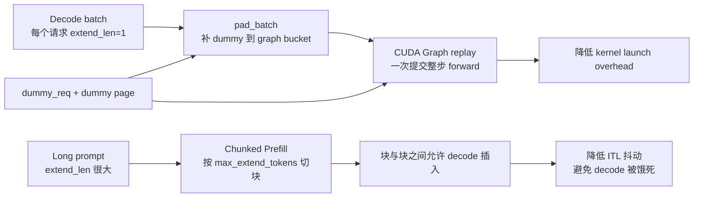

# 第 10 章：CUDA Graph 与 Chunked Prefill

> 这一章讲两个看似无关、实际紧密相连的优化：
> - **CUDA Graph**：把 decode 的整个 forward 录成一个大 op，replay 时省掉 kernel launch 开销。
> - **Chunked Prefill**：把超长 prompt 切成多块，避免单次 prefill 占用太多算力把 decode 饿死。
>
> 它们的共同点是都在 **`pad_batch` / `padded_size`** 上做文章——decode 必须 pad 到 capture 过的 bs 值，prefill 必须按 chunk 切。

---

先给两个优化的关系画一张总图。CUDA Graph 解决的是 decode 小步多 kernel 的 launch overhead；Chunked Prefill 解决的是长 prompt 一次 prefill 霸占 GPU 太久的问题。



## 10.1 为什么 decode 慢——kernel launch overhead

LLM decode 一步要跑几十层 transformer，每层至少 5-10 个 kernel（QKV proj、RoPE、attention、O proj、norm、residual add、SiLU、down proj、up proj、gate proj 等）。一个 30 层模型一步至少 200-300 个 kernel launch。

每个 kernel launch 在 CUDA driver / runtime 里要做：
- 解析参数
- 找内核函数
- 准备 launch config
- 提交到 stream queue

每个 launch 大概 10-30 µs（CPU 时间）。300 launch = 3-9 ms 的 launch overhead。

而 **decode 本身的 GPU 计算时间**：对小模型（Qwen3-0.6B）只有几毫秒——launch overhead 几乎和计算同等量级！这意味着 GPU 一半时间在等 CPU launch 下一个 kernel。

CUDA Graph 把所有这些 launch **预先录到一个 graph 里**，replay 时一次性提交——kernel launch 开销从 N 个 RPC 变成 1 个。

---

## 10.2 GraphRunner 的整体设计

[`graph.py:GraphRunner`](../../python/minisgl/engine/graph.py:78-171)：

```python
class GraphRunner:
    def __init__(self, stream, device, model, attn_backend,
                 cuda_graph_bs, cuda_graph_max_bs, free_memory,
                 max_seq_len, vocab_size, dummy_req):
        cuda_graph_bs = _determine_cuda_graph_bs(cuda_graph_bs, cuda_graph_max_bs, free_memory)
        ...
        self.max_graph_bs = max(cuda_graph_bs) if cuda_graph_bs else 0
        self.graph_bs_list = sorted(cuda_graph_bs)
        ...
        self._capture_graphs(max_seq_len, vocab_size, model)
```

三块：

1. **决定要 capture 哪些 batch_size**：`graph_bs_list`，比如 `[1, 2, 4, 8, 16, 24, 32, ..., 256]`。
2. **`_capture_graphs`**：依次为每个 bs capture 一个 graph，存到 `graph_map: Dict[int, CUDAGraph]`。
3. **`replay(batch)`**：把 batch 数据拷到 capture buffer，调 `graph.replay()`。

### 决定 graph_bs_list

[`graph.py:49-67`](../../python/minisgl/engine/graph.py)：

```python
def _determine_cuda_graph_bs(cuda_graph_bs, cuda_graph_max_bs, free_memory):
    if cuda_graph_bs is not None: return cuda_graph_bs
    free_memory_gb = free_memory / (1 << 30)
    if cuda_graph_max_bs is None:
        if free_memory_gb > 80:  cuda_graph_max_bs = 256   # H100/H200 80GB
        else:                    cuda_graph_max_bs = 160
    if cuda_graph_max_bs < 1:    return []
    return [1, 2, 4] + list(range(8, cuda_graph_max_bs + 1, 8))
```

策略：
- 显存够大时（>80 GB），上限 256；否则 160。
- 小 bs 用 `[1, 2, 4]`（线性增长保留小 bs 的性能优势）。
- 大 bs 用 `range(8, max+1, 8)`（间隔 8，每个 bucket 最多多 7 个 dummy）。

`--cuda-graph-max-bs 0` 完全关掉 CUDA Graph（CLI flag 见 [`server/args.py:148-154`](../../python/minisgl/server/args.py)）。

### `_capture_graphs`

[`graph.py:105-147`](../../python/minisgl/engine/graph.py)：

```python
def _capture_graphs(self, max_seq_len, vocab_size, model):
    self.graph_map = {}
    if self.max_graph_bs == 0:
        return logger.info_rank0("CUDA graph is disabled.")

    self.attn_backend.init_capture_graph(max_seq_len=max_seq_len, bs_list=self.graph_bs_list)
    ...
    self.buffer = GraphCaptureBuffer.init(self.max_graph_bs, vocab_size, self.device)
    pbar = tqdm(sorted(self.graph_bs_list, reverse=True), ...)
    pool = None
    for bs in pbar:
        graph = torch.cuda.CUDAGraph()
        batch = Batch(reqs=[self.dummy_req] * bs, phase="decode")
        batch.padded_reqs = batch.reqs
        self.attn_backend.prepare_for_capture(batch)
        self.buffer.set_batch(batch)
        with get_global_ctx().forward_batch(batch):
            self.buffer.logits[:bs] = model.forward()                # warmup（确保 lazy init 完成）
            with torch.cuda.graph(graph, pool=pool, stream=self.stream):
                self.buffer.logits[:bs] = model.forward()             # 这一次被 capture
        if pool is None:
            pool = graph.pool()                                      # 复用 graph memory pool
        self.graph_map[bs] = graph
```

几个值得注意的点：

#### 从大到小 capture（`reversed`）

`tqdm(sorted(self.graph_bs_list, reverse=True))`——先 capture bs=256，再 192、128、...、1。

为什么？大 bs 的 graph 内部 memory 需求最大；先 capture 大的，**memory pool 一次性按最大需求分配**；后面小 bs 用同一个 pool，不需要再扩。如果反过来从小到大 capture，pool 会反复扩容。

`pool=graph.pool()` 的写法——第一次 capture 后拿到 pool 句柄，后面所有 graph 共享。

#### Warmup forward

```python
self.buffer.logits[:bs] = model.forward()                # warmup
with torch.cuda.graph(...):
    self.buffer.logits[:bs] = model.forward()             # capture
```

为什么要先跑一次 warmup？因为 PyTorch 的某些 op 是 **lazy init**——第一次调用时分配 workspace、初始化 cublas handle 等。这些操作不能进 graph（capture 期间不能分配新内存或做 stream 同步）。

所以 capture 前先用 dummy 跑一次让 lazy init 都完成，第二次 forward 就只是纯计算，可以安全 capture。

#### `dummy_req` 的多重身份

```python
batch = Batch(reqs=[self.dummy_req] * bs, phase="decode")
batch.padded_reqs = batch.reqs
```

capture 时整批都是 dummy。回想第 4.5 节：dummy_req 的 page_table 行全填 dummy page slot id，所以 attention 跑出来的结果是垃圾——但**没关系**，capture 不在乎结果对不对，只在乎"哪些 op 被 launch、什么参数"。

---

## 10.3 GraphCaptureBuffer

[`graph.py:GraphCaptureBuffer:20-46`](../../python/minisgl/engine/graph.py)：

```python
@dataclass
class GraphCaptureBuffer:
    input_ids: torch.Tensor   # [max_bs] int32
    out_loc: torch.Tensor     # [max_bs] int32
    positions: torch.Tensor   # [max_bs] int32
    logits: torch.Tensor      # [max_bs, vocab_size] float32

    def set_batch(self, batch):
        _slice = slice(batch.padded_size)
        batch.input_ids = self.input_ids[_slice]
        batch.out_loc   = self.out_loc[_slice]
        batch.positions = self.positions[_slice]

    def copy_from(self, batch):
        _slice = slice(batch.padded_size)
        self.input_ids[_slice] = batch.input_ids
        self.out_loc[_slice]   = batch.out_loc
        self.positions[_slice] = batch.positions
```

设计意图：

- **buffer 在 capture 之前一次性分配**，capture 期间所有 op 引用这些 buffer 的指针。
- **replay 之前用 `copy_from` 把真实数据写入 buffer**：graph 里的 op 引用的 buffer 地址不变，但内容是当前 batch 的，所以 replay 出来的结果就是当前 batch 的结果。
- **`set_batch` 是 capture 阶段用**：把 dummy batch 的 input_ids/out_loc/positions 字段重定向到 buffer 切片，让 model.forward 直接读 buffer。

> 关键不变量：**buffer 的张量地址在 capture 后不能换**。否则 graph 里 op 对应的内存地址错位、replay 时读到垃圾。

---

## 10.4 `replay` 与 `pad_batch`

[`graph.py:152-166`](../../python/minisgl/engine/graph.py)：

```python
def can_use_cuda_graph(self, batch):
    return batch.is_decode and batch.size <= self.max_graph_bs

def replay(self, batch):
    assert self.can_use_cuda_graph(batch)
    self.buffer.copy_from(batch)
    g = self.graph_map[batch.padded_size]
    self.attn_backend.prepare_for_replay(batch)
    g.replay()
    return self.buffer.logits[:batch.size]

def pad_batch(self, batch):
    padded_size = (
        next(bs for bs in self.graph_bs_list if bs >= batch.size)
        if self.can_use_cuda_graph(batch)
        else batch.size
    )
    batch.padded_reqs = batch.reqs + [self.dummy_req] * (padded_size - batch.size)
```

### `pad_batch` 的桶化逻辑

`next(bs for bs in self.graph_bs_list if bs >= batch.size)` 找第一个不小于 batch.size 的 bs。比如 batch.size=13、graph_bs_list=[1,2,4,8,16,24,32,...]，pad 到 16，多 3 个 dummy。

`batch.padded_reqs = batch.reqs + [dummy] * 3`——dummy 占据后面的位置。

### `replay` 三步

1. `self.buffer.copy_from(batch)`：把当前 batch 的 input_ids/out_loc/positions 拷到 capture buffer。
2. `self.attn_backend.prepare_for_replay(batch)`：让 attention backend 把当前 metadata 拷到它的 capture buffer（FA/FlashInfer 各自实现，第 9 章讲过）。
3. `graph.replay()`：触发 GPU 跑整个 captured graph。
4. 返回 `self.buffer.logits[:batch.size]`——只取真实部分的 logits（dummy 的丢掉）。

---

## 10.5 哪些 op 走 graph、哪些不走

CUDA Graph 能 capture 的 op 有限制：

✅ **能 capture**：
- 矩阵乘 / RMSNorm / softmax / attention / element-wise op
- pynccl 的 collective（通过 stream 关联）
- FA / FlashInfer / TRT-LLM 的 attention kernel

❌ **不能 capture**：
- 任何分配新内存的操作（`torch.empty(...)`，除非用 capture-allocator）
- `cuda.synchronize`、`stream.synchronize`
- CPU 端的 Python 代码（包括 `if`、`for`，但会被 trace 成 single-path）
- torch.distributed 的 NCCL（默认实现有 implicit sync，所以 mini-sglang 用 pynccl 替代）

这就是为什么 **prepare_metadata 必须放在 forward 之外**：metadata 构造涉及 `torch.tensor(...).to(...)` 这种 H2D，capture 不了。

也是为什么 mini-sglang 默认用 pynccl 而不是 torch nccl ([engine.py:_init_communication](../../python/minisgl/engine/engine.py:112-137))：torch nccl 的 all_reduce 隐式 sync stream，会破坏 capture。

---

## 10.6 内存占用：CUDA Graph 不便宜

每个 captured graph 持有一份 workspace（attention 的 workspace、临时 tensor、KV cache 引用等）。在 mini-sglang 里：

- `pool = graph.pool()` 让所有 graph 共享 memory pool—— 大幅减少内存。
- 但每个 graph 还是有自己的内部状态记账。

实测：32 层小模型、bs_list=[1,2,4,8,...,256]，CUDA Graph 占用大约 1-2 GB 的额外显存（相对于不用 graph）。

如果显存紧（小 GPU、模型大），可以：
- `--cuda-graph-max-bs 64`：减少 capture 的 bs 数量。
- `--cuda-graph-max-bs 0`：完全关掉。

`Engine.__init__` 在 capture 前后都打印 free memory（[`graph.py:117-118, 146-147`](../../python/minisgl/engine/graph.py)），方便调优。

---

## 10.7 Chunked Prefill：什么场景需要

> 📚 **算法来源**：chunked prefill 由 **SARATHI (Agrawal et al., arXiv:2308.16369, 2023)** 首次系统化提出，OSDI 2024 的 **SARATHI-Serve (arXiv:2403.02310)** 进一步把它推广到生产级调度。论文的核心洞察叫 **"piggyback decode with chunked prefill"**：把多个 in-flight decode 请求**搭顺风车**塞进 chunked prefill 的同一个 batch，让一次 forward 同时推进 prefill chunk 和 decode token——既隐藏 prefill 的延迟、又消除 decode 的 GPU 空闲。
>
> mini-sglang 实现了 chunked prefill 的"切分"部分（`max-prefill-length` + ChunkedReq），但**没有实现 piggyback**——它的 batch 永远是纯 prefill 或纯 decode（[`scheduler.py:_schedule_next_batch`](../../python/minisgl/scheduler/scheduler.py:219-225) 用 `or` 而不是混 batch）。这是 mini-sglang 与工业 SGLang 的一个差异，也是个值得练手的扩展点（第 15 章会再提）。
> DeepSpeed-FastGen 的 "Dynamic SplitFuse" 是同一思想的另一种实现。详见 [`references.md`](./references.md#sarathi-efficient-llm-inference-by-piggybacking-decodes-with-chunked-prefills)。

考虑这个场景：

- 用户发了一个 16K token 的 long-context prompt 做 prefill。
- 同时还有 30 个 in-flight 的 decode 请求。

如果 prefill 一次性跑完整 16K：
- 单次 forward 时间 = 100+ ms（compute-bound）。
- 这 100 ms 内 30 个 decode 请求**完全停滞**——它们的 ITL 突然飙升到 100+ ms。

Chunked prefill 把这个 16K 切成 N 段（比如 `--max-prefill-length 8192` → 切成 2 段，每段 8K）。每段做一次 forward，每段之间允许调度 decode batch 插入：

- t0: prefill chunk1 (8K) → 50 ms。decode 卡住 50 ms。
- t1: decode batch（30 个）→ 5 ms。每个 decode 出一个 token。
- t2: prefill chunk2 (8K) → 50 ms。decode 又卡 50 ms。
- t3: decode batch → 5 ms。每个 decode 又出一个 token。

总耗时差不多（100 ms vs 110 ms），但 decode 的 ITL 抖动大幅缓解。

**`--max-prefill-length` 默认 8192**（[`SchedulerConfig.max_extend_tokens`](../../python/minisgl/scheduler/config.py:16)）。CLI 别名 `--max-extend-length`。

> mini-sglang 的注释里说"don't go below ~512"——chunk 太小会让 prefill 完全 memory-bound，吞吐崩溃。

---

## 10.8 Chunked Prefill 在代码里怎么实现

回看第 6.4 节的 PrefillAdder。关键就是 [`_add_one_req`](../../python/minisgl/scheduler/prefill.py:65-90)：

```python
def _add_one_req(self, pending_req, cache_handle, table_idx, cached_len):
    remain_len = pending_req.input_len - cached_len
    chunk_size = min(self.token_budget, remain_len)
    is_chunked = chunk_size < remain_len
    CLS = ChunkedReq if is_chunked else Req
    self.token_budget  -= chunk_size
    self.reserved_size += remain_len + pending_req.output_len
    _slice = slice(cached_len, cached_len + chunk_size)
    device_ids = self.table_manager.token_pool[table_idx, _slice]
    device_ids.copy_(pending_req.input_ids[_slice].pin_memory(), non_blocking=True)
    return CLS(
        input_ids=pending_req.input_ids[: cached_len + chunk_size],   # ← 只到本块结束
        table_idx=table_idx,
        cached_len=cached_len,
        output_len=pending_req.output_len,
        ...
    )
```

要点：

1. **chunk_size = min(token_budget, remain_len)**：本批 prefill 的剩余预算 vs 这个请求还需要算的长度。
2. **`is_chunked = chunk_size < remain_len`**：如果还有剩，下次再切。
3. **`CLS = ChunkedReq if is_chunked else Req`**：中间块用 ChunkedReq（不能被 sample），最后一块用普通 Req（要 sample）。
4. **`Req.input_ids = pending_req.input_ids[:cached_len + chunk_size]`**：CPU 端 input_ids 只到本块结束——保证 device_len = 本块结束位置（因为 `device_len = len(input_ids)`，由 `__post_init__` 算）。

### PrefillManager 怎么处理 chunked 状态

[`PrefillManager.schedule_next_batch:126-151`](../../python/minisgl/scheduler/prefill.py)：

```python
reqs = []
chunked_list = []
for pending_req in self.pending_list:
    if req := adder.try_add_one(pending_req):
        pending_req.chunked_req = None
        if isinstance(req, ChunkedReq):
            pending_req.chunked_req = req     # ← 状态保留在 pending_req 上
            chunked_list.append(pending_req)
        reqs.append(req)
    else:
        break
if len(reqs) == 0: return None
self.pending_list = chunked_list + self.pending_list[len(reqs):]   # ← chunked 留在 pending_list 前面
return Batch(reqs=reqs, phase="prefill")
```

- 如果切成 ChunkedReq，把它**留在 pending_req.chunked_req 字段**，pending_req 也保留在 chunked_list 里——它会回到下一轮 pending_list 的最前面，下次还是从它开始切。
- 普通 Req（最后一块或一次切完）从 pending_list 里被取出，不再回去。

下一轮 `try_add_one` 看到 `pending_req.chunked_req != None`，走 [chunked 分支](../../python/minisgl/scheduler/prefill.py:96-102)：

```python
if chunked_req := pending_req.chunked_req:
    return self._add_one_req(
        pending_req=pending_req,
        cache_handle=chunked_req.cache_handle,    # 复用前一段的 handle
        table_idx=chunked_req.table_idx,
        cached_len=chunked_req.cached_len,        # 接着前一段的 cached_len 切
    )
```

**resource 不重新申请**——上一段已经分了 table_idx + cache_handle，就是用同一份。

### ChunkedReq 在 forward 里的特殊处理

[`scheduler.py:_process_last_data:147-149`](../../python/minisgl/scheduler/scheduler.py)：

```python
for i, req in enumerate(batch.reqs):
    if isinstance(req, ChunkedReq):
        continue                       # ← 不 sample，不发 reply
```

ChunkedReq 也跑 forward（K/V 也写到 cache），但它**不被 sample**——因为最后一段还没来，提前 sample 出来的 token 是错的。

[`engine.py:forward_batch:199-200`](../../python/minisgl/engine/engine.py)：

```python
for req in batch.reqs:
    req.complete_one()
```

这里 ChunkedReq 也会 `complete_one`——把 `cached_len` 推到 `device_len`，下一段从这里继续。

---

## 10.9 一个完整的 chunked prefill 例子

假设 max_extend_tokens = 4096，请求 X 的 input_ids 长度 = 9000。

```
轮 1:
  pending_list = [X]
  schedule_next_batch:
    adder.token_budget = 4096
    for X:
      cache_handle = match (cached_len=0)
      _try_allocate_one: estimated_len=9000+output_len, 假设资源足够
      _add_one_req(X, ..., cached_len=0):
        remain_len=9000, chunk_size=min(4096, 9000)=4096
        is_chunked=True, CLS=ChunkedReq
        token_budget -= 4096 → 0
        Req(input_ids[:4096], cached_len=0, table_idx=T)
    pending_list 重新构造: [X (chunked_req=ChunkedReq A)]
  Batch(reqs=[ChunkedReq A], phase="prefill")
  forward 跑 prefill, ChunkedReq A.complete_one() → cached_len=4096, device_len=4097（这里有点小问题，因为device_len = len(input_ids[:4096])=4096，complete_one 后 device_len=4097）
  
  哦，这里其实 ChunkedReq 是 chunked 时 device_len = cached_len + chunk_size = 0+4096=4096，complete_one 后 cached_len=4096, device_len=4097——但是这违反了"不能sample"...

  不对，再看 _add_one_req 末尾 input_ids=pending_req.input_ids[:cached_len + chunk_size]，所以 input_ids.length=4096，device_len 也是 4096。complete_one 后 cached_len=4096, device_len=4097。但这个 ChunkedReq 会被丢弃（_process_last_data 跳过），不会真正 append_host。

  所以下一轮：
轮 2:
  pending_list = [X (chunked_req=ChunkedReq A)]
  注意：pending_req.input_ids 还是原来的 9000 长度——chunked_req.cached_len=4096
  schedule_next_batch:
    adder.token_budget = 4096
    for X:
      pending_req.chunked_req exists →
      _add_one_req(X, cache_handle=chunked_req.cache_handle, table_idx=chunked_req.table_idx, cached_len=4096):
        remain_len = 9000 - 4096 = 4904
        chunk_size = min(4096, 4904) = 4096
        is_chunked=True
        新 ChunkedReq B: input_ids[0:8192], cached_len=4096
        token_budget -= 4096 → 0
    pending_list = [X (chunked_req=ChunkedReq B)]
  Batch(reqs=[ChunkedReq B], phase="prefill")
  forward, complete_one → cached_len=8192

轮 3:
  pending_list = [X (chunked_req=B, cached_len=8192)]
  _add_one_req: remain_len=9000-8192=808, chunk_size=min(4096, 808)=808, is_chunked=False, CLS=Req
  Req C: input_ids[0:9000], cached_len=8192
  pending_list = [] (X 被消耗了)
  Batch(reqs=[Req C], phase="prefill")
  forward → 真正 sample 出第一个 token
  X 进入 decode 队列
```

整个过程把 9000 token 切成 4096 + 4096 + 808 三段，每段之间 decode 都能插入跑。

---

## 10.10 检查清单

1. **CUDA Graph 为什么只对 decode 用，不对 prefill 用？**
   <details><summary>参考答案</summary>

   - **decode 形状稳定**：每个序列 q 长度都是 1，唯一变化的是 batch_size 和 cache 长度。前者用 padding 桶化解决；后者通过 graph buffer 的最大长度 + replay 时拷实际值解决。
   - **prefill 形状高度可变**：每个序列的 q 长度可以从几十到几千 token 任意变化，cu_seqlens 完全不同；硬要 capture 一堆不同 shape 的 graph 会爆炸（capture 数量 = `bs * max_q` 量级）。
   - **prefill 的 launch overhead 占比小**：prefill 的 GPU 时间几十到上百毫秒，launch overhead < 5%；CUDA Graph 收益不大。
   </details>

2. **`pool = graph.pool()` 是干什么？为什么从大到小 capture？**
   <details><summary>参考答案</summary>

   `graph.pool()` 拿到第一个 graph 的内存池句柄。之后所有 `torch.cuda.graph(graph, pool=pool, stream=...)` 共享这个池——多个 graph 复用同一段内存（CUDA driver 知道它们不会同时活动）。

   从大到小 capture：第一个 capture 的 bs=max_bs 占用最大，先开池子按最大需求分配；后面小 bs 用同一个池子，不再扩容。如果反过来，第一个池子小，后面 capture 大 graph 时要扩容——可能失败或昂贵。

   节省的内存可达数 GB（每个 graph 各开池的话）。
   </details>

3. **`buffer.copy_from(batch)` 在 replay 之前必须做。如果忘了写会怎样？**
   <details><summary>参考答案</summary>

   replay 出来的结果是**上一次** batch 的结果——因为 buffer 内容没更新，graph 里的 op 还引用着上一次的数据。

   极端情况下，第一次 replay 跑出来的是 capture 时填进去的 dummy 数据（全 0）；以后每次 replay 跟上一次的输入相关。模型 forward 看似在跑，但输入完全不对。

   这种 bug 不会触发 assertion，但生成质量直线下降——是非常容易踩的"语义错误"。要靠手动 review 或 sanity check 兜底。
   </details>

4. **Chunked prefill 把一个长 prompt 切成 N 段后，第 i 段的 attention metadata 长什么样？`extend_len` 和 `cached_len` 都会变吗？**
   <details><summary>参考答案</summary>

   每段：
   - **`cached_len`** = 前面所有段的总长度（i=0 时为 prefix cache match_len）。
   - **`device_len`** = `cached_len + chunk_size`。
   - **`extend_len`** = chunk_size。
   - **attention 看到的 K**：长度 = `device_len`，包括前面段已经写到 KV cache 的部分 + 本段刚写的部分。
   - **attention 看到的 Q**：长度 = `extend_len`，本段的 chunk_size 个 token。

   也就是说，**第 i 段的 q 是新的，k 是累计的**——和 "prefill with prefix cache hit" 完全一样的形状。FA/FlashInfer/TRT-LLM 都支持这种"q < k"的 ragged batch，不需要 chunked prefill 的特殊路径。
   </details>

5. **如果有 100 个并发 decode 请求，CUDA Graph 的 batch_size 列表是 `[1,2,4,8,16,...,256,8]`。一步 forward 实际跑哪个 graph？**
   <details><summary>参考答案</summary>

   `pad_batch` 找 `next bs >= 100` = `104`？错——`graph_bs_list = [1,2,4,8,16,24,...,256]`（间隔 8 从 8 开始），不是 100。100 找下一个 = 104？不，列表是 `[8, 16, 24, 32, 40, 48, ..., 256]`——具体地 `range(8, max+1, 8) = [8, 16, 24, 32, 40, 48, 56, 64, 72, 80, 88, 96, 104, 112, ...]`。所以 100 → 104。

   实际 batch.padded_size = 104，padding 4 个 dummy_req。replay `graph_map[104]`。`logits[:100]` 是真实结果。

   注意 `graph_bs_list` 实际是 `[1, 2, 4] + range(8, max+1, 8)`，所以 padding 的最小桶位是 4。
   </details>

---

## 下一章预告

下一章我们看 mini-sglang 的 **Tensor Parallelism** 细节：TP 数学原理（Column/Row Parallel Linear）、NCCL 通信原语在哪里被调用、为什么要自己写 pynccl 而不是用 torch.distributed.nccl、`enable_pynccl_distributed` 怎么 boot 起来。
