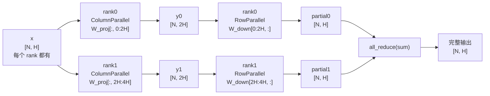

# 第 11 章：Tensor Parallelism 与 PyNCCL

> mini-sglang 的 TP 实现和 nano-vllm 完全不同：用 NCCL 走 GPU 通信、用 ZMQ 走 CPU 控制流、自己写了一个 pynccl wrapper 绕开 torch.distributed.nccl。
>
> 这一章讲清楚：① TP 数学原理（Column/Row Parallel）；② mini-sglang 的 5 种 Linear 各对应什么场景；③ pynccl 为什么必须自己写、它的 stream 模型；④ 整个 TP 如何在 launch 时握手起来。
>
> 入口：[`layers/linear.py`](../../python/minisgl/layers/linear.py)、[`distributed/impl.py`](../../python/minisgl/distributed/impl.py)、[`kernel/pynccl.py`](../../python/minisgl/kernel/pynccl.py)、[`engine/engine.py:_init_communication`](../../python/minisgl/engine/engine.py:112-137)。

---

## 11.1 TP 数学原理简单回顾

> 📚 **算法来源**：本章讲的 column / row parallel 切法来自 **Megatron-LM (Shoeybi et al., arXiv:1909.08053, 2019)** §3。后续的 sequence parallel（Korthikanti 2023, MLSys）在此之上补了 LayerNorm/Dropout 切分，mini-sglang 没实现。详见 [`references.md`](./references.md#megatron-lm-training-multi-billion-parameter-language-models-using-model-parallelism)。

考虑 transformer 里两个连续的 linear：

```
y_proj  = x @ W_proj^T          # [N, H] @ [H, 4H]  → [N, 4H]
y_silu  = silu(y_proj)
y_down  = y_silu @ W_down^T     # [N, 4H] @ [4H, H] → [N, H]
```

**Column Parallel**（W_proj）：把 W_proj 沿**输出维**切。每个 rank 持有 `W_proj[:, r * 4H/N : (r+1) * 4H/N]`，得到 `y_proj[:, r * 4H/N : (r+1) * 4H/N]`——输出在通道维分散，每个 rank 各自有一片。

**Row Parallel**（W_down）：把 W_down 沿**输入维**切。每个 rank 持有 `W_down[r * 4H/N : (r+1) * 4H/N, :]`，输入正好是上一步的分片输出。每个 rank 算出 `[N, H]` 的 partial sum，最后做 **all_reduce** 把所有 rank 的 partial 加起来 = 完整 `y_down`。

**核心节省**：列切 + 行切 = **一次 all_reduce 通信**，而不是两次（如果列切之后做 all_gather 再做下一层）。这是 Megatron 论文的经典分解。



> mini-sglang 的所有 attention block / FFN block 都按这套切：`qkv_proj` 列切（输出 = 各 head 的 Q/K/V），`o_proj` 行切（输入 = 各 head 的 attn out，输出做 all_reduce）；MLP 的 `gate_up_proj` 列切，`down_proj` 行切。

---

## 11.2 mini-sglang 的 5 种 Linear

[`layers/linear.py`](../../python/minisgl/layers/linear.py) 定义了 5 种：

| 类 | 切法 | 用途 | 输出做 all_reduce？ |
|----|-----|-----|------|
| `LinearReplicated` | 不切（全复制） | MoE router | 否 |
| `LinearColParallelMerged` | 列切 + 输出维度合并 | gate_up_proj（gate 和 up 合并） | 否 |
| `LinearQKVMerged` | 列切，按 head 切 | qkv_proj | 否 |
| `LinearOProj` | 行切 + all_reduce | attention out projection | **是** |
| `LinearRowParallel` | 行切 + all_reduce | down_proj | **是** |

逐个看：

### LinearReplicated

```python
class LinearReplicated(_LinearTPImpl):
    def __init__(self, input_size, output_size, has_bias):
        super().__init__(
            full_isize=input_size,
            full_osize=output_size,
            local_isize=input_size,
            local_osize=output_size,
            has_bias=has_bias,
        )
```

完整 weight 复制到每个 rank。用在 MoE 的 router（[`models/utils.py:62-66`](../../python/minisgl/models/utils.py)）——router 输出每个 expert 的 logits，TP 切了之后还要再 gather 回来才能 routing，得不偿失。

### LinearColParallelMerged

```python
class LinearColParallelMerged(_LinearTPImpl):
    def __init__(self, input_size, output_sizes, has_bias):
        tp_info = get_tp_info()
        tp_output_sizes = [div_even(size, tp_info.size) for size in output_sizes]
        output_size = sum(output_sizes)
        tp_output_size = sum(tp_output_sizes)
        super().__init__(input_size, output_size, input_size, tp_output_size, has_bias)
```

接受 `output_sizes: List[int]`——一个 weight 实际是多个 sub-projection 拼起来，比如 `gate_up_proj = [gate, up]`、output_sizes=[intermediate, intermediate]。每个 sub 都按 TP 切，最后串成一行 weight。

forward 不需要通信，因为输出本来就是 channel-parallel，下一层（LinearRowParallel）会消化。

### LinearQKVMerged

```python
class LinearQKVMerged(_LinearTPImpl):
    def __init__(self, hidden_size, head_dim, num_qo_heads, num_kv_heads, has_bias):
        tp_info = get_tp_info()
        local_num_qo = div_even(num_qo_heads, tp_info.size)
        local_num_kv = div_even(num_kv_heads, tp_info.size, allow_replicate=True)
        full_isize  = hidden_size
        full_osize  = (num_qo_heads + 2 * num_kv_heads) * head_dim
        local_isize = hidden_size
        local_osize = (local_num_qo + 2 * local_num_kv) * head_dim
        super().__init__(full_isize, full_osize, local_isize, local_osize, has_bias)
```

QKV 三个 projection 合成一个大 linear，列切。注意 KV head 用 `allow_replicate=True`——GQA 时 num_kv_heads 可能小于 tp_size，每个 rank **复制**完整的 num_kv_heads。

### LinearOProj 和 LinearRowParallel

```python
class LinearOProj(_LinearTPImpl):
    def __init__(self, input_size, output_size, has_bias):
        tp_info = get_tp_info()
        local_isize = div_even(input_size, tp_info.size)
        local_osize = output_size
        self._comm = DistributedCommunicator()
        self._tp_size = tp_info.size
        super().__init__(...)

    def forward(self, x):
        y = F.linear(x, self.weight, self.bias)
        if self._tp_size > 1:
            y = self._comm.all_reduce(y)
        return y
```

行切 + all_reduce。`LinearRowParallel` 几乎一样，专门给 MLP 的 down_proj 用。

它们的差别只在**语义命名**——`LinearOProj` 强调"attention output projection"、`LinearRowParallel` 强调"通用行切"。两者实现完全一样。

---

## 11.3 VocabParallelEmbedding 与 ParallelLMHead

不止 Linear 切，**Embedding 也切**——按 vocab 维切（[`layers/embedding.py`](../../python/minisgl/layers/embedding.py)）。

### VocabParallelEmbedding

```python
class VocabParallelEmbedding(BaseOP):
    def __init__(self, num_embeddings, embedding_dim):
        tp_info = get_tp_info()
        tp_rank = tp_info.rank
        self.tp_size = tp_info.size
        self.num_embeddings_tp = div_ceil(num_embeddings, self.tp_size)
        start_idx = self.num_embeddings_tp * tp_rank
        finish_idx = min(start_idx + self.num_embeddings_tp, num_embeddings)
        self.vocab_range = (start_idx, finish_idx - start_idx)
        self.weight = torch.empty(self.num_embeddings_tp, embedding_dim)

    def forward(self, x):
        from minisgl.kernel import indexing
        y = indexing(
            weights=self.weight,
            indices=x,
            vocab_range=self.vocab_range if self.tp_size > 1 else None,
        )
        return self._comm.all_reduce(y) if self.tp_size > 1 else y
```

每个 rank 持有 `vocab_size / tp_size` 行 embedding。某 token id 落在自己的 vocab_range 内，`indexing` kernel 返回对应 embedding；否则返回 0。最后 all_reduce 让每个 rank 都拿到完整 embedding。

`indexing` 是自定义 CUDA kernel ([`kernel/index.py`](../../python/minisgl/kernel/index.py))——比 `torch.embedding + masked_fill` 快。

### ParallelLMHead

[`layers/embedding.py:88-110`](../../python/minisgl/layers/embedding.py)：

```python
def forward(self, x):
    ctx = get_global_ctx()
    batch = ctx.batch
    bs = batch.size
    if batch.is_prefill:
        indices = batch.attn_metadata.get_last_indices(bs)
        x = x[indices].contiguous()              # 只取每序列最后一个 token

    module = self.tied_embedding or self
    logits = F.linear(x, module.weight, self.bias)
    if self.tp_size == 1:
        return logits
    output_tensor = self._comm.all_gather(logits)  # gather 各 rank 的 vocab partial
    if bs == 1:
        return output_tensor.view(1, -1)[:, :self.num_embeddings]
    output_tensor = output_tensor.view((self.tp_size,) + input_shape)
    output_tensor = output_tensor.permute(1, 0, 2).contiguous()
    output_tensor = output_tensor.reshape(input_shape[:1] + (self.tp_size * input_shape[1],))
    return output_tensor[:, :self.num_embeddings]   # trim padding
```

3 个要点：

1. **prefill 时只取最后一个 token**：通过 `attn_metadata.get_last_indices(bs)`。这是 prefill / decode 的差异——prefill 输入 `[total_tokens, H]`，但只有每序列最后一个 token 需要算 logits（用来 sample 第一个新 token）。
2. **all_gather 而不是 all_reduce**：因为 vocab 维度是切的，每个 rank 算出 `[bs, vocab/N]`，gather 完得到 `[bs, vocab]`。
3. **维度重排**：all_gather 后是 `[N*bs, vocab/N]`（默认 stack 在 dim=0），reshape 成 `[bs, N, vocab/N]`、permute 成 `[bs, vocab]`。

**`tied_embedding`**：很多模型把 LM head 和 embedding 共享 weight（`tie_word_embeddings=True`）。`ParallelLMHead` 持有 `tied_embedding` 引用，forward 时用它的 weight，不另开一份。

---

## 11.4 DistributedCommunicator：通信抽象

[`distributed/impl.py`](../../python/minisgl/distributed/impl.py)：

```python
class DistributedCommunicator:
    plugins: List[DistributedImpl] = [TorchDistributedImpl()]

    def all_reduce(self, x):  return self.plugins[-1].all_reduce(x)
    def all_gather(self, x):  return self.plugins[-1].all_gather(x)
```

设计模式：**plugin 栈，调用最后注册的**。

- 默认只有 `TorchDistributedImpl`（用 torch.distributed）。
- `enable_pynccl_distributed` 在初始化后 push 一个 `PyNCCLDistributedImpl`——以后所有 collective 走 pynccl。
- 想加新 backend（比如 NVSHMEM）就再写一个 push 上去。

注意 `plugins` 是**类变量**，所有实例共享。Engine 一次性 enable 之后，所有 `DistributedCommunicator()` 实例都用 pynccl。

---

## 11.5 PyNCCL：为什么不用 torch.distributed.nccl

mini-sglang 默认开 pynccl（`use_pynccl=True`）。原因有两个：

### 原因 1：torch.distributed.nccl 与 CUDA Graph capture 的不友好

torch 的 NCCL 实现 (`ProcessGroupNCCL`) 在调度 collective 时有几个 capture 不友好的行为：

1. **专门的 NCCL stream**：collective op 不是在调用方的当前 stream 上 enqueue，而是 ProcessGroupNCCL 内部维护的"NCCL stream"。然后通过 `record_stream` 让当前 stream 等 NCCL stream（CUDA Event 同步）。
2. **`work.wait()` 隐式 host 同步**：默认情况下 `dist.all_reduce(...)` 返回的 `Work` 对象会在某些 path 上调用 `cudaEventSynchronize`（host 同步），CUDA Graph capture 期间不允许这样。
3. **跨 stream 数据所有权追踪**：`record_stream` 标记当前 stream 持有 tensor 的引用，capture 期间 stream-graph 关系是显式的，这种隐式追踪与 capture 状态机冲突。

NCCL 库本身从 2.15 起原生支持 stream capture（[NCCL release notes](https://github.com/NVIDIA/nccl/releases)），但 PyTorch 的包装层一直没把"capture-friendly path"做成默认。社区有一些 workaround（`use_high_priority_stream=False` + 手动 record_stream），但配置复杂。

mini-sglang 直接绕开 ProcessGroupNCCL，自己写 [`PyNCCLCommunicator`](../../python/minisgl/kernel/pynccl.py)，让 NCCL collective 在**调用方当前 stream** 上发起，不切 stream、不做 host 同步——天然 capture-compatible。

### 原因 2：pynccl 让通信和计算同 stream

[`pynccl.py:init_pynccl:45-78`](../../python/minisgl/kernel/pynccl.py)：

```python
def init_pynccl(*, tp_rank, tp_size, tp_cpu_group, max_size_bytes):
    max_size_bytes = min(max_size_bytes, ENV.PYNCCL_MAX_BUFFER_SIZE.value)
    module = _load_nccl_module()
    cls = _get_pynccl_wrapper_cls()
    if tp_rank == 0:
        id_list = [module.create_nccl_uid()]
        torch.distributed.broadcast_object_list(id_list, src=0, group=tp_cpu_group)
    else:
        id_list = [None]
        torch.distributed.broadcast_object_list(id_list, src=0, group=tp_cpu_group)
    nccl_id = id_list[0]
    return cls(tp_rank, tp_size, max_size_bytes, nccl_id)
```

关键是 pynccl 的 collective 在调用方的当前 stream 上 enqueue，不切换 stream，不做隐式同步。这样 CUDA Graph capture 能干净地把 all_reduce 也录进去。

### pynccl 的实现栈

```
PyNCCLDistributedImpl (Python)            ← 实现 DistributedImpl 接口
  └─ comm: PyNCCLCommunicator (tvm-ffi 包装)
       └─ pynccl.cu (C++/CUDA, NCCL 库直接绑定)   ← 用 tvm-ffi 加载的 .so
```

[`kernel/pynccl.py`](../../python/minisgl/kernel/pynccl.py) 用 `tvm-ffi` 的 `load_aot` 加载一个 .so 文件（`csrc/pynccl.cu`，本地用 nvcc + `-lnccl` 编译）。然后通过 `@tvm_ffi.register_object("minisgl.NCCLWrapper")` 注册一个 Python class，可以直接调用 `comm.all_reduce(tensor, "sum")`。

`tvm-ffi` 是 TVM 团队的 FFI 库，比 cuda-python 更轻、JIT 编译更快——mini-sglang 作者选择它来做 C++/CUDA 绑定。

---

## 11.6 NCCL 通信子的 Bootstrap

NCCL 工作前必须先建立 **communicator**——一组 GPU 通过同一个 nccl_id 建立一个通信子。Bootstrap 流程：

1. **rank 0 创建 nccl_id**（一个唯一的 128 字节字符串）。
2. **广播 nccl_id 到所有 rank**（在 mini-sglang 通过 `tp_cpu_group`，一个 gloo group）。
3. **每个 rank 用 (rank, size, nccl_id) 调 ncclCommInitRank**——所有 rank 都调完后通信子就建立好了。

[`pynccl.py:62-78`](../../python/minisgl/kernel/pynccl.py) 的实现：

```python
if tp_rank == 0:
    id_list = [module.create_nccl_uid()]
    torch.distributed.broadcast_object_list(id_list, src=0, group=tp_cpu_group)
else:
    id_list = [None]
    torch.distributed.broadcast_object_list(id_list, src=0, group=tp_cpu_group)
nccl_id = id_list[0]
return cls(tp_rank, tp_size, max_size_bytes, nccl_id)
```

`broadcast_object_list` 用 gloo group——必须用 CPU 后端，因为 nccl_id 是 Python 对象。

回到 [`Engine._init_communication`](../../python/minisgl/engine/engine.py:112-137)：

```python
if config.tp_info.size == 1 or config.use_pynccl:
    torch.distributed.init_process_group(backend="gloo", ...)
    tp_cpu_group = torch.distributed.group.WORLD
    enable_pynccl_distributed(config.tp_info, tp_cpu_group, max_bytes)
else:
    torch.distributed.init_process_group(backend="nccl", ...)
    tp_cpu_group = torch.distributed.new_group(backend="gloo")
```

两种路径：
- **pynccl**：torch 的 process group 用 gloo（用于 nccl_id 广播 + scheduler/io 的 CPU broadcast），同时启动 pynccl。
- **torch nccl**：torch 用 nccl，**额外**建一个 gloo group 给 CPU 通信。

无论哪种路径，**总有两个 group**：一个 GPU collective（NCCL 或 pynccl）、一个 CPU collective（gloo）。

---

## 11.7 init_process_group 和 ZMQ 的对应关系

回顾第 1 章的拓扑图：scheduler ranks 之间的"控制流"用 ZMQ PUB/SUB，"GPU 张量"用 NCCL。但 **scheduler 还需要一个第三类通信**：CPU broadcast（用来同步消息计数等）。这就是 gloo group 的用途。

具体场景（[`scheduler/io.py:_recv_msg_multi_rank0:88-122`](../../python/minisgl/scheduler/io.py)）：

```python
# rank 0
src_tensor = torch.tensor(len(pending_raw_msgs))
self.tp_cpu_group.broadcast(src_tensor, root=0).wait()

# rank 1+
dst_tensor = torch.tensor(-1)
self.tp_cpu_group.broadcast(dst_tensor, root=0).wait()
dst_length = int(dst_tensor.item())
```

为什么不用 ZMQ 同步？因为 ZMQ 的 PUB/SUB 不保证 atomic broadcast——如果 rank 0 还在 publish，rank 1 已经开始处理，会出现一致性问题。gloo barrier 给一个**显式同步点**：所有 rank 都过了这个点，才知道 raw 消息数。

---

## 11.8 max_bytes 与 pynccl buffer

`enable_pynccl_distributed(tp_info, tp_cpu_group, max_bytes)` 的 max_bytes 参数：

```python
max_bytes = (config.max_forward_len * config.model_config.hidden_size * self.dtype.itemsize)
```

- `max_forward_len`：一次 forward 最多多少 token（= max_extend_tokens）。
- `hidden_size`：模型隐藏维度。
- `dtype.itemsize`：每个元素几字节。

总和 = 一次 all_reduce 最大数据量。pynccl 内部预分配 buffer 用于 reduce-scatter / all-gather 的中间结果。`MINISGL_PYNCCL_MAX_BUFFER_SIZE` 环境变量给了上限（默认 1 GB）。

---

## 11.9 为什么 `--tp 1` 也走 pynccl 初始化

回看代码：

```python
if config.tp_info.size == 1 or config.use_pynccl:
    torch.distributed.init_process_group(backend="gloo", ...)
    enable_pynccl_distributed(...)
```

`tp_info.size == 1` 时也 init_process_group——但 tp_size=1 时 `enable_pynccl_distributed` 内部直接 return（[`distributed/impl.py:79-80`](../../python/minisgl/distributed/impl.py)），不真创建 NCCL communicator。

为什么还 init？因为：
- `_sync_get_memory` 需要 `tp_cpu_group` 做 all_reduce（只 1 个 rank 时也是个 no-op，但 API 必须可调用）。
- `scheduler/io.py` 的 `sync_all_ranks` 用 `tp_cpu_group.barrier()`，统一逻辑不分 tp_size。
- 启动时所有 rank 都 init process_group——不分支让代码统一。

---

## 11.10 检查清单

1. **TP=4，请求的 hidden_size=4096，每层 attention 层会做几次 all_reduce？mlp 层呢？**
   <details><summary>参考答案</summary>

   - **Attention 层**：1 次 all_reduce（在 `LinearOProj.forward` 末尾）。Q/K/V projection 是列切，attention 计算后是 `[N, qo_heads/4, head_dim]`，o_proj 行切，输出做 all_reduce。
   - **MLP 层**：1 次 all_reduce（在 `LinearRowParallel.forward` 末尾）。gate_up_proj 列切，down_proj 行切。

   一个 transformer 层 = attention + mlp = 2 次 all_reduce。30 层模型每步 60 次 all_reduce。这就是 mini-sglang 强调"避免破坏 CUDA Graph"的原因——60 次同步开销叠加起来很贵。
   </details>

2. **`LinearQKVMerged` 把 Q/K/V 合成一个 linear，TP 切完之后 weight shape 是怎样的？**
   <details><summary>参考答案</summary>

   假设 hidden_size=4096，num_qo_heads=32，num_kv_heads=8，head_dim=128，TP=4：
   - `local_num_qo = 32 / 4 = 8`
   - `local_num_kv = 8 / 4 = 2`
   - `local_osize = (8 + 2*2) * 128 = 12 * 128 = 1536`
   - `local_isize = hidden_size = 4096`
   - **每个 rank 的 weight: `[1536, 4096]`**

   forward 后输出 shape `[N, 1536]`，split 成 Q `[N, 8*128]` + K `[N, 2*128]` + V `[N, 2*128]`。每个 rank 持有的是"自己负责的几个 head 的 Q/K/V"。

   合成一个 linear 而不是分三个：减少了 kernel launch 数（1 个 GEMM vs 3 个），尤其是 small model decode 阶段收益明显。
   </details>

3. **如果你想加一个新的通信原语 `reduce_scatter`，要改哪些地方？**
   <details><summary>参考答案</summary>

   1. 在 `DistributedImpl` 接口加抽象方法：
      ```python
      @abstractmethod
      def reduce_scatter(self, x): ...
      ```
   2. 在 `TorchDistributedImpl` 和 `PyNCCLDistributedImpl` 各实现一份。
   3. `DistributedCommunicator.reduce_scatter` 委托到 `plugins[-1]`：
      ```python
      def reduce_scatter(self, x): return self.plugins[-1].reduce_scatter(x)
      ```
   4. 在 layer 里使用：`y = self._comm.reduce_scatter(x)`。

   pynccl 的 C++ 端可能也要加一个 `reduce_scatter` 方法（如果之前没暴露的话），通过 tvm-ffi 注册。
   </details>

4. **gloo 和 nccl 的 process_group 各自负责什么？为什么必须都有？**
   <details><summary>参考答案</summary>

   - **NCCL group**：GPU 张量的 collective（all_reduce / all_gather）。GPU 显存上，速度极快但不能传 CPU 张量。
   - **gloo group**：CPU 张量的 collective（barrier、broadcast scalar、`_sync_get_memory` 的 free memory all_reduce）。需要传少量 CPU 数据时（消息数、内存数、nccl_id）必须用 gloo。

   工业部署里通常两个都建——`init_process_group(nccl)` + `new_group(gloo)`。
   mini-sglang 在 use_pynccl 模式下反着来：default 是 gloo group，pynccl 单独管 GPU collective——结构更清晰，避免 torch.distributed.nccl 的隐式同步坑。
   </details>

5. **`MINISGL_PYNCCL_MAX_BUFFER_SIZE=512M` 这个环境变量改小了，会出现什么后果？**
   <details><summary>参考答案</summary>

   pynccl 内部用 buffer 做 reduce-scatter / all-gather 的中间存储。如果一次 all_reduce 的数据量超过 buffer 大小，必须切成多次小 collective 完成——增加几次 NCCL launch overhead，降低吞吐。

   但收益是减少 1 GB（默认）的预留显存——对小 GPU、KV cache 紧的场景有意义。

   建议规则：`max_buffer_size ≥ max_forward_len * hidden_size * dtype_size`。比如 max_extend=8192、hidden=4096、bf16，需要 64 MB——512 MB 还有大冗余。但 32K context、hidden=8192 的大模型可能就不够了。
   </details>

---

## 下一章预告

下一章讲 **MoE**：mini-sglang 怎么实现 Mixture-of-Experts。重点：`fused_moe` Triton kernel 怎么把 N 个 expert 计算融合成一个 kernel、`moe_align_block_size` 在做什么、Qwen3-MoE 是怎么用 MoELayer 的。
