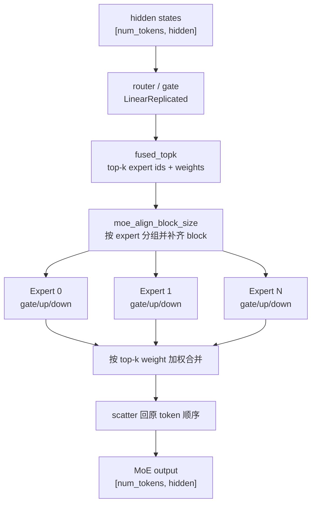

# 第 12 章：MoE 实现

> Mini-SGLang 支持 Mixture-of-Experts (MoE) 模型——典型代表 Qwen3-MoE。这一章讲清楚：
> 1. 什么是 MoE，和 Dense 模型的本质差别。
> 2. mini-sglang 的 MoE 在 layer / backend / weight loading 三层各自怎么做。
> 3. `fused_moe` Triton kernel 的核心思路：`moe_align_block_size` + 单 kernel 跑所有 expert。
>
> 入口：[`layers/moe.py`](../../python/minisgl/layers/moe.py)、[`moe/fused.py`](../../python/minisgl/moe/fused.py)、[`models/qwen3_moe.py`](../../python/minisgl/models/qwen3_moe.py)、[`models/utils.py:MoEMLP`](../../python/minisgl/models/utils.py:53-77)。

---

## 12.1 MoE 是什么 / 为什么

> 📚 **MoE 的算法谱系**（详见 [`references.md`](./references.md#gshard-scaling-giant-models-with-conditional-computation-and-automatic-sharding)）：
> - **GShard** (Lepikhin 2020, arXiv:2006.16668)：现代 MoE 起点，提出 top-2 routing + dispatch/combine 算法。
> - **Switch Transformer** (Fedus 2021, arXiv:2101.03961)：简化为 top-1 routing；提出 expert capacity factor、auxiliary loss。
> - **Mixtral** (Jiang 2024, arXiv:2401.04088)：第一个高质量开源 MoE LLM；top-2 sparse activation。Qwen3-MoE 沿用同一架构思路（top-K + softmax routing + renormalize）。
>
> mini-sglang 实现的就是这个谱系的"推理时路径"：[router → top_k softmax → 各 expert FFN → 加权 combine]。**训练时的 auxiliary loss / expert capacity 在推理时都不需要**——load balancing 已经由训练阶段保证。

经典 transformer 的 FFN 长这样：

```python
y = down_proj(silu_and_mul(gate_up_proj(x)))   # 一层 = 1 套 weight
```

每个 token 都过同一套 `gate_up_proj + down_proj`，参数量 = `3 * H * 4H = 12H²`。

MoE 用**多套 FFN**（叫 expert，比如 Qwen3-MoE 有 60 个 expert），但每个 token 只过 K 个（top-K，比如 K=4）：

```python
# 1. router 选 top_k expert
weights, expert_ids = router(x)          # [N, top_k]
# 2. 每个 token 过它选中的 K 个 expert
y = sum(w_i * expert_i(x) for w_i, expert_i in selected)
```

收益：
- **总参数量大** = `12H² * num_experts`，远超 dense；
- **每 token 计算量** = `12H² * top_k`，**和 dense 同量级（如果 top_k ≪ num_experts）**。

例如 Qwen3-30B-A3B：30B 总参数，但每 token 只激活 3B——推理速度接近 3B 模型，质量接近 30B。

挑战：实现高效的 MoE forward 比 dense 难得多。一个朴素实现是个 `for i in range(num_experts)` 循环：每个 expert 处理路由到它的 token。但这样 GPU 利用率极低（每个 expert 只有几 token，矩阵小）。**fused MoE kernel** 用 batched 矩阵乘 + 排序技巧把所有 expert 一次算掉。

---

## 12.2 mini-sglang 的 MoE 三层结构

先看一眼 token 在 MoE 里的路径。普通 MLP 是"每个 token 过同一套 FFN"，MoE 则是 router 先给每个 token 选 top-k expert，然后把 token 按 expert 重新分组计算，最后再按原顺序 scatter 回去。



```
ModelConfig (is_moe = True)
  ↓
MoEMLP (models/utils.py)              ← 模型层包装：router + experts
  ├─ self.gate (LinearReplicated)     ← router (TP 不切，因为输出小)
  └─ self.experts (MoELayer)          ← 真正的 fused MoE 计算
       └─ ctx.moe_backend.forward()   ← FusedMoe (kernel 调用)
```

逐层看：

### MoEMLP（模型层）

[`models/utils.py:53-76`](../../python/minisgl/models/utils.py)：

```python
class MoEMLP(BaseOP):
    def __init__(self, config):
        self.experts = MoELayer(
            num_experts=config.num_experts,
            top_k=config.num_experts_per_tok,
            hidden_size=config.hidden_size,
            intermediate_size=config.moe_intermediate_size,
            renormalize=config.norm_topk_prob,
        )
        self.gate = LinearReplicated(
            config.hidden_size, config.num_experts, has_bias=False
        )

    def forward(self, hidden_states):
        num_tokens, hidden_dim = hidden_states.shape
        hidden_states = hidden_states.view(-1, hidden_dim)
        router_logits = self.gate.forward(hidden_states)
        final_hidden_states = self.experts.forward(
            hidden_states=hidden_states, router_logits=router_logits
        )
        return final_hidden_states.view(num_tokens, hidden_dim)
```

- `self.gate`：router，把 hidden 映射到 num_experts 维。**LinearReplicated**——不切 TP，因为输出维度小（几十到几百），TP 切完之后还要 all_gather 才能 routing，得不偿失。
- `self.experts`：真正的 MoE 计算。

### MoELayer（layer 抽象）

[`layers/moe.py:9-59`](../../python/minisgl/layers/moe.py)：

```python
class MoELayer(BaseOP):
    def __init__(self, num_experts, top_k, hidden_size, intermediate_size, renormalize, ...):
        self.num_experts = num_experts
        self.top_k = top_k
        self._comm = DistributedCommunicator()
        tp_size = get_tp_info().size
        intermediate_size_per_partition = div_even(intermediate_size, tp_size)
        # Expert weights are stacked along expert dim (E)
        self.gate_up_proj = torch.empty(
            num_experts,
            2 * intermediate_size_per_partition,
            hidden_size,
        )
        self.down_proj = torch.empty(
            num_experts,
            hidden_size,
            intermediate_size_per_partition,
        )

    def forward(self, hidden_states, router_logits):
        ctx = get_global_ctx()
        final_hidden_states = ctx.moe_backend.forward(
            hidden_states=hidden_states,
            w1=self.gate_up_proj,
            w2=self.down_proj,
            gating_output=router_logits,
            topk=self.top_k,
            renormalize=self.renormalize,
            ...
        )
        if self.tp_size > 1:
            final_hidden_states = self._comm.all_reduce(final_hidden_states)
        return final_hidden_states
```

要点：

1. **TP 切 intermediate_size**：每个 rank 持有 `intermediate / tp_size` 大小的 expert 中间维。这是 row parallel 风格——expert 输出部分聚合在每个 rank，最后做 all_reduce。
2. **Expert weights stacked along E dim**：`[num_experts, 2*intermediate, hidden]`——所有 expert 的 weight 摞成一个大 tensor，方便 batched matmul。
3. **委托给 `ctx.moe_backend`**：和 attention 一样，layer 不直接调 kernel，由 backend 处理。

### FusedMoe backend

[`moe/fused.py:230-256`](../../python/minisgl/moe/fused.py)：

```python
class FusedMoe(BaseMoeBackend):
    def forward(self, hidden_states, w1, w2, gating_output, topk, renormalize, activation, ...):
        topk_weights, topk_ids = fused_topk(
            hidden_states=hidden_states,
            gating_output=gating_output,
            topk=topk,
            renormalize=renormalize,
        )
        return fused_experts_impl(
            hidden_states, w1, w2, topk_weights, topk_ids,
            activation, apply_router_weight_on_input=...,
        )
```

两步：

1. **`fused_topk`**：算 top_k 选谁、各自权重多大。
2. **`fused_experts_impl`**：跑所有 expert 的 GEMM。

---

## 12.3 fused_topk：topk softmax

[`moe/fused.py:9-28`](../../python/minisgl/moe/fused.py)：

```python
def fused_topk(hidden_states, gating_output, topk, renormalize, num_token_non_padded=None):
    from sgl_kernel import topk_softmax
    M, _ = hidden_states.shape
    topk_weights = torch.empty(M, topk, dtype=torch.float32, device=hidden_states.device)
    topk_ids = torch.empty(M, topk, dtype=torch.int32, device=hidden_states.device)
    topk_softmax(topk_weights, topk_ids, gating_output.float(), renormalize)
    if renormalize:
        topk_weights = topk_weights / (topk_weights.sum(dim=-1, keepdim=True) + 1e-8)
    if num_token_non_padded is not None:
        indices = torch.arange(0, topk_ids.shape[0], device=topk_ids.device)
        topk_ids[indices >= num_token_non_padded, :] = -1
    return topk_weights, topk_ids
```

- 调 `sgl_kernel.topk_softmax`——一个 kernel 同时做 softmax 和 top_k。
- `renormalize=True`（Qwen3 默认）：top_k 选完后再次 normalize 让权重之和 = 1。
- 返回：`topk_weights [M, top_k]` 和 `topk_ids [M, top_k]` —— 每个 token 选中的 k 个 expert id 和权重。

---

## 12.4 fused_experts_impl 的核心算法

如果朴素实现，per-expert 一个循环：

```python
for e in range(num_experts):
    tokens_for_e = tokens[topk_ids == e]   # 选中 expert e 的 token
    out_for_e = silu_and_mul(tokens_for_e @ w1[e].T) @ w2[e].T
    accumulate to output
```

性能问题：每个 expert 处理的 token 数不同（可能 1-2 个或几十个），GPU 利用率极低。

**fused 思路**：

1. **重新排序 token**：把"被同一 expert 选中的所有 token"放在一起。
2. **一次 batched GEMM**：用 `bmm` 把所有 expert 的计算合并（每个 expert 一组矩阵乘）。
3. **再排回原顺序**：累加到 output。

但有个细节问题：每个 expert 处理的 token 数不一样，矩阵不方便切——`moe_align_block_size` 解决这个问题。

### `moe_align_block_size`

[`moe/fused.py:31-89`](../../python/minisgl/moe/fused.py)：

> **意图**：把 token 按 expert 排序，并 pad 到 block_size 的整数倍——这样 batched GEMM 的每个 block 都满，硬件效率最高。

```python
"""
Aligns the token distribution across experts to be compatible with block size.
...
Example: topk_ids = [[2,3,4],[1,2,4],[1,3,4],[1,2,3]], block_size=4, num_experts=4
- 12 tokens (4*3), each expert needs to process 3 tokens
- block_size=4, pad 1 token for each expert
- Sorted by expert: token_ids = [3, 6, 9, 12, 0, 4, 10, 12, 1, 7, 11, 12, 2, 5, 8, 12]
  (12 = padding tokens, ignored)
"""
```

输出三个 tensor：
- `sorted_token_ids` `[max_padded]`：按 expert 排序后的 token id（带 padding）。
- `expert_ids` `[max_blocks]`：每个 block 对应哪个 expert。
- `num_tokens_post_pad` `[1]`：padding 后总长度（除以 block_size = 总 block 数）。

调用：

```python
from sgl_kernel import moe_align_block_size as sgl_moe_align_block_size
sgl_moe_align_block_size(
    topk_ids, num_experts + 1, block_size,
    sorted_ids, expert_ids, num_tokens_post_pad, cumsum_buffer,
    True,
)
```

`num_experts + 1` 给 padding token 预留一个"假 expert"。

### `fused_moe_kernel_triton`：核心计算

[`moe/fused.py:127-228`](../../python/minisgl/moe/fused.py) 是 `fused_experts_impl` 的全文，关键调用：

```python
sorted_token_ids, expert_ids, num_tokens_post_padded = moe_align_block_size(
    curr_topk_ids, config["BLOCK_SIZE_M"], E
)

fused_moe_kernel_triton(
    curr_hidden_states,    # [M, K]
    w1,                    # [E, 2N, K]
    intermediate_cache1,   # [M, top_k, 2N]
    curr_topk_weights,
    curr_topk_ids,
    sorted_token_ids,
    expert_ids,
    num_tokens_post_padded,
    apply_router_weight_on_input,
    topk,
    config,
    compute_type,
)
FN_MAP[activation](intermediate_cache1.view(-1, N), intermediate_cache2)
fused_moe_kernel_triton(
    intermediate_cache2,   # [M*top_k, N]
    w2,                    # [E, K, N]
    intermediate_cache3,
    ...,
)
moe_sum_reduce_triton(intermediate_cache3, out_hidden_states[...])
```

数据流：

```
hidden_states [M, K] ──gate_up_proj──→ intermediate1 [M, top_k, 2N]
                                            ↓ silu_and_mul
                                       intermediate2 [M*top_k, N]
                                            ↓ down_proj
                                       intermediate3 [M, top_k, K]
                                            ↓ moe_sum_reduce (× topk_weights)
                                       output [M, K]
```

`fused_moe_kernel_triton` 是 mini-sglang 自己写的 Triton kernel（[`kernel/triton/fused_moe.py`](../../python/minisgl/kernel/triton/fused_moe.py)），它接收 sorted_token_ids 和 expert_ids，按 block 循环：

```
for each block b:
    expert = expert_ids[b]
    tokens = sorted_token_ids[b * BLOCK_M : (b+1) * BLOCK_M]
    weight = w[expert, ...]
    intermediate[tokens] += tokens @ weight.T
```

每个 block 都用同一个 expert weight 做 GEMM，硬件效率高。最后 `moe_sum_reduce_triton` 把每个 token 的 K 个 expert 输出按权重加起来。

---

## 12.5 expert weights 的 weight loading

HuggingFace 的 MoE 模型里，每个 expert 有独立的 `.experts.<i>.gate_proj.weight`、`.experts.<i>.up_proj.weight`、`.experts.<i>.down_proj.weight`，共 `num_experts * 3` 个 tensor。

mini-sglang 内部的 weight 是 stacked 的：`gate_up_proj` shape `[E, 2*N, K]`、`down_proj` shape `[E, K, N]`——把所有 expert 的 weight 摞成一个 tensor。

[`models/weight.py:111-119`](../../python/minisgl/models/weight.py) 在 `load_weight` generator 里处理：

```python
if config.is_moe and (expert_info := _get_expert_stack_info(out[0])) is not None:
    packed_key, expert_idx = expert_info
    slots = expert_buf.setdefault(packed_key, {})
    slots[expert_idx] = out[1]
    if len(slots) != config.num_experts:
        continue
    experts = [slots[idx] for idx in range(config.num_experts)]
    del expert_buf[packed_key]
    yield packed_key, torch.stack(experts, dim=0)
```

逻辑：
1. 用 `_EXPERT_PATTERN`（`r"^(?P<prefix>.+\.experts)\.(?P<idx>\d+)\.(?P<name>.+)$"`）识别 expert weight。
2. 累积到 `expert_buf[packed_key]: {idx: tensor}`。
3. 当所有 expert 都收齐了，stack 成 `[E, ...]` 形状一次性 yield。

**完整流程对 gate/up 还要先 merge**（gate 和 up 各自 stack 后被 cat 在 dim 0 上得到 gate_up_proj）：

```
Disk:    .experts.0.gate_proj   .experts.0.up_proj   .experts.1.gate_proj   ...
↓ shard
↓ merge  (gate_proj + up_proj → gate_up_proj per expert)
.experts.0.gate_up_proj   .experts.1.gate_up_proj   ...
↓ stack expert dim
.experts.gate_up_proj  shape=[E, 2*N, K]
```

第 13 章详细讲整个 weight loading pipeline。

---

## 12.6 Qwen3-MoE 的模型代码

[`models/qwen3_moe.py`](../../python/minisgl/models/qwen3_moe.py) 看着和 [`qwen3.py`](../../python/minisgl/models/qwen3.py) 几乎一样：

```python
from .utils import MoEMLP as Qwen3MLP   # ← 这里改了
from .utils import RopeAttn as Qwen3Attn

class Qwen3DecoderLayer(BaseOP):
    def __init__(self, config, layer_id):
        self.self_attn = Qwen3Attn(config, layer_id, has_qk_norm=True)
        self.mlp = Qwen3MLP(config)         # ← 这里就是 MoEMLP
        self.input_layernorm = ...
        self.post_attention_layernorm = ...
```

唯一差异：dense 模型的 `Qwen3MLP = GatedMLP`，MoE 模型的 `Qwen3MLP = MoEMLP`。两者接口相同（`forward(x) -> x_new`），只是内部实现不一样。

`is_moe` 由 [`ModelConfig.from_hf`](../../python/minisgl/models/config.py:36-38) 决定：

```python
@property
def is_moe(self):
    return "moe" in self.model_type
```

注册表（[`models/register.py:9`](../../python/minisgl/models/register.py)）按 architecture 名字分发：

```python
"Qwen3MoeForCausalLM": (".qwen3_moe", "Qwen3MoeForCausalLM"),
```

HF config 里 `architectures: ["Qwen3MoeForCausalLM"]` 自动走这个文件。

---

## 12.7 MoE 的性能特点

跟 dense 比，MoE 在推理时几个差异点：

1. **prefill 阶段差不多**：大量 token 一起算，每个 expert 都有足够的 token 喂满，效率高。
2. **decode 阶段慢**：每步只 1 token，要走 top_k 个 expert，每个 expert 矩阵乘的 GPU 利用率低。
3. **memory bandwidth 是瓶颈**：MoE 的 expert weight 大（10× dense），decode 步骤要从 HBM 读取被选中的 expert weight，带宽吃紧。
4. **batch size 收益更大**：MoE 的 decode 效率随 batch size 提升非常显著（因为每个 expert 收到更多 token），所以 MoE 模型适合高并发场景。

mini-sglang 的 fused MoE 已经做了 token 重排和 batched GEMM，但仍然不如 expert parallel（EP）——后者把不同 expert 放到不同 GPU，每个 GPU 只算自己的几个 expert，避免 weight 反复读取。EP 是工业级 SGLang 的特性，mini-sglang 暂未实现（见第 15 章总结）。

---

## 12.8 MoE backend 的 Registry

[`moe/__init__.py`](../../python/minisgl/moe/__init__.py)：

```python
SUPPORTED_MOE_BACKENDS = Registry[MoeBackendCreator]("MoE Backend")

@SUPPORTED_MOE_BACKENDS.register("fused")
def create_fused_moe_backend():
    from .fused import FusedMoe
    return FusedMoe()

def create_moe_backend(backend):
    return SUPPORTED_MOE_BACKENDS[backend]()
```

CLI 的 `--moe-backend` 默认是 `auto`，[`engine.py:_adjust_config:231-233`](../../python/minisgl/engine/engine.py)：

```python
if config.model_config.is_moe and config.moe_backend == "auto":
    override("moe_backend", "fused")
```

只支持一个 backend `fused`——但 Registry 模式让加新的（比如 EP、Triton-Block-Sparse）非常容易。

---

## 12.9 检查清单

1. **如果 num_experts=60、top_k=4，MoE FFN 一次 forward 比 dense FFN 多做多少倍计算？多少倍参数读？**
   <details><summary>参考答案</summary>

   - **计算**：每 token 过 4 个 expert，每个 expert 计算量 ≈ dense FFN（如果 moe_intermediate_size 是普通 intermediate / 4）。所以总计算量 ≈ dense FFN（持平）；如果 moe_intermediate 不缩，则是 4 倍。
   - **参数读取（HBM bandwidth）**：每 token 访问 4 个 expert 的 weight，每个 expert 的 weight 大小 = `2 * moe_intermediate * hidden`。整体而言，MoE 的 weight 读取量 ≈ 4× dense（或更多，看 moe_intermediate）。

   这就是为什么 MoE 的 decode 是 memory-bound 重灾区——weight 读取压垮 HBM bandwidth。
   </details>

2. **`moe_align_block_size` 把 token 按 expert 排序，padding 到 block_size 整数倍。block_size 选 16 vs 64 各有什么权衡？**
   <details><summary>参考答案</summary>

   - **block_size 大（64）**：每个 GEMM block 大，硬件效率高（tensor core 满载）。但 padding 浪费多——每 expert 平均浪费 `(block_size - 1) / 2` 个 token slot。如果 batch 小、token 少、expert 多（每 expert 平均才几个 token），padding 浪费率可能 50%+。
   - **block_size 小（16）**：padding 少，但 tensor core 利用率不高，单次 GEMM kernel launch 也更频繁。

   实践中 mini-sglang 用 `BLOCK_SIZE_M=64`（M >> E）或 `16`（M ≤ E）的自适应（[`moe/fused.py:92-113`](../../python/minisgl/moe/fused.py)）：

   ```python
   if M <= E:
       config = {"BLOCK_SIZE_M": 16, ...}
   else:
       config = {"BLOCK_SIZE_M": 64, ...}
   ```
   </details>

3. **`MoELayer` 的 `gate_up_proj` 形状是 `[E, 2N, K]`。其中 N 是 `intermediate_size / tp_size`。把这个 weight 在 TP 各 rank 间是怎么切的？**
   <details><summary>参考答案</summary>

   每个 rank 持有 `[E, 2N/tp_size, K]`——切的是 N 维（intermediate）。

   forward 时：
   - 输入 `[M, K]`：每个 rank 都有完整副本（hidden_size 不切）。
   - GEMM：`[M, K] @ [K, 2N/tp_size]` → `[M, 2N/tp_size]`。
   - silu_and_mul：`[M, 2N/tp_size]` → `[M, N/tp_size]`。
   - down_proj：`[M, N/tp_size] @ [N/tp_size, K]` → `[M, K]` partial sum。
   - all_reduce：每个 rank 的 partial sum 加起来 = 完整 `[M, K]`。

   这是标准的 column-row parallel 组合，跟 dense MLP 一样的策略。
   </details>

4. **MoE 模型可以用 CUDA Graph 吗？有没有特殊问题？**
   <details><summary>参考答案</summary>

   可以，mini-sglang 默认就开 CUDA Graph。但有几个细节：

   - **`moe_align_block_size` 在 GPU 上跑，输出 shape 取决于 topk_ids 的内容**——但因为 padding 总长度由 `max_num_tokens_padded = topk_ids.numel() + (E+1) * (block_size - 1)` 给出固定上限，所以 buffer 形状是固定的，可以 capture。
   - **`num_tokens_post_padded` 是个动态 scalar tensor**：Triton kernel 用它做循环边界，但 capture 时会把它当作 input pointer，replay 时读到真实值——OK。
   - **expert 选择不一致 → 某些 block 可能不参与计算**：Triton kernel 内部循环到 `num_tokens_post_padded` 就停，但 graph 里 launch 的 grid 大小是 `max_blocks`——多余 block 内部判断后早退。轻微浪费但 capture-friendly。

   总之 fused_moe 是显式设计成 CUDA Graph 兼容的——用 max upper bound + dynamic length pointer，避开 shape 依赖。
   </details>

5. **如果你想加 Expert Parallel (EP) 让不同 GPU 持有不同 expert，要改 mini-sglang 的哪些地方？**
   <details><summary>参考答案</summary>

   工程量很大，主要：

   1. **MoELayer 的 weight 形状**：每个 rank 只持有 `num_experts / ep_size` 个 expert 的 weight。
   2. **forward 流程加 all-to-all**：
      - 输入：每个 rank 都有完整 hidden_states。
      - 算 topk → 知道每个 token 要去哪个 expert。
      - **all-to-all 1**：把 token 按目标 expert 重新分发到对应 rank。
      - 各 rank 跑自己的 expert FFN。
      - **all-to-all 2**：把结果按原 rank 分发回去。
      - 各 rank 按 topk_weights 累加。
   3. **新增 communicator**：all-to-all 是 NCCL 原语，要在 `DistributedImpl` 接口加。
   4. **weight loader**：按 expert id 模 ep_size 切分。
   5. **配置**：`--ep` 参数、`tp_size * ep_size = world_size` 的约束。

   这就是为什么 EP 没在 mini-sglang 实现——它需要彻底改造通信和 weight 流程，不是简单的 Layer-level 改动。SGLang 的工业版本里有完整的 EP/TP 混合并行，是一个独立的子系统。
   </details>

---

## 下一章预告

下一章我们彻底打开 weight loading：safetensors 流式加载、按 TP 切片、合并 (q/k/v → qkv_proj、gate/up → gate_up_proj)、MoE 的 expert stack。把这条 pipeline 走通。
