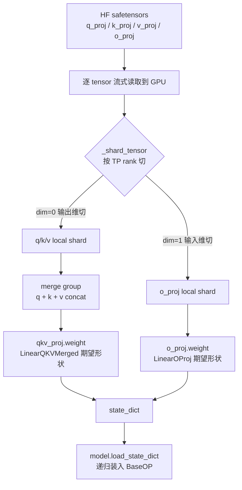

# 第 13 章：模型加载与权重切分

> 这一章把 weight loading 整条 pipeline 走通：从 HuggingFace 的 safetensors 文件到模型每层 parameter 的赋值，中间要做哪些变换、怎么避免 OOM、怎么处理 GQA 的 KV head 复制。
>
> 入口：[`models/weight.py`](../../python/minisgl/models/weight.py)、[`engine.py:_load_weight_state_dict`](../../python/minisgl/engine/engine.py:139-146)、[`layers/base.py`](../../python/minisgl/layers/base.py)。

---

## 13.1 设计目标

加载几十 GB 的模型 weight 时，约束是：
1. **不 OOM**：单台机器 GPU 显存有限（80-141 GB），CPU 内存也有限（几百 GB）。一次性把整个 model 读到内存再分发会爆。
2. **TP 各 rank 只持有自己那一份**：4 GPU TP 的话，每个 rank 显存占用只该是 1/4。
3. **支持 weight 合并**：mini-sglang 内部的 `qkv_proj` 是单个 weight（合并 Q/K/V），但 HF 是分开的；要在加载时 merge。
4. **支持 expert stack**：MoE 模型的每个 expert 是单独的 weight，mini-sglang 要 stack 成 `[E, 2N, K]`。

mini-sglang 的解决方案是**流式加载**：用 generator 逐文件、逐 tensor 处理，CPU 内存峰值约等于一个最大 tensor + 几个 merge buffer。

---

## 13.2 主入口：`load_weight` generator

[`models/weight.py:75-124`](../../python/minisgl/models/weight.py)：

```python
def load_weight(model_path, device):
    model_folder = download_hf_weight(model_path)
    config = ModelConfig.from_hf(cached_load_hf_config(model_path))
    files = glob.glob(f"{model_folder}/*.safetensors")
    files = [f for f in files if not f.endswith("consolidated.safetensors")] or files
    tp_info = get_tp_info()

    merge_buf  = {}    # merged_key -> {slot: tensor}
    expert_buf = {}    # packed_key -> {expert_idx: tensor}

    for file in tqdm(files, desc="Loading weights", disable=not tp_info.is_primary()):
        with safetensors.safe_open(file, framework="pt", device=str(device)) as f:
            for name in f.keys():
                if name.startswith(("vision_tower.", "multi_modal_projector.")):
                    continue
                raw = f.get_tensor(name)
                name = name.removeprefix("language_model.")
                tensor = _shard_tensor(name, raw, tp_info.rank, tp_info.size, config.num_kv_heads)
                del raw

                # === 1. merge group: q/k/v → qkv, gate/up → gate_up ===
                if (info := _get_merge_info(name)) is None:
                    out = (name, tensor)
                else:
                    merged_key, slot, all_slots = info
                    merge_buf.setdefault(merged_key, {})[slot] = tensor
                    if not all(s in merge_buf[merged_key] for s in all_slots):
                        continue
                    parts = [merge_buf[merged_key][s] for s in all_slots]
                    del merge_buf[merged_key]
                    out = (merged_key, torch.cat(parts, dim=0))

                # === 2. expert stack: experts.<i>.gate_up → experts.gate_up ===
                if config.is_moe and (expert_info := _get_expert_stack_info(out[0])) is not None:
                    packed_key, expert_idx = expert_info
                    slots = expert_buf.setdefault(packed_key, {})
                    slots[expert_idx] = out[1]
                    if len(slots) != config.num_experts:
                        continue
                    experts = [slots[idx] for idx in range(config.num_experts)]
                    del expert_buf[packed_key]
                    yield packed_key, torch.stack(experts, dim=0)
                else:
                    yield out[0], out[1]

    assert not merge_buf, f"Incomplete merge groups in checkpoint: {list(merge_buf.keys())}"
    assert not expert_buf, f"Incomplete expert tensors in checkpoint: {list(expert_buf.keys())}"
```

整体是个 generator，逐文件遍历，每个 tensor 走两步变换（shard → merge → expert stack），完成的 yield 出去。

---

## 13.3 步骤 1：download_hf_weight

[`utils/hf.py`](../../python/minisgl/utils/hf.py) 的 `download_hf_weight` 调用 `huggingface_hub.snapshot_download` 把 repo 下载到本地缓存（默认 `~/.cache/huggingface`），返回本地文件夹路径。

如果是 ModelScope 模式（`--model-source modelscope`），CLI 已经在 `parse_args` 里把 model_path 替换成 ModelScope 下载的本地路径（[`server/args.py:239-249`](../../python/minisgl/server/args.py)）。

`--dummy-weight` 模式下，[`engine.py:_load_weight_state_dict:140-144`](../../python/minisgl/engine/engine.py) 跳过这条路径：

```python
def _load_weight_state_dict(self, config):
    if config.use_dummy_weight:
        return {
            k: torch.randn_like(v, device=self.device)
            for k, v in self.model.state_dict().items()
        }
    else:
        return {k: v.to(self.dtype) for k, v in load_weight(config.model_path, self.device)}
```

注意 `model.state_dict()` 在 meta tensor 上是合法的——只读形状不需要 weight，所以可以拿到所有 key、依形状 `randn_like` 出 dummy 值。

---

## 13.4 步骤 2：safetensors 流式读

```python
with safetensors.safe_open(file, framework="pt", device=str(device)) as f:
    for name in f.keys():
        raw = f.get_tensor(name)        # ← 只在这一刻 mmap+读这一个 tensor
        ...
```

safetensors 的 `safe_open` 用 mmap 打开文件，`get_tensor` 才真正把这个 tensor 读进内存。`device=str(device)` 让 safetensors 直接读到 GPU——绕过 CPU 中转。

> **效率关键**：直接读到 GPU，避免"safetensors → CPU → GPU"两次拷贝。但要求 GPU 有足够空间 hold 这一个 tensor（通常没问题，模型最大单个 tensor 是 vocab embedding，几百 MB）。

`framework="pt"` 让返回的是 PyTorch tensor。

---

## 13.5 步骤 3：multimodal 前缀剥离

```python
if name.startswith(("vision_tower.", "multi_modal_projector.")):
    continue
name = name.removeprefix("language_model.")
```

针对 multimodal 模型（如 Qwen2-VL、Mistral-3 with vision），HF checkpoint 的 key 长这样：

```
language_model.model.embed_tokens.weight
language_model.model.layers.0.self_attn.q_proj.weight
...
vision_tower.transformer.layers.0.attention.q_proj.weight     ← 跳过
multi_modal_projector.linear.weight                           ← 跳过
```

mini-sglang 只支持 LLM 部分，所以：
- 跳过 `vision_tower.` 和 `multi_modal_projector.` 开头的（vision 部分）。
- 把 `language_model.` 前缀去掉，让 key 看起来和纯 LLM 一致。

[`models/register.py:11`](../../python/minisgl/models/register.py) 把 `Mistral3ForConditionalGeneration` 也映射到 MistralForCausalLM——只用其语言模型部分。

---

## 13.6 步骤 4：`_shard_tensor` 按 TP 切

[`models/weight.py:34-52`](../../python/minisgl/models/weight.py)：

```python
_SPLIT_DIM_0 = [".q_proj", ".k_proj", ".v_proj", ".gate_proj", ".up_proj"]
_SPLIT_DIM_1 = [".o_proj", ".down_proj"]

def _shard_tensor(key, value, r, n, num_kv_heads):
    if any(key.count(sub) for sub in _SPLIT_DIM_0):
        is_kv_proj = any(key.count(sub) for sub in (".k_proj", ".v_proj"))
        if is_kv_proj and num_kv_heads is not None and num_kv_heads < n:
            head_dim = value.shape[0] // num_kv_heads
            head_idx = r * num_kv_heads // n
            return value[head_idx * head_dim : (head_idx + 1) * head_dim].clone()
        return value.chunk(n, dim=0)[r].clone()
    elif any(key.count(sub) for sub in _SPLIT_DIM_1):
        return value.chunk(n, dim=1)[r].clone()
    elif key.count("lm_head") or key.count("embed_tokens"):
        num_embeddings = value.shape[0]
        num_embeddings_per_partition = div_ceil(num_embeddings, n)
        vocab_start_idx = r * num_embeddings_per_partition
        vocab_end_idx = min((r + 1) * num_embeddings_per_partition, num_embeddings)
        return value[vocab_start_idx:vocab_end_idx, :].clone()
    else:
        return value
```

四类切法：

### 1. 列切（dim=0）：q_proj / k_proj / v_proj / gate_proj / up_proj

PyTorch linear weight 的 shape 是 `[out, in]`——列切（输出维切）就是切 dim=0。`value.chunk(n, dim=0)[r]` 取第 r 块。

### 2. 行切（dim=1）：o_proj / down_proj

`[out, in]` 的输入维切就是 dim=1。

### 3. Vocab 切：embed_tokens / lm_head

按 vocab 维（`num_embeddings`）切。`div_ceil` 向上取整：vocab_size 不一定能被 tp_size 整除，最后一个 rank 可能少几个 token——这就是 `ParallelLMHead.forward` 末尾 `[:, :self.num_embeddings]` 的作用（丢掉 padding）。

### 4. GQA 的特殊处理：KV head 数 < TP size

```python
if is_kv_proj and num_kv_heads is not None and num_kv_heads < n:
    head_dim = value.shape[0] // num_kv_heads
    head_idx = r * num_kv_heads // n
    return value[head_idx * head_dim : (head_idx + 1) * head_dim].clone()
```

例子：Llama-3.1-70B 有 8 个 KV head、TP=16。每个 head 不能切（要保持完整），需要 **复制**：

- rank 0  → head 0 (`r * 8 // 16 = 0`)
- rank 1  → head 0 (`1 * 8 // 16 = 0`)
- rank 2  → head 1 (`2 * 8 // 16 = 1`)
- rank 3  → head 1
- ...
- rank 14 → head 7
- rank 15 → head 7

每两个 rank 复制同一个 KV head——和 [`MHAKVCache.__init__`](../../python/minisgl/kvcache/mha_pool.py) 的 `local_kv_heads = div_even(num_kv_heads, tp_size, allow_replicate=True)` 一致。

> **精确条件**：从 [`utils/misc.py:div_even`](../../python/minisgl/utils/misc.py) 的实现看，`allow_replicate=True` 时要求**要么 `num_kv_heads % tp_size == 0`（普通切，每 rank 拿 N/M 个 head），要么 `tp_size % num_kv_heads == 0`（复制，多 rank 共一个 head）**——其它比例（比如 num_kv_heads=8、tp_size=12）会直接 assert error。这是 mini-sglang 的硬约束，部署时要注意。
>
> 📚 **延伸阅读**：
> - **MQA** (Shazeer 2019, arXiv:1911.02150)：所有 Q head 共享一组 K/V head（num_kv_heads=1）。decode 阶段 KV 缩小 num_qo_heads 倍。
> - **GQA** (Ainslie 2023, EMNLP 2023, arXiv:2305.13245)：MQA 与 MHA 的折中；分 G 组、每组共享一对 K/V head。Llama-3、Qwen2/3 都是 GQA。
> - 详见 [`references.md`](./references.md#gqa-training-generalized-multi-query-transformer-models-from-multi-head-checkpoints)。

> **`.clone()` 很重要**：`chunk` 返回的是 view（共享底层内存）。不 clone 会让 `del raw` 没用——view 还引用着原 tensor，CPU/GPU 内存释放不掉。clone 拷贝一份，后续 raw 可以被 GC。

---

## 13.7 步骤 5：merge group (Q/K/V → qkv_proj、gate/up → gate_up_proj)

[`models/weight.py:17-30`](../../python/minisgl/models/weight.py)：

```python
_MERGE_GROUPS = {
    ".q_proj":    (".qkv_proj",     ("q", "k", "v")),
    ".k_proj":    (".qkv_proj",     ("q", "k", "v")),
    ".v_proj":    (".qkv_proj",     ("q", "k", "v")),
    ".gate_proj": (".gate_up_proj", ("gate", "up")),
    ".up_proj":   (".gate_up_proj", ("gate", "up")),
}
_SLOT_NAMES = {".q_proj": "q", ".k_proj": "k", ".v_proj": "v", ".gate_proj": "gate", ".up_proj": "up"}
```

[`_get_merge_info`](../../python/minisgl/models/weight.py:55-60)：

```python
def _get_merge_info(key):
    for suffix, (fused_suffix, slots) in _MERGE_GROUPS.items():
        if key.count(suffix):
            return key.replace(suffix, fused_suffix), _SLOT_NAMES[suffix], slots
    return None
```

输入 `model.layers.0.self_attn.q_proj.weight`，返回 `(model.layers.0.self_attn.qkv_proj.weight, "q", ("q", "k", "v"))`——告诉调用方"这个 tensor 是 q slot，要等 q/k/v 三个都到齐再 merge"。

merge 逻辑（generator 里）：

```python
if (info := _get_merge_info(name)) is None:
    out = (name, tensor)
else:
    merged_key, slot, all_slots = info
    merge_buf.setdefault(merged_key, {})[slot] = tensor
    if not all(s in merge_buf[merged_key] for s in all_slots):
        continue                           # 还没收齐，下一轮再来
    parts = [merge_buf[merged_key][s] for s in all_slots]
    del merge_buf[merged_key]              # 释放 buf 引用
    out = (merged_key, torch.cat(parts, dim=0))   # cat 到一个 tensor
```

`torch.cat(parts, dim=0)` 把 q+k+v 三个分别 `[Q_local, H], [K_local, H], [V_local, H]` 拼成 `[Q_local + K_local + V_local, H]`——和 [`LinearQKVMerged`](../../python/minisgl/layers/linear.py:71-88) 期望的形状一致。

> **顺序敏感**：`all_slots = ("q", "k", "v")`——必须按 q/k/v 的顺序 cat，否则 `AttentionLayer.forward` 里 `qkv.split([qo, kv, kv], dim=-1)` 会切错。

> **`merge_buf` 一直在内存里**：q 来了之后等 k 和 v——这意味着同时最多有 layer_count 个 (q, k) 半完成的 merge_buf 占内存。但每个 buf 也就一个 tensor 大小（几十 MB），可接受。

---

## 13.8 步骤 6：expert stack

```python
_EXPERT_PATTERN = re.compile(r"^(?P<prefix>.+\.experts)\.(?P<idx>\d+)\.(?P<name>.+)$")

def _get_expert_stack_info(key):
    match = _EXPERT_PATTERN.match(key)
    if match is None: return None
    packed_name = match.group("name").removesuffix(".weight")
    return f"{match.group('prefix')}.{packed_name}", int(match.group("idx"))
```

例：`model.layers.0.mlp.experts.5.gate_up_proj.weight` 匹配后返回 `(model.layers.0.mlp.experts.gate_up_proj, 5)`。

stack 逻辑：

```python
if config.is_moe and (expert_info := _get_expert_stack_info(out[0])) is not None:
    packed_key, expert_idx = expert_info
    slots = expert_buf.setdefault(packed_key, {})
    slots[expert_idx] = out[1]
    if len(slots) != config.num_experts:
        continue
    experts = [slots[idx] for idx in range(config.num_experts)]
    del expert_buf[packed_key]
    yield packed_key, torch.stack(experts, dim=0)
```

收集所有 expert 的同名 weight，按 expert idx 排好后 `torch.stack(experts, dim=0)` 得到 `[E, ...]`。

> 注意 merge group 在 expert stack **之前**做：先 q/k/v → qkv（如果 expert 内部也有 attention，但 MoE 一般只在 FFN 里），或 gate/up → gate_up，**对每个 expert 单独 merge**。然后再把所有 expert 的 gate_up 摞起来。

---

## 13.9 步骤 7：`load_state_dict` 把 tensor 装进模型

[`engine.py:_load_weight_state_dict:139-146`](../../python/minisgl/engine/engine.py)：

```python
def _load_weight_state_dict(self, config):
    if config.use_dummy_weight:
        return {k: torch.randn_like(v, device=self.device)
                for k, v in self.model.state_dict().items()}
    else:
        return {k: v.to(self.dtype) for k, v in load_weight(config.model_path, self.device)}
```

注意是**先 dict comprehension 收集完才返回**——这就把 generator 实现的"流式"打回成"一次性 dict"了？

仔细看：每个 `(k, v)` yield 出来后立刻 `.to(self.dtype)`，然后塞进 dict。dict 只持有 GPU 上的 tensor 引用——CPU 内存峰值还是 generator 生命周期里的一个 tensor + merge_buf。**GPU 上则是全量模型——这是必须的**，因为最终 weight 要在 GPU。

`Engine.__init__` 接 `self.model.load_state_dict(...)`，由 [`BaseOP.load_state_dict`](../../python/minisgl/layers/base.py:32-53) 递归到每个 layer：

```python
def load_state_dict(self, state_dict, *, prefix="", _internal=False):
    for name, param in self.__dict__.items():
        if name.startswith("_"): continue
        if isinstance(param, torch.Tensor):
            item = state_dict.pop(_concat_prefix(prefix, name))
            assert isinstance(item, torch.Tensor)
            assert param.shape == item.shape and param.dtype == item.dtype
            setattr(self, name, item)
        elif isinstance(param, BaseOP):
            param.load_state_dict(state_dict, prefix=_concat_prefix(prefix, name), _internal=True)

    if not _internal and state_dict:
        raise RuntimeError(f"Unexpected keys in state_dict: {list(state_dict.keys())}")
```

要点：

1. **递归遍历 `__dict__`**：忽略 `_` 开头的私有属性，遇到 tensor 就从 state_dict pop 出对应 key 装进去；遇到 BaseOP 子模块就递归。
2. **shape/dtype 校验**：保证形状和 dtype 都匹配——错位会立刻 assert 失败。
3. **末尾 `if not _internal and state_dict`**：递归回到根时检查 state_dict 是否还有"没用上的 key"——如果有说明 checkpoint 多了什么，应该报错（除非是 `tied_embedding` 这种特殊场景，由 [`ParallelLMHead.load_state_dict`](../../python/minisgl/layers/embedding.py:59-75) 单独处理）。

---

## 13.10 一张完整流程图

以 Llama-3.1-8B、TP=2、layer 0 的 attention 为例：



```
HF Checkpoint Files:
  model-00001.safetensors:
    model.layers.0.self_attn.q_proj.weight     [4096, 4096]
    model.layers.0.self_attn.k_proj.weight     [1024, 4096]   (8 KV heads * 128 = 1024)
    model.layers.0.self_attn.v_proj.weight     [1024, 4096]
    model.layers.0.self_attn.o_proj.weight     [4096, 4096]
    ...

flow for rank 0 (TP=2):
  q_proj read → safetensors device=GPU0:
      raw = [4096, 4096]
      after _shard_tensor(rank=0, n=2):
          row split → [2048, 4096]                ← 列切（输出维切）
      _get_merge_info: → ("model.layers.0.self_attn.qkv_proj.weight", "q", ("q","k","v"))
      merge_buf[qkv_key]["q"] = [2048, 4096]
      slot incomplete → continue

  k_proj read:
      raw = [1024, 4096]
      _shard_tensor: chunk → [512, 4096]
      merge_buf[qkv_key]["k"] = [512, 4096]
      continue

  v_proj read:
      raw = [1024, 4096]
      _shard_tensor: chunk → [512, 4096]
      merge_buf[qkv_key]["v"] = [512, 4096]
      all 3 slots present!
      cat([q, k, v], dim=0) → [3072, 4096]
      yield ("model.layers.0.self_attn.qkv_proj.weight", [3072, 4096])
      del merge_buf

  o_proj read:
      raw = [4096, 4096]
      _shard_tensor: chunk dim=1 → [4096, 2048]   ← 行切
      yield ("model.layers.0.self_attn.o_proj.weight", [4096, 2048])

Engine collects all yields:
  state_dict = {
      "model.layers.0.self_attn.qkv_proj.weight": [3072, 4096],
      "model.layers.0.self_attn.o_proj.weight":   [4096, 2048],
      ...
  }

self.model.load_state_dict(state_dict):
  recurses into model.layers[0].self_attn (RopeAttn):
    self_attn.qkv_proj (LinearQKVMerged) shape=[3072, 4096]  ← matches
    self_attn.o_proj   (LinearOProj)     shape=[4096, 2048]  ← matches
```

整个过程 CPU 内存峰值 ≈ 一个 chunk_buffer + merge_buf 里的 1-2 个 partial tensor。GPU 上则随着 yield 累积到完整 model weight。

---

## 13.11 检查清单

1. **如果 HF checkpoint 里 q_proj 的 weight 是 `[Q*head_dim, hidden]`，TP=4，你拿到的 rank 0 q_proj 是什么 shape？**
   <details><summary>参考答案</summary>

   `_shard_tensor` 走 `_SPLIT_DIM_0` 分支，`value.chunk(4, dim=0)[0]`——shape 变成 `[Q*head_dim/4, hidden]`。

   假设 Llama-3.1-8B：Q*head_dim = 32 * 128 = 4096，TP=4 → `[1024, 4096]`。
   每个 rank 持有 8 个 Q head 的 weight。
   </details>

2. **GQA 的 KV head 复制策略，rank 计算公式是 `head_idx = r * num_kv_heads // n`。如果 num_kv_heads = 8、TP = 16，rank 5 拿哪一个 KV head？**
   <details><summary>参考答案</summary>

   `head_idx = 5 * 8 // 16 = 40 // 16 = 2`。rank 5 拿第 2 个 KV head（索引从 0 开始）。

   验证一下分布：`[r * 8 // 16 for r in range(16)] = [0,0,1,1,2,2,3,3,4,4,5,5,6,6,7,7]`——每个 head 被两个连续 rank 共享，正好。
   </details>

3. **为什么 `_shard_tensor` 末尾要 `.clone()`？省略会出什么问题？**
   <details><summary>参考答案</summary>

   `value.chunk(n, dim=0)[r]` 返回的是 view——和原 tensor 共享底层内存。

   - 如果不 clone：`del raw` 之后 view 还引用着原 tensor 数据，**内存不会释放**——内存峰值一路涨到所有 tensor 都加载完。
   - clone 之后：返回独立内存的 tensor，`del raw` 真正释放。

   GPU 内存上特别明显：safetensors 直接读到 GPU，不 clone 会让中间状态占满显存。
   </details>

4. **`merge_buf` 里同时可能存几个未完成的 merge group？**
   <details><summary>参考答案</summary>

   理论最坏 = 所有 layer × 2（每层有 qkv 和 gate_up 两个 merge group）+ 各自 2 个 partial slot。

   假设 32 层模型，最多 32×2 = 64 个 merge group，每个最多 2 个 partial（q+k 等 v）。每个 partial tensor 几 MB（已 TP 切了），总开销 ~几百 MB——完全能接受。

   实际上 safetensors 文件里同一层的权重一般连续存储，merge_buf 通常只持有 1-2 个 partial，立刻就完成 cat 释放。
   </details>

5. **`load_state_dict` 末尾的 `state_dict.pop(...)` 而不是 `state_dict[...]` 是为什么？**
   <details><summary>参考答案</summary>

   两个原因：

   - **节省 GPU 内存**：tensor 装到 layer 之后，从 dict 里 pop 走，dict 不再持有引用——下一次 GC 时这个 tensor 只剩一份引用（layer 上）。如果 dict 一直持有，整个 dict 直到 `load_state_dict` 完成才会被释放，期间显存有冗余引用。
   - **未使用 key 检测**：[`base.py:52-53`](../../python/minisgl/layers/base.py)：

     ```python
     if not _internal and state_dict:
         raise RuntimeError(f"Unexpected keys in state_dict: {list(state_dict.keys())}")
     ```

     只有用 `pop` 才能在递归结束时通过"dict 是否为空"判断有没有多余 key——用 `__getitem__` 的话需要单独维护一个"已用 key"集合。
   </details>

---

## 下一章预告

下一章我们看 mini-sglang 的 **自定义 CUDA 与 Triton kernel**：sgl_kernel 的 JIT 加载机制（tvm-ffi）、Triton 写的 fused_moe_kernel、自定义的 store_cache / fast_compare_key / indexing 这几个性能关键点。
